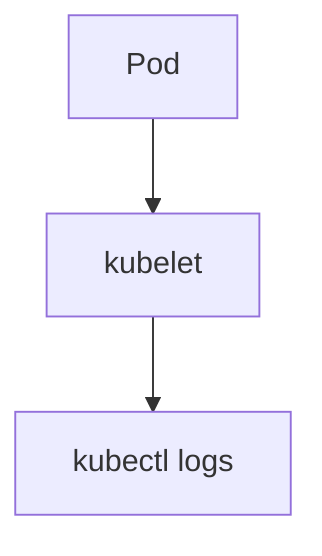

# Contributing to k8slearn-content

Two files per topic — Markdown + JSON. No app code needed.

---

## Folder structure

```
content/{cert}/{roadmap-slug}/{subtopic-slug}/
  {subtopic}.md    ← content
  {subtopic}.json  ← metadata + quiz
```

**Example:** `content/cka/scheduling/taints/taints.md` + `taints.json`

All folder/file names: **lowercase letters, numbers, hyphens only.**

---

## Topic JSON

```json
{
  "title": "Taints and Tolerations",
  "cert": "cka",
  "roadmap": "Scheduling",
  "subtopic": "Taints",
  "difficulty": "intermediate",
  "content": "taints.md",
  "order": 3,
  "tags": ["scheduling", "nodes"],
  "questions": [
    {
      "type": "mcq",
      "q": "Which taint effect evicts already-running pods?",
      "options": ["NoSchedule", "PreferNoSchedule", "NoExecute", "Evict"],
      "answer": 2,
      "explanation": "NoExecute evicts existing pods without a matching toleration."
    }
  ]
}
```

### Field rules

| Field | Required | Values |
|---|---|---|
| `cert` | ✅ | `cka` `ckad` `cks` `kcna` |
| `difficulty` | ✅ | `beginner` `intermediate` `advanced` |
| `content` | ✅ | Filename of `.md` in same folder |
| `order` | optional | Number — lower appears first |
| `type` (question) | ✅ | `mcq` `multi-select` `true-false` |
| `answer` | ✅ | Zero-based index into `options` |

**Multi-cert topic** — use object syntax:
```json
{
  "cert": ["cka", "ckad"],
  "roadmap": { "cka": "core-concepts", "ckad": "application-design" }
}
```

---

## Markdown

Standard GitHub markdown. Use `mermaid` fenced blocks for diagrams — **no ASCII art.**

````markdown

````

Tables must have a label in every header column — never leave `| |` empty.

---

## exam.json — section ordering

Every cert has `content/{cert}/exam.json`. The `roadmapOrder` array controls
the sidebar order. **Values must match the `roadmap` field in your topic JSONs exactly** (case-insensitive).

```json
{
  "title": "Certified Kubernetes Administrator",
  "subtitle": "...",
  "duration": "2 Hours",
  "passingScore": "66%",
  "format": "Hands-on Performance-based (Interactive CLI)",
  "price": "$445 USD",
  "attempts": "2 attempts included",
  "roadmapOrder": [
    "core-concepts",
    "Scheduling",
    "Logging & Monitoring"
  ],
  "curriculum": [
    { "domain": "Cluster Architecture, Installation & Configuration", "weight": 25 },
    { "domain": "Workloads & Scheduling", "weight": 15 }
  ]
}
```

To add a new section — add its `roadmap` key to `roadmapOrder` at the position you want.

---

## CI validation

Every PR runs `node scripts/validate.js`. Run it locally before pushing:

```bash
node scripts/validate.js
```

It checks required fields, valid `cert`/`difficulty` values, that the `.md` file exists, and that question `answer` indexes are in range.

---

## Submitting

```bash
git checkout -b add/cka-scheduling-my-topic
# ... add your files ...
node scripts/validate.js           # must pass
git add content/
git commit -m "feat(cka/scheduling): add My Topic"
git push origin add/cka-scheduling-my-topic
# open a PR on GitHub
```

### Common mistakes

| Problem | Fix |
|---|---|
| Section at wrong position in sidebar | Check `roadmap` value matches `roadmapOrder` in `exam.json` |
| CI error: content file not found | `"content"` field must match the `.md` filename exactly |
| Table header misaligned | Every column needs a header — never `\| \|` |
| ASCII diagram not rendering | Convert to a `mermaid` code block |
| `answer` out of range | It's zero-based — `answer: 2` means the 3rd option |

---

To add a **new certification**, open an issue first — a maintainer will update `schema.json`.
