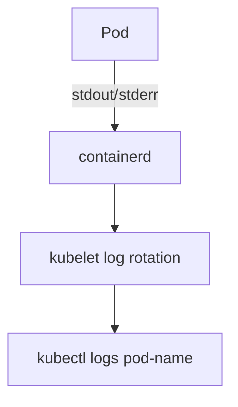

# Contributing to k8slearn-content

> **No app code needed.** Content lives entirely in this repository.  
> Every topic is two files — a Markdown file and a JSON sidecar. That's it.

---

## Table of contents

1. [Repository layout](#1-repository-layout)
2. [Quick start — add a topic in 5 steps](#2-quick-start--add-a-topic-in-5-steps)
3. [The JSON sidecar — full reference](#3-the-json-sidecar--full-reference)
4. [The Markdown file — what's supported](#4-the-markdown-file--whats-supported)
5. [exam.json — cert metadata & section ordering](#5-examjson--cert-metadata--section-ordering)
6. [How sidebar section ordering works](#6-how-sidebar-section-ordering-works)
7. [Adding a brand-new section (roadmap)](#7-adding-a-brand-new-section-roadmap)
8. [Adding a brand-new certification](#8-adding-a-brand-new-certification)
9. [CI validation — what gets checked](#9-ci-validation--what-gets-checked)
10. [Branch & PR conventions](#10-branch--pr-conventions)
11. [Common mistakes & fixes](#11-common-mistakes--fixes)

---

## 1. Repository layout

```
k8slearn-content/
├── schema.json                     ← global validation rules (do not edit unless adding a cert)
├── CONTRIBUTING.md                 ← this file
├── README.md
├── scripts/
│   └── validate.js                 ← CI validator run on every PR
└── content/
    ├── cka/
    │   ├── exam.json               ← cert metadata + section ordering
    │   ├── core-concepts/
    │   │   └── namespaces/
    │   │       ├── namespaces.md   ← the content (Markdown)
    │   │       └── namespaces.json ← the sidecar (metadata + quiz)
    │   ├── scheduling/
    │   │   └── taints/
    │   │       ├── taints.md
    │   │       └── taints.json
    │   └── logging-monitoring/
    │       └── monitoring/
    │           ├── monitoring.md
    │           └── monitoring.json
    ├── ckad/
    │   ├── exam.json
    │   └── ...
    ├── cks/
    └── kcna/
```

**Naming convention** — all folder and file names: lowercase letters, numbers, hyphens only.  
Example: `node-affinity`, `resource-limits`, `configmaps-secrets`.

---

## 2. Quick start — add a topic in 5 steps

### Step 1 — Fork and clone

```bash
git clone https://github.com/YOUR-USERNAME/k8slearn-content.git
cd k8slearn-content
git checkout -b add/cka-scheduling-my-topic
```

### Step 2 — Create the folder

```
content/{cert}/{roadmap-slug}/{subtopic-slug}/
```

Example — adding "Node Affinity" to CKA Scheduling:

```bash
mkdir -p content/cka/scheduling/node-affinity
```

### Step 3 — Write the Markdown file

```bash
touch content/cka/scheduling/node-affinity/node-affinity.md
```

See [§4 The Markdown file](#4-the-markdown-file--whats-supported) for what you can use.

### Step 4 — Write the JSON sidecar

```bash
touch content/cka/scheduling/node-affinity/node-affinity.json
```

See [§3 The JSON sidecar](#3-the-json-sidecar--full-reference) for the full schema.

Minimum valid example:

```json
{
  "title": "Node Affinity",
  "cert": "cka",
  "roadmap": "Scheduling",
  "subtopic": "Node Affinity",
  "difficulty": "intermediate",
  "content": "node-affinity.md",
  "order": 5,
  "tags": ["affinity", "scheduling", "nodes"],
  "questions": [
    {
      "type": "mcq",
      "q": "Which affinity type makes a rule mandatory rather than preferred?",
      "options": [
        "preferredDuringSchedulingIgnoredDuringExecution",
        "requiredDuringSchedulingIgnoredDuringExecution",
        "requiredDuringSchedulingRequiredDuringExecution",
        "hardAffinityRule"
      ],
      "answer": 1,
      "explanation": "requiredDuringSchedulingIgnoredDuringExecution is the hard affinity rule — the pod will only be placed on nodes that satisfy it. The preferred variant is a soft hint."
    }
  ]
}
```

### Step 5 — Validate, commit, and open a PR

```bash
# Validate locally before pushing
node scripts/validate.js

# Commit
git add content/cka/scheduling/node-affinity/
git commit -m "feat(cka/scheduling): add Node Affinity topic"

# Push and open a PR
git push origin add/cka-scheduling-my-topic
```

CI runs `node scripts/validate.js` automatically on every PR. Fix any errors it reports, push again.

---

## 3. The JSON sidecar — full reference

### Required fields

| Field | Type | Rules |
|---|---|---|
| `title` | string | Max 80 chars. Shown in the sidebar and page heading. |
| `cert` | string **or** array of strings | Must be one of: `cka` `ckad` `cks` `kcna` |
| `roadmap` | string **or** object | The section name. Must be **consistent** across all topics in the same section. See §6. |
| `subtopic` | string | Max 50 chars. The specific topic name, e.g. `"Taints"`. |
| `difficulty` | string | Must be one of: `beginner` `intermediate` `advanced` |
| `content` | string | Filename of the `.md` file in the **same folder**. |
| `questions` | array | 1–20 questions. Each question must satisfy the rules below. |

### Optional fields

| Field | Type | Description |
|---|---|---|
| `order` | number **or** object | Controls display order within a section. Lower = first. |
| `tags` | array of strings | Keywords used for search and filtering. |
| `prerequisites` | array of strings | Topic slugs that should be read first. |

### Multi-cert topics

A topic that belongs to both CKA and CKAD can use object syntax for `cert`-specific fields:

```json
{
  "title": "Deployments",
  "cert": ["cka", "ckad"],
  "roadmap": {
    "cka":  "core-concepts",
    "ckad": "application-design"
  },
  "order": {
    "cka":  3,
    "ckad": 1
  },
  "subtopic": "Deployments",
  "difficulty": "beginner",
  "content": "deployments.md",
  "questions": [ ... ]
}
```

### Question rules

Every object in the `questions` array must have:

| Field | Type | Rules |
|---|---|---|
| `type` | string | `mcq` \| `multi-select` \| `true-false` |
| `q` | string | Max 300 chars. The question text. |
| `options` | array | 2–5 strings. For `true-false` use `["True", "False"]`. |
| `answer` | number | **Zero-based** index into `options`. |
| `explanation` | string | Max 500 chars. Shown after the user answers. |

#### Question type examples

**`mcq`** — single correct answer:
```json
{
  "type": "mcq",
  "q": "Which taint effect evicts already-running pods?",
  "options": ["NoSchedule", "PreferNoSchedule", "NoExecute", "Evict"],
  "answer": 2,
  "explanation": "NoExecute evicts existing pods that do not have a matching toleration."
}
```

**`true-false`** — always exactly two options:
```json
{
  "type": "true-false",
  "q": "A toleration guarantees that a pod will be scheduled on a tainted node.",
  "options": ["True", "False"],
  "answer": 1,
  "explanation": "False. A toleration allows scheduling on a tainted node but does not guarantee placement."
}
```

**`multi-select`** — multiple correct answers (`answer` is an array):
```json
{
  "type": "multi-select",
  "q": "Which of the following are valid taint effects?",
  "options": ["NoSchedule", "NoExecute", "PreferNoSchedule", "SoftEvict"],
  "answer": [0, 1, 2],
  "explanation": "NoSchedule, NoExecute, and PreferNoSchedule are the three valid taint effects. SoftEvict does not exist."
}
```

---

## 4. The Markdown file — what's supported

Write standard GitHub-flavored Markdown. The app renders the following:

### Standard elements

```markdown
# H1 heading (use for the main topic title)
## H2 heading (use for major sections)
### H3 heading

**bold**, _italic_, `inline code`

- bullet list
- another item

1. numbered list

> blockquote

[link text](https://example.com)
```

### Code blocks (with syntax highlighting)

````markdown
```bash
kubectl get pods -n kube-system
```

```yaml
apiVersion: v1
kind: Pod
metadata:
  name: nginx
```

```json
{ "key": "value" }
```
````

### Tables

```markdown
| Feature        | Static Pods    | DaemonSets              |
|---|---|---|
| Managed by     | kubelet        | kube-controller-manager |
| Needs API server | No           | Yes                     |
```

> **Important:** Always include a header row and a separator row (`|---|`).
> If the first column has no header, use `| Feature |` (empty headers cause alignment issues).

### Mermaid diagrams

Wrap any Mermaid diagram in a fenced code block with the `mermaid` language tag.
The app renders it as an interactive SVG with zoom and pan controls.

````markdown

````

Supported diagram types: `flowchart`, `sequenceDiagram`, `classDiagram`, `stateDiagram`, `erDiagram`, `gantt`.

> **Do not** use ASCII art diagrams (`┌─┐│└─┘▼►`). Convert them to Mermaid blocks.

---

## 5. exam.json — cert metadata & section ordering

Every certification has exactly one `exam.json` at `content/{cert}/exam.json`.

### Full structure

```json
{
  "title": "Certified Kubernetes Administrator",
  "subtitle": "One-line description shown on the cert intro card.",
  "duration": "2 Hours",
  "passingScore": "66%",
  "format": "Hands-on Performance-based (Interactive CLI)",
  "price": "$445 USD",
  "attempts": "2 attempts included",

  "roadmapOrder": [
    "core-concepts",
    "Scheduling",
    "Logging & Monitoring"
  ],

  "curriculum": [
    { "domain": "Cluster Architecture, Installation & Configuration", "weight": 25 },
    { "domain": "Workloads & Scheduling",                            "weight": 15 },
    { "domain": "Services & Networking",                             "weight": 20 },
    { "domain": "Storage",                                           "weight": 10 },
    { "domain": "Troubleshooting",                                   "weight": 30 }
  ]
}
```

### Field reference

| Field | Required | Description |
|---|---|---|
| `title` | yes | Full cert name, shown on the intro page |
| `subtitle` | yes | Short description, shown on landing page card |
| `duration` | yes | Exam duration, e.g. `"2 Hours"` |
| `passingScore` | yes | Minimum pass percentage, e.g. `"66%"` |
| `format` | yes | Exam format description |
| `price` | yes | Current USD price including any retake info |
| `attempts` | yes | Number of attempts included |
| `roadmapOrder` | yes | Array of roadmap keys — controls sidebar section order |
| `curriculum` | yes | Official CNCF domain weights (informational) |

---

## 6. How sidebar section ordering works

The sidebar lists sections in a deliberate order — not alphabetically.
This is controlled by the `roadmapOrder` array in `exam.json`.

### End-to-end flow

```
content/{cert}/exam.json
  roadmapOrder: ["core-concepts", "Scheduling", "Logging & Monitoring"]
        │
        ▼
API: src/app/api/content/route.ts
  Reads roadmapOrder, rebuilds the tree object with roadmap keys
  in that sequence using case-insensitive matching.
  Any roadmap not in the list appears at the end, alphabetically.
        │
        ▼
Sidebar: src/components/Sidebar.tsx
  Renders Object.entries(tree[cert]) in insertion order.
  Maps raw keys to display labels via ROADMAP_LABELS
  (e.g. "core-concepts" → "Core Concepts").
        │
        ▼
Browser sidebar — sections appear in roadmapOrder sequence
```

### Critical rule — roadmap name consistency

The string in `roadmapOrder` must **match the `roadmap` field in your topic JSON files**
(case-insensitive, spelling must be exact):

| Topic JSON `"roadmap"` value | Entry in `roadmapOrder` |
|---|---|
| `"core-concepts"` | `"core-concepts"` |
| `"Scheduling"` | `"Scheduling"` |
| `"Logging & Monitoring"` | `"Logging & Monitoring"` |

### Current CKA section order

| Position | `roadmap` key | Sidebar display label |
|---|---|---|
| 1 | `core-concepts` | Core Concepts |
| 2 | `Scheduling` | Scheduling |
| 3 | `Logging & Monitoring` | Logging & Monitoring |
| 4+ | *(any unlisted — alphabetical)* | *(raw key or ROADMAP_LABELS value)* |

### Troubleshooting: section at wrong position

```bash
# 1. Check what roadmap value your topic file actually uses
node -e "console.log(require('./content/cka/my-section/my-topic/my-topic.json').roadmap)"

# 2. Compare it to roadmapOrder in exam.json — spelling must match exactly
cat content/cka/exam.json | grep -A 10 roadmapOrder
```

---

## 7. Adding a brand-new section (roadmap)

**Step 1 — Choose a roadmap key** and use it consistently in all your topic JSON files:

```json
{ "roadmap": "Storage" }
```

**Step 2 — Create your topics** in `content/{cert}/{roadmap-slug}/`:

```
content/cka/storage/
  persistent-volumes/
    persistent-volumes.md
    persistent-volumes.json
  storage-classes/
    storage-classes.md
    storage-classes.json
```

**Step 3 — Insert the roadmap key at the correct position** in `exam.json`:

```json
{
  "roadmapOrder": [
    "core-concepts",
    "Scheduling",
    "Storage",              ← inserted at desired position
    "Logging & Monitoring"
  ]
}
```

**Step 4 — If the key is kebab-case**, add a display label in the Sidebar app:
> File: `k8slearn-app/src/components/Sidebar.tsx`

```ts
const ROADMAP_LABELS: Record<string, string> = {
  'core-concepts': 'Core Concepts',
  'storage':       'Storage',       // ← add this
}
```

**Step 5 — Commit both** the topic files and the updated `exam.json` together.

---

## 8. Adding a brand-new certification

To add a certification not currently supported (`cka`, `ckad`, `cks`, `kcna`):

1. Open an issue first — a maintainer will add the cert to `schema.json → certifications.allowed` and the validator.
2. Once approved, create `content/{new-cert}/exam.json` following the structure in §5.
3. Add your topics as usual.

---

## 9. CI validation — what gets checked

Every PR runs `node scripts/validate.js` via GitHub Actions (`.github/workflows/validate.yml`).

The validator checks every `.json` file in `content/` against `schema.json`:

| Check | Rule |
|---|---|
| Required fields | `title`, `cert`, `roadmap`, `subtopic`, `difficulty`, `content`, `questions` must be present |
| `cert` value | Must be in `["cka", "ckad", "cks", "kcna"]` |
| `difficulty` value | Must be `beginner`, `intermediate`, or `advanced` |
| `content` file exists | The `.md` filename must exist in the same folder |
| Questions array | Must have at least 1 question |
| Question fields | `type`, `q`, `options`, `answer`, `explanation` required per question |
| Question `type` | Must be `mcq`, `multi-select`, or `true-false` |
| `answer` value | Must be a valid index into `options` |

### Run the validator locally before pushing

```bash
node scripts/validate.js
```

A passing run outputs:
```
✓  content/cka/scheduling/taints/taints.json
✓  content/cka/logging-monitoring/monitoring/monitoring.json
...
All N files valid.
```

A failing run outputs the exact field and file that failed — fix it, run again.

---

## 10. Branch & PR conventions

### Branch naming

```
add/{cert}-{roadmap}-{subtopic}       # new topic
fix/{cert}-{roadmap}-{subtopic}       # fix existing content
feat/{cert}-{roadmap}                 # new section / multiple topics
docs/contributing                     # docs-only change
```

### Commit messages

Follow [Conventional Commits](https://www.conventionalcommits.org/):

```
feat(cka/scheduling): add Node Affinity topic
fix(cka/core-concepts): correct namespaces quiz answer #2
docs: update CONTRIBUTING with multi-select example
```

### PR checklist

Before opening a PR, confirm:

- [ ] `node scripts/validate.js` passes locally with no errors
- [ ] Every `.json` has a matching `.md` in the same folder
- [ ] All `roadmap` values use the **same string** across topics in the same section
- [ ] If adding a new section: `roadmapOrder` in `exam.json` updated
- [ ] Mermaid diagrams used instead of ASCII art
- [ ] Table header rows have a label in every column (no empty `| |` cells)
- [ ] Commit message follows the convention above

---

## 11. Common mistakes & fixes

| Mistake | Symptom | Fix |
|---|---|---|
| `"roadmap"` value doesn't match `roadmapOrder` | Section appears at wrong position in sidebar | Make spelling match exactly (case-insensitive is OK) |
| Empty first column in a table `\| \| Col2 \| Col3 \|` | Misaligned header in the app | Add a label: `\| Feature \| Col2 \| Col3 \|` |
| ASCII art diagram (`┌─┐`) in `.md` | Not rendered as a diagram | Convert to a `mermaid` fenced code block |
| `"answer": 2` but only 2 options | CI validator error | `answer` is zero-based — `2` means 3rd option. Fix the index or add more options |
| `.md` filename doesn't match `"content"` field | CI error: content file not found | Make them identical, e.g. `"content": "taints.md"` and file named `taints.md` |
| Folder name has spaces or capitals | Files not picked up by the walker | Rename to `lowercase-with-hyphens` |
| `roadmapOrder` not updated after adding new section | New section appears at bottom | Add the roadmap key to `roadmapOrder` in `exam.json` |
| Multi-cert topic missing object-form `roadmap` | Topic appears in wrong cert's section | Use `"roadmap": { "cka": "...", "ckad": "..." }` object syntax |
