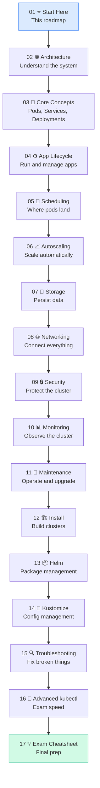
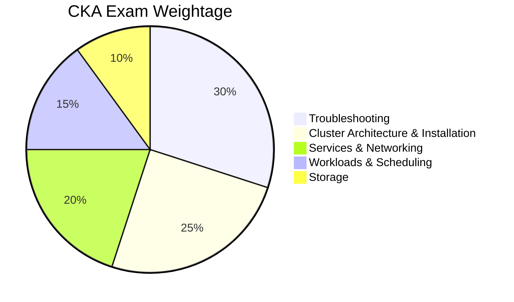

# Overview

This guide is structured for **complete beginners** — follow the chapters in order. Each chapter builds on the previous one. Don't skip ahead!

---

## How Long Will This Take?

[Table Not Rendered - Unsupported Block]

---

## The Learning Path



---

## Chapter Map

[Table Not Rendered - Unsupported Block]

---

## CKA Exam Domain Weights (2025/2026)



> 💡 **Troubleshooting is worth 30% of the exam** — don’t neglect Chapter 15!

---

## Beginner Tips Before You Start

1. **Read every chapter top to bottom** — don’t jump around
1. **Type every command yourself** — muscle memory matters for the exam
1. **Use **[**killer.sh**](http://killer.sh/) — comes free with your CKA registration (2 attempts)
1. **Practice **`**--dry-run=client -o yaml**` on every resource until it’s automatic
1. **Bookmark **[**kubernetes.io/docs**](http://kubernetes.io/docs) — you can use it during the exam
1. **Set your aliases on exam day** immediately:
```bash
alias k=kubectl
export do='--dry-run=client -o yaml'
export now='--force --grace-period=0'
source <(kubectl completion bash)
complete -F __start_kubectl k
```

---

> 📚 **Exam Registration:** [training.linuxfoundation.org/certification/certified-kubernetes-administrator-cka](http://training.linuxfoundation.org/certification/certified-kubernetes-administrator-cka)

> 

> 🧠 **Official Docs:** [kubernetes.io/docs](http://kubernetes.io/docs) — allowed during exam

> 

> 🧪 **Practice Platform:** [killer.sh](http://killer.sh/) — 2 free sessions with exam registration

