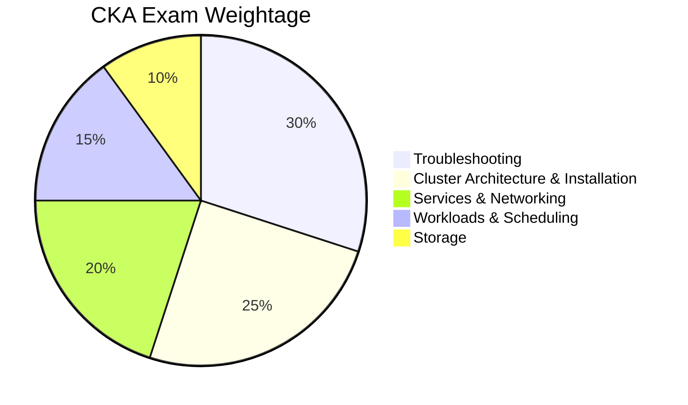

# CKA Exam Domain Weights (2025/2026)

```mermaid
pie title CKA Exam Weightage
    "Troubleshooting" : 30
    "Cluster Architecture & Installation" : 25
    "Services & Networking" : 20
    "Workloads & Scheduling" : 15
    "Storage" : 10
```

> 💡 **Troubleshooting is worth 30% of the exam** — don’t neglect Chapter 15!

---
