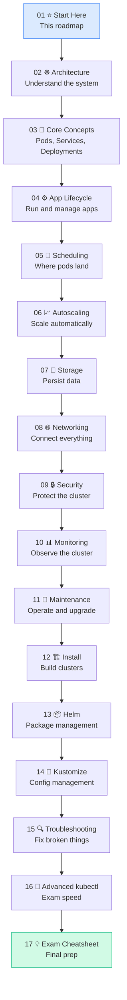

# The Learning Path

```mermaid
flowchart TD
    A["01 ⭐ Start Here\nThis roadmap"] --> B["02 ☸️ Architecture\nUnderstand the system"]
    B --> C["03 🧡 Core Concepts\nPods, Services, Deployments"]
    C --> D["04 ⚙️ App Lifecycle\nRun and manage apps"]
    D --> E["05 📅 Scheduling\nWhere pods land"]
    E --> F["06 📈 Autoscaling\nScale automatically"]
    F --> G["07 💾 Storage\nPersist data"]
    G --> H["08 🌐 Networking\nConnect everything"]
    H --> I["09 🔒 Security\nProtect the cluster"]
    I --> J["10 📊 Monitoring\nObserve the cluster"]
    J --> K["11 🔧 Maintenance\nOperate and upgrade"]
    K --> L["12 🏗️ Install\nBuild clusters"]
    L --> M["13 📦 Helm\nPackage management"]
    M --> N["14 🔧 Kustomize\nConfig management"]
    N --> O["15 🔍 Troubleshooting\nFix broken things"]
    O --> P["16 📐 Advanced kubectl\nExam speed"]
    P --> Q["17 💡 Exam Cheatsheet\nFinal prep"]

    style A fill:#dbeafe,stroke:#3b82f6
    style Q fill:#d1fae5,stroke:#10b981
```

---
