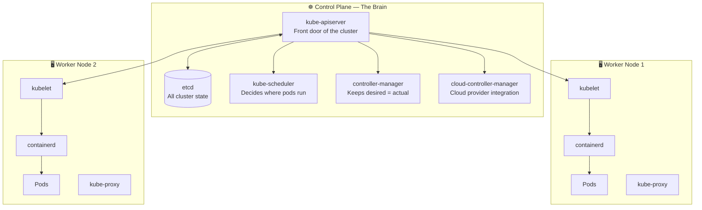
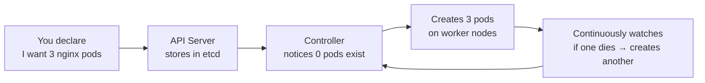

# 2.1 Cluster Components Overview

> Part of **02 ☸️ Kubernetes Architecture** | CKA Chapter 2

A complete bird's-eye view of every component in a Kubernetes cluster and how they relate to each other.

---

# What is Kubernetes?

Kubernetes is a **container orchestration platform** — it automates deploying, scaling, and managing containerised applications. You tell it *what* you want (desired state), and it continuously works to make reality match that.



---

# Control Plane vs Worker Nodes


> ⚠️ **Notice:** Table content could not be synced from Notion due to integration permission restrictions.

## Control Plane Components


| Component | Role | Stateless? |
| --- | --- | --- |
| kube-apiserver | Front door — all communication goes through it | ✅ Yes — can scale horizontally |
| etcd | Key-value store — stores ALL cluster state | ❌ No — has persistent state |
| kube-scheduler | Picks which node a new pod runs on | ✅ Yes |
| kube-controller-manager | Runs reconciliation loops | ✅ Yes |
| cloud-controller-manager | Integrates with cloud provider APIs | ✅ Yes |

## Worker Node Components


| Component | Role |
| --- | --- |
| kubelet | Node agent — starts/stops containers, reports status |
| kube-proxy | Handles Service networking (iptables/IPVS rules) |
| Container Runtime | Actually runs containers (containerd, CRI-O) |

---

# The Golden Rule — Desired State



> 💡 You never say **how** to do things — you say **what** you want. Kubernetes figures out the how.

---

# Quick Command Reference

```bash
# See all nodes in your cluster
kubectl get nodes
kubectl get nodes -o wide          # with IPs and OS info

# See control plane pods
kubectl get pods -n kube-system

# Component health
kubectl get componentstatuses

# Cluster info
kubectl cluster-info
```

