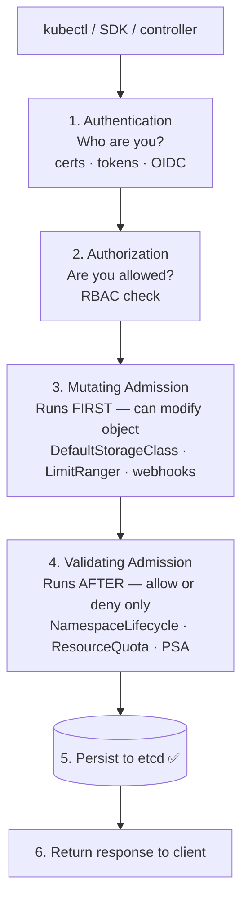
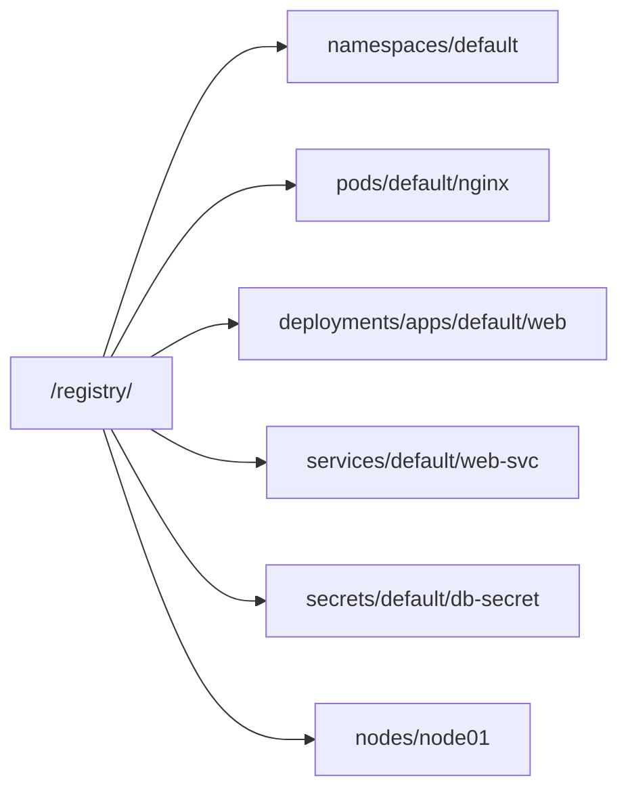
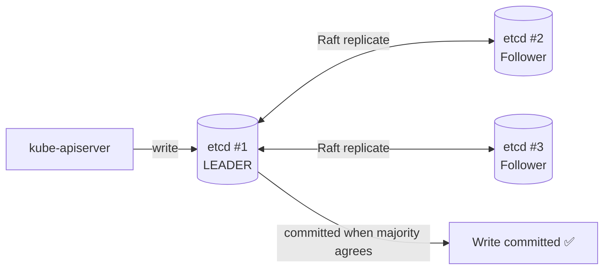

# 2.2 kube-apiserver & etcd

> Part of **02 ☸️ Kubernetes Architecture** | CKA Chapter 2

---

# kube-apiserver — The Front Door

Every single operation in Kubernetes goes through the API server. It is the **only** component that reads and writes to etcd.

## What it does

* Exposes the Kubernetes REST API on port `6443`
* Authenticates every request (who are you?)
* Authorizes every request (are you allowed?)
* Runs admission controllers (should this be allowed/modified?)
* Persists validated objects to etcd
* Notifies watching components via the Watch API
## API Request Flow



> ⚠️ **Mutating webhooks ALWAYS run before Validating webhooks.** Validators see the final mutated object.

## Key Facts

* Stateless → can run multiple replicas behind a load balancer (HA setup)
* Uses **Watch API** — components register watches, get push notifications on changes
* Exposed via HTTPS only — client must present a valid certificate
```bash
# Check if API server is healthy
curl -k https://localhost:6443/healthz

# View API server static pod manifest
cat /etc/kubernetes/manifests/kube-apiserver.yaml

# View API server logs
kubectl logs -n kube-system kube-apiserver-controlplane
```

---

# etcd — The Source of Truth

etcd is a **distributed key-value store** using the Raft consensus algorithm. It stores 100% of cluster state.

## What gets stored in etcd?

Everything — pods, deployments, services, configmaps, secrets, nodes, RBAC rules, custom resources.



## Raft Consensus — How HA etcd Works



> ✅ Always use **odd numbers** of etcd nodes. 3 is the minimum for production.

## Key Facts

* Only `kube-apiserver` talks to etcd directly
* Strongly consistent — reads always return the latest committed value
* Runs on port `2379` (client) and `2380` (peer)
```bash
# Check etcd health
export ETCDCTL_API=3
etcdctl endpoint health \
  --endpoints=https://127.0.0.1:2379 \
  --cacert=/etc/kubernetes/pki/etcd/ca.crt \
  --cert=/etc/kubernetes/pki/etcd/server.crt \
  --key=/etc/kubernetes/pki/etcd/server.key

# List all keys stored in etcd
etcdctl get / --prefix --keys-only \
  --endpoints=https://127.0.0.1:2379 \
  --cacert=/etc/kubernetes/pki/etcd/ca.crt \
  --cert=/etc/kubernetes/pki/etcd/server.crt \
  --key=/etc/kubernetes/pki/etcd/server.key

# View etcd static pod
cat /etc/kubernetes/manifests/etcd.yaml
```

