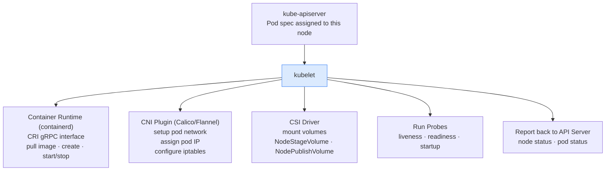
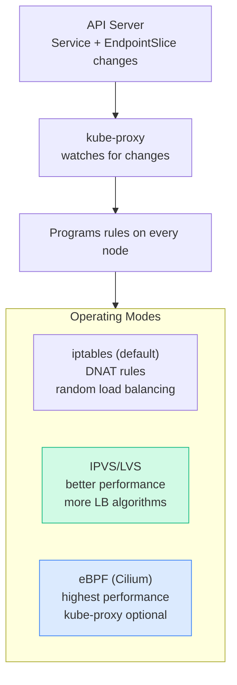

# 2.4 kubelet, kube-proxy & Container Runtime

> Part of **02 ☸️ Kubernetes Architecture** | CKA Chapter 2

These three components run on **every worker node** and handle the actual work of running containers.

---

# kubelet — The Node Agent

The kubelet is the most important component on a worker node. It's the bridge between the control plane and the containers actually running on the node.

## What kubelet does



## kubelet Key Facts

* Runs as a **systemd service** (not a static pod)
* Watches API Server for pods assigned to its node
* Calls **CRI** (Container Runtime Interface) to manage containers
* Calls **CNI** to set up pod networking
* Calls **CSI** to mount volumes
* Runs health probes and restarts containers on failure
* Reports node conditions: `Ready`, `MemoryPressure`, `DiskPressure`, `PIDPressure`
```bash
# Check kubelet status
systemctl status kubelet
journalctl -u kubelet -f              # live logs
journalctl -u kubelet --no-pager | tail -30

# Kubelet config
cat /etc/kubernetes/kubelet.conf
cat /var/lib/kubelet/config.yaml

# Restart kubelet after config changes
systemctl daemon-reload
systemctl restart kubelet
```

---

# kube-proxy — Service Networking

kube-proxy runs on every node and maintains network rules so that traffic to a Service ClusterIP gets routed to the correct backend Pod.

## How kube-proxy works



```bash
# Check kube-proxy mode
kubectl get cm -n kube-system kube-proxy -o yaml | grep mode

# View kube-proxy pods (DaemonSet — one per node)
kubectl get pods -n kube-system -l k8s-app=kube-proxy

# Check iptables rules for a service
iptables -t nat -L KUBE-SERVICES -n | grep <service-cluster-ip>
```

---

# Container Runtime — CRI

The container runtime is what actually creates and runs containers on the node.

## Container Runtime Interface (CRI)

kubelet uses a **gRPC API** called CRI to talk to any compliant runtime — it doesn't care which one you use.

[Table Not Rendered - Unsupported Block]

```bash
# Check which runtime is in use
kubectl get nodes -o wide
# CONTAINER-RUNTIME column shows: containerd://1.7.x

# Interact with containerd directly (on the node)
crictl ps                             # list running containers
crictl images                         # list cached images
crictl logs <container-id>            # container logs
crictl inspect <container-id>         # full container info

# Pull image
crictl pull nginx:1.25
```

