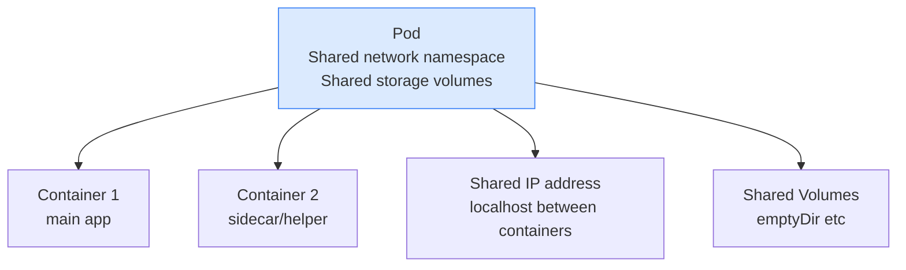

# 3.1 Pods

> Part of **03 🧠 Core Concepts** | CKA Chapter 3

A Pod is the **smallest deployable unit** in Kubernetes. Every container you run lives inside a Pod.

---

# What is a Pod?



* Containers inside a pod **share the same IP address** — they talk to each other via `localhost`
* Containers inside a pod **share volumes** — they can read/write the same files
* A pod is **ephemeral** — if it dies, it's gone. Use Deployments for self-healing.
---

# Create a Pod

```bash
# Imperative — fastest way
kubectl run nginx --image=nginx:1.25

# With port exposed
kubectl run nginx --image=nginx:1.25 --port=80

# Generate YAML without creating (exam trick)
kubectl run nginx --image=nginx:1.25 --dry-run=client -o yaml

# Generate and save to file
kubectl run nginx --image=nginx:1.25 --dry-run=client -o yaml > pod.yaml
kubectl apply -f pod.yaml
```

```yaml
# pod.yaml — basic pod
apiVersion: v1
kind: Pod
metadata:
  name: nginx
  labels:
    app: web
spec:
  containers:
  - name: nginx
    image: nginx:1.25
    ports:
    - containerPort: 80
    resources:
      requests:
        cpu: 100m
        memory: 128Mi
      limits:
        cpu: 500m
        memory: 256Mi
```

---

# Pod Commands

```bash
# List pods
kubectl get pods
kubectl get pods -o wide           # with node + IP info
kubectl get pods -A                # all namespaces
kubectl get pods -n kube-system    # specific namespace
kubectl get pods -w                # watch live

# Inspect a pod
kubectl describe pod nginx         # full detail + events
kubectl get pod nginx -o yaml      # raw YAML

# Logs
kubectl logs nginx
kubectl logs nginx -f              # follow/stream
kubectl logs nginx --previous      # previous crash

# Shell into a pod
kubectl exec -it nginx -- /bin/bash
kubectl exec -it nginx -- /bin/sh

# Delete
kubectl delete pod nginx
kubectl delete pod nginx --force --grace-period=0   # immediate
```

---

# Pod Status — What Do They Mean?

[Table Not Rendered - Unsupported Block]

