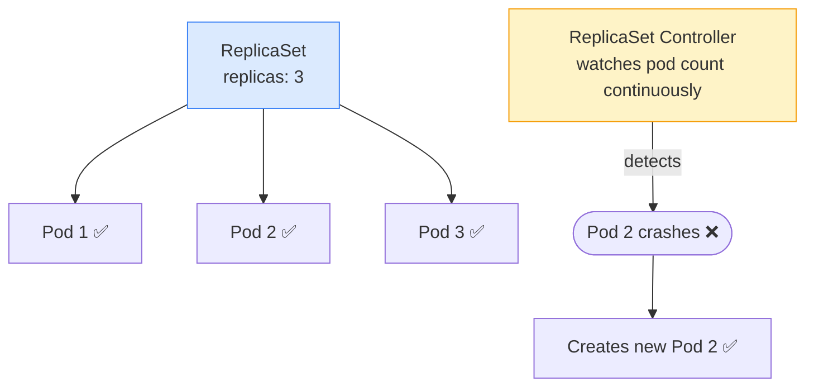
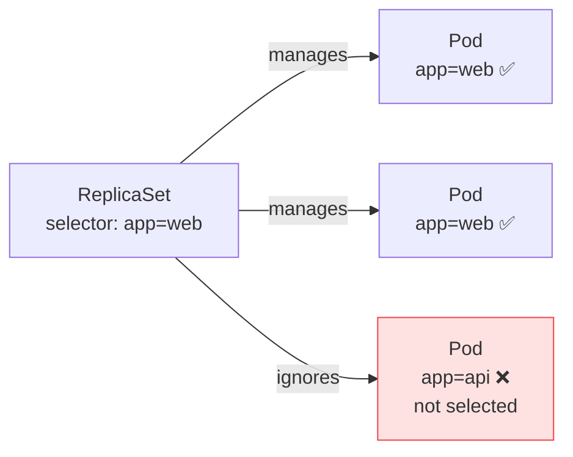

# 3.2 ReplicaSets

> Part of **03 🧠 Core Concepts** | CKA Chapter 3

ReplicaSets ensure a **specified number of pod replicas** are always running at any time.

---

# What is a ReplicaSet?



> **In practice:** You almost never create ReplicaSets directly. You use **Deployments** instead — they manage ReplicaSets for you and add rolling updates + rollback.

---

# ReplicaSet YAML

```yaml
apiVersion: apps/v1
kind: ReplicaSet
metadata:
  name: web-rs
spec:
  replicas: 3
  selector:
    matchLabels:
      app: web          # select pods with this label
  template:
    metadata:
      labels:
        app: web        # pods MUST have this label
    spec:
      containers:
      - name: nginx
        image: nginx:1.25
```

---

# Key Commands

```bash
kubectl get replicasets
kubectl get rs
kubectl describe rs web-rs

# Scale
kubectl scale rs web-rs --replicas=5

# Delete RS (does NOT delete pods unless --cascade=foreground)
kubectl delete rs web-rs
```

---

# How Selector Works



> ⚠️ **Warning:** If you manually create pods with the same label as a ReplicaSet's selector, the RS will count them and may delete some to maintain the desired count.

