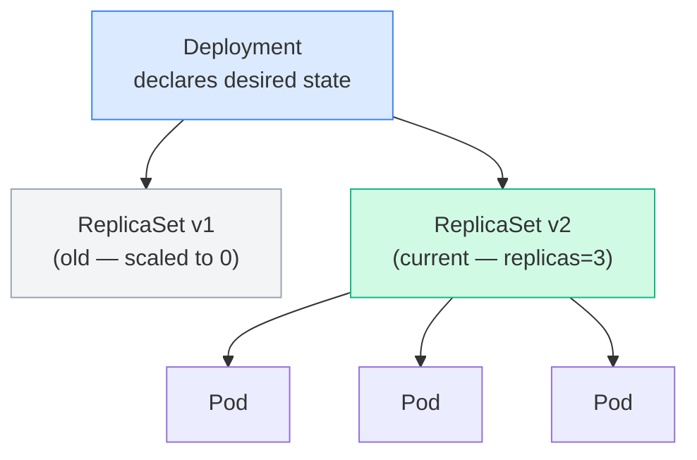
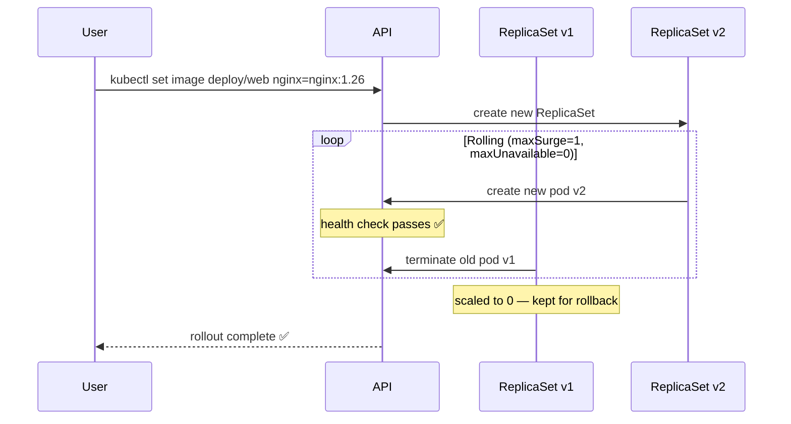

# 3.3 Deployments

> Part of **03 🧠 Core Concepts** | CKA Chapter 3

Deployments are the **primary way to run stateless applications** in Kubernetes. They add rolling updates and rollbacks on top of ReplicaSets.

---

# Deployment → ReplicaSet → Pod



---

# Create a Deployment

```bash
# Imperative
kubectl create deployment web --image=nginx:1.25 --replicas=3

# Generate YAML
kubectl create deployment web --image=nginx:1.25 --replicas=3 \
  --dry-run=client -o yaml > deployment.yaml
```

```yaml
apiVersion: apps/v1
kind: Deployment
metadata:
  name: web
spec:
  replicas: 3
  selector:
    matchLabels:
      app: web
  strategy:
    type: RollingUpdate
    rollingUpdate:
      maxSurge: 1          # max extra pods during update
      maxUnavailable: 0    # max pods down during update
  template:
    metadata:
      labels:
        app: web
    spec:
      containers:
      - name: nginx
        image: nginx:1.25
        ports:
        - containerPort: 80
        resources:
          requests:
            cpu: 100m
            memory: 128Mi
          limits:
            cpu: 500m
            memory: 256Mi
```

---

# Rolling Update Flow



---

# Key Commands

```bash
# Create + manage
kubectl create deployment web --image=nginx:1.25 --replicas=3
kubectl get deployments
kubectl describe deployment web

# Scale
kubectl scale deployment web --replicas=5

# Update image
kubectl set image deployment/web nginx=nginx:1.26

# Rollout
kubectl rollout status deployment/web
kubectl rollout history deployment/web
kubectl rollout undo deployment/web
kubectl rollout undo deployment/web --to-revision=1

# Pause/resume (batch multiple changes)
kubectl rollout pause deployment/web
kubectl rollout resume deployment/web

# Delete
kubectl delete deployment web
```

