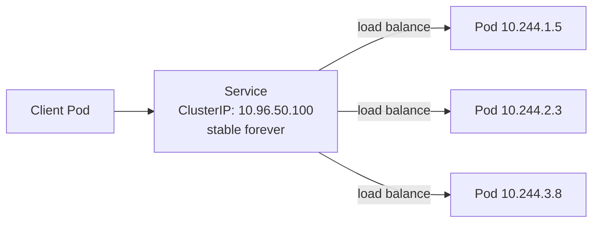
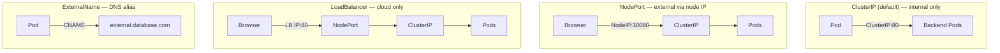

# 3.4 Services — ClusterIP, NodePort, LoadBalancer

> Part of **03 🧠 Core Concepts** | CKA Chapter 3

Services give pods a **stable network identity** — a fixed IP address and DNS name that doesn't change even as pods come and go.

---

# Why Services?

Pods are ephemeral — they get new IP addresses every time they restart. A Service provides a **stable virtual IP (ClusterIP)** that always routes to healthy pods.



---

# Service Types



---

# Service YAML

```yaml
# ClusterIP (default)
apiVersion: v1
kind: Service
metadata:
  name: web-svc
spec:
  type: ClusterIP          # default — omit for same result
  selector:
    app: web               # routes to pods with this label
  ports:
  - port: 80               # service port (what clients connect to)
    targetPort: 8080       # container port (what app listens on)
    protocol: TCP
```

```yaml
# NodePort
apiVersion: v1
kind: Service
metadata:
  name: web-nodeport
spec:
  type: NodePort
  selector:
    app: web
  ports:
  - port: 80
    targetPort: 8080
    nodePort: 30080        # optional: 30000-32767 range
```

---

# Key Commands

```bash
# Create service
kubectl expose deployment web --port=80 --target-port=8080
kubectl expose deployment web --port=80 --type=NodePort
kubectl expose pod nginx --port=80 --name=nginx-svc

# Inspect
kubectl get services
kubectl get svc
kubectl describe svc web-svc

# Check actual pod IPs behind service
kubectl get endpoints web-svc
kubectl get endpointslices -l kubernetes.io/service-name=web-svc

# Test service DNS from inside cluster
kubectl exec -it busybox -- nslookup web-svc
kubectl exec -it busybox -- curl http://web-svc.default.svc.cluster.local
```

