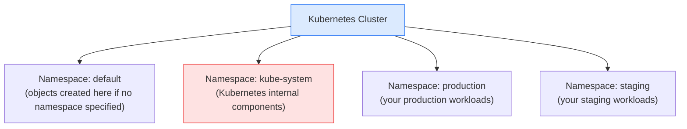

# 3.5 Namespaces

> Part of **03 🧠 Core Concepts** | CKA Chapter 3

Namespaces are **virtual clusters** within a physical cluster — a way to divide cluster resources between multiple teams, projects, or environments.

---

# What are Namespaces?



## Default Namespaces

[Table Not Rendered - Unsupported Block]

---

# Namespaced vs Cluster-Scoped Resources

[Table Not Rendered - Unsupported Block]

```bash
# Check if a resource is namespaced
kubectl api-resources --namespaced=true
kubectl api-resources --namespaced=false
```

---

# Key Commands

```bash
# List namespaces
kubectl get namespaces
kubectl get ns

# Create namespace
kubectl create namespace production
kubectl create ns staging

# Work in a namespace
kubectl get pods -n production
kubectl get all -n production

# Set default namespace for your session
kubectl config set-context --current --namespace=production

# Get everything across all namespaces
kubectl get pods -A
kubectl get all -A

# Delete namespace (deletes ALL resources inside it)
kubectl delete namespace staging
```

```yaml
# Namespace YAML
apiVersion: v1
kind: Namespace
metadata:
  name: production
```

---

# DNS Between Namespaces

```bash
# Same namespace — just use service name
curl http://web-svc

# Different namespace — use full DNS name
curl http://web-svc.production.svc.cluster.local

# Format: <service>.<namespace>.svc.cluster.local
```

