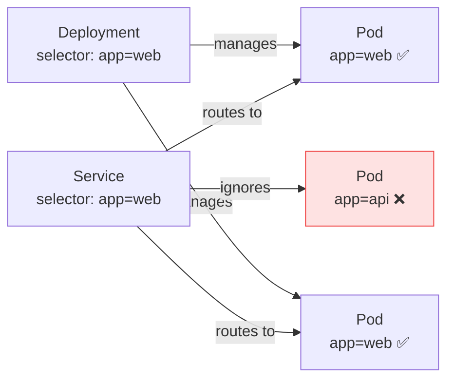

# 3.6 Labels, Selectors & Annotations

> Part of **03 🧠 Core Concepts** | CKA Chapter 3

Labels and selectors are the **glue** of Kubernetes — how resources find and relate to each other.

---

# Labels

Labels are **key-value pairs** attached to any Kubernetes object. They're used for identification, grouping, and selection.

```yaml
metadata:
  name: nginx-pod
  labels:
    app: web           # what app is this?
    version: v2        # what version?
    env: production    # what environment?
    tier: frontend     # what tier?
```

```bash
# Add/update a label
kubectl label pod nginx-pod env=production
kubectl label pod nginx-pod version=v2 --overwrite

# Remove a label
kubectl label pod nginx-pod env-

# Show labels
kubectl get pods --show-labels

# Filter by label
kubectl get pods -l app=web
kubectl get pods -l app=web,env=production
kubectl get pods -l 'app in (web,api)'
kubectl get pods -l 'env notin (dev,staging)'
```

---

# Selectors — How Resources Find Each Other



## Equality-based vs Set-based Selectors

```yaml
# Equality-based (used in Services)
selector:
  app: web
  env: production

# Set-based (used in Deployments/Jobs)
selector:
  matchLabels:
    app: web
  matchExpressions:
  - key: env
    operator: In
    values: [production, staging]
  - key: version
    operator: NotIn
    values: [v1]
  - key: beta
    operator: DoesNotExist
```

---

# Annotations

Annotations are also key-value pairs but for **non-identifying metadata** — used by tools, not for selection.

```yaml
metadata:
  annotations:
    # Tool metadata
    kubectl.kubernetes.io/last-applied-configuration: "..."
    # Ingress controller config
    nginx.ingress.kubernetes.io/rewrite-target: /
    # Human-readable info
    description: "Main web frontend for myapp"
    contact: "team-platform@company.com"
    git-commit: "abc123def"
```

