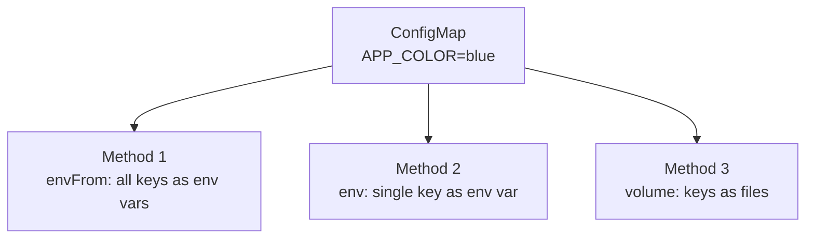

# 4.2 ConfigMaps

> Part of **04 ⚙️ Application Lifecycle Management** | CKA Chapter 4

ConfigMaps store **non-sensitive configuration** as key-value pairs. Decouple config from your container image.

---

# Create a ConfigMap

```bash
# From literals
kubectl create configmap app-config \
  --from-literal=APP_COLOR=blue \
  --from-literal=APP_MODE=production

# From a file
kubectl create configmap app-config --from-file=config.properties

# From a directory (each file becomes a key)
kubectl create configmap app-config --from-file=./config/

# View
kubectl get configmaps
kubectl describe configmap app-config
kubectl get configmap app-config -o yaml
```

```yaml
# Declarative ConfigMap
apiVersion: v1
kind: ConfigMap
metadata:
  name: app-config
data:
  APP_COLOR: blue
  APP_MODE: production
  DB_HOST: mysql-service
  # Multi-line value (e.g. a config file)
  config.properties: |
    color=blue
    mode=production
```

---

# Use ConfigMap in a Pod



```yaml
# Method 1 — inject ALL keys as env vars
spec:
  containers:
  - name: app
    image: myapp:v1
    envFrom:
    - configMapRef:
        name: app-config
```

```yaml
# Method 2 — inject single key
spec:
  containers:
  - name: app
    image: myapp:v1
    env:
    - name: APP_COLOR
      valueFrom:
        configMapKeyRef:
          name: app-config
          key: APP_COLOR
```

```yaml
# Method 3 — mount as files in a volume
spec:
  containers:
  - name: app
    image: myapp:v1
    volumeMounts:
    - name: config-vol
      mountPath: /etc/config
  volumes:
  - name: config-vol
    configMap:
      name: app-config
# Result: /etc/config/APP_COLOR contains "blue"
#         /etc/config/APP_MODE contains "production"
```

