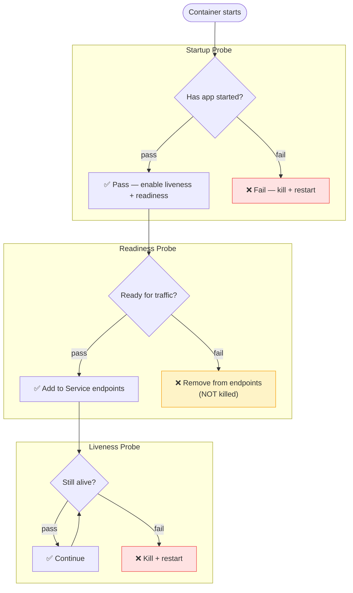

# 4.4 Liveness, Readiness & Startup Probes

> Part of **04 ⚙️ Application Lifecycle Management** | CKA Chapter 4

Probes let Kubernetes automatically detect and fix unhealthy containers.

---

# Three Probe Types



[Table Not Rendered - Unsupported Block]

---

# Probe Types (How to Check)

```yaml
# httpGet — makes an HTTP GET request
livenessProbe:
  httpGet:
    path: /healthz
    port: 8080
    httpHeaders:
    - name: X-Health-Check
      value: kubernetes
  initialDelaySeconds: 10    # wait before first check
  periodSeconds: 5           # check every 5s
  timeoutSeconds: 1          # timeout after 1s
  failureThreshold: 3        # fail 3 times before action
  successThreshold: 1        # 1 success to pass
```

```yaml
# tcpSocket — checks if port accepts connections
readinessProbe:
  tcpSocket:
    port: 3306
  initialDelaySeconds: 5
  periodSeconds: 10
```

```yaml
# exec — runs a command inside the container
livenessProbe:
  exec:
    command:
    - cat
    - /tmp/healthy
  initialDelaySeconds: 5
  periodSeconds: 5
```

---

# Full Example

```yaml
spec:
  containers:
  - name: app
    image: myapp:v2
    startupProbe:           # for slow-starting apps
      httpGet:
        path: /started
        port: 8080
      failureThreshold: 30
      periodSeconds: 10     # up to 5 min to start
    livenessProbe:
      httpGet:
        path: /healthz
        port: 8080
      initialDelaySeconds: 10
      periodSeconds: 5
      failureThreshold: 3
    readinessProbe:
      httpGet:
        path: /ready
        port: 8080
      initialDelaySeconds: 5
      periodSeconds: 5
      failureThreshold: 3
```

