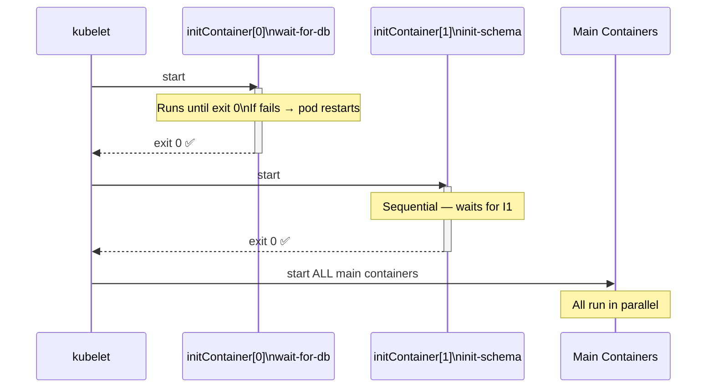

# 4.5 Init Containers

> Part of **04 ⚙️ Application Lifecycle Management** | CKA Chapter 4

Init containers run **sequentially before main containers start** — perfect for setup tasks like waiting for dependencies.

---

# Init Container Flow



## Rules

* Init containers run **one at a time, in order**
* Each must **exit 0 (success)** before the next starts
* If any init container fails → pod is restarted (per `restartPolicy`)
* Main containers **never start** until ALL init containers succeed
* Init containers can have **different images** from main containers
---

# Init Container YAML

```yaml
apiVersion: v1
kind: Pod
metadata:
  name: myapp
spec:
  initContainers:
  - name: wait-for-db
    image: busybox:1.28
    command: ['sh', '-c',
      'until nc -z mysql-service 3306; do echo waiting; sleep 2; done']

  - name: init-schema
    image: mysql:8
    command: ['sh', '-c',
      'mysql -h mysql-service -u root -p$DB_PASS < /schema/init.sql']
    env:
    - name: DB_PASS
      valueFrom:
        secretKeyRef:
          name: db-secret
          key: password

  containers:
  - name: app
    image: myapp:v2
    ports:
    - containerPort: 8080
```

```bash
# Watch init containers running
kubectl get pods -w
# NAME    READY   STATUS       RESTARTS
# myapp   0/1     Init:0/2     0   ← init container 1 running
# myapp   0/1     Init:1/2     0   ← init container 2 running
# myapp   0/1     PodInitializing  0
# myapp   1/1     Running      0   ← main container started

# Logs of init container
kubectl logs myapp -c wait-for-db
```

