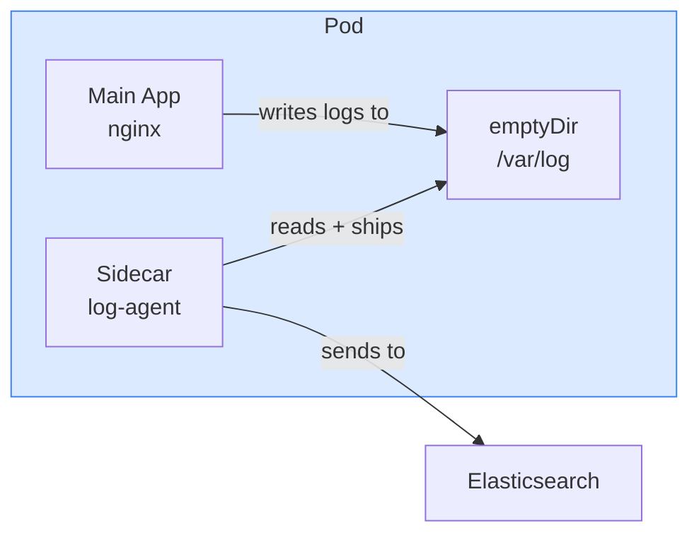
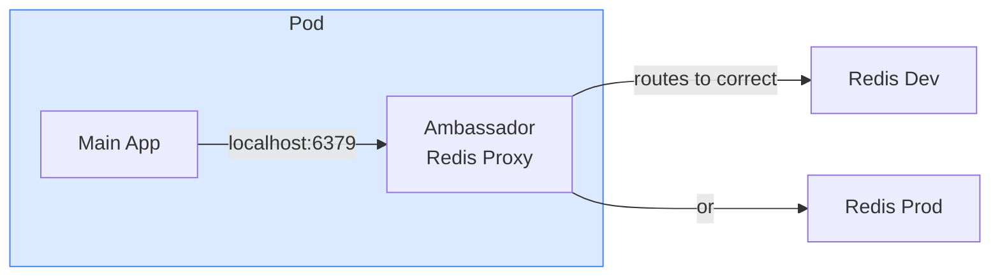
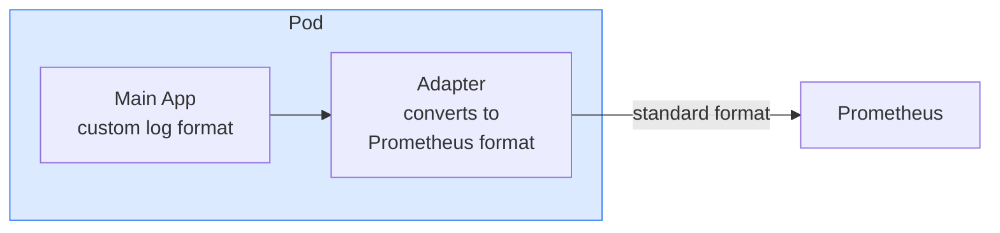

# 4.6 Multi-Container Pod Patterns

> Part of **04 ⚙️ Application Lifecycle Management** | CKA Chapter 4

Multiple containers in a single pod that work together — sharing network ([localhost](http://localhost/)) and volumes.

---

# Why Multi-Container Pods?

Sometimes a primary container needs a helper that:

* Ships its logs somewhere
* Acts as a network proxy
* Adapts data formats
These helpers run **alongside** the main container in the same pod, sharing the same IP and volumes.

---

# Pattern 1 — Sidecar

> Helper extends or enhances the main container. Most common pattern.



```yaml
spec:
  containers:
  - name: nginx
    image: nginx:1.25
    volumeMounts:
    - name: logs
      mountPath: /var/log/nginx
  - name: log-agent
    image: fluentd:latest
    volumeMounts:
    - name: logs
      mountPath: /var/log/nginx
  volumes:
  - name: logs
    emptyDir: {}
```

---

# Pattern 2 — Ambassador

> Proxy container that handles external communication for the main app.



```yaml
spec:
  containers:
  - name: app
    image: myapp:v1
    # app always connects to localhost:6379
  - name: redis-ambassador
    image: envoy:latest
    # proxy decides which Redis to route to
```

---

# Pattern 3 — Adapter

> Transforms the main container's output into a standard format.



---

# Key Differences

```bash
# Get logs from specific container in multi-container pod
kubectl logs <pod> -c <container-name>
kubectl logs <pod> --all-containers=true

# Exec into specific container
kubectl exec -it <pod> -c <container-name> -- /bin/sh
```

