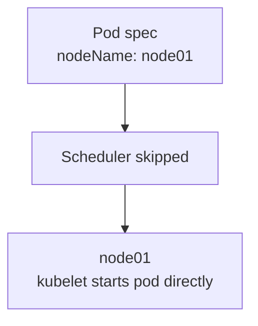
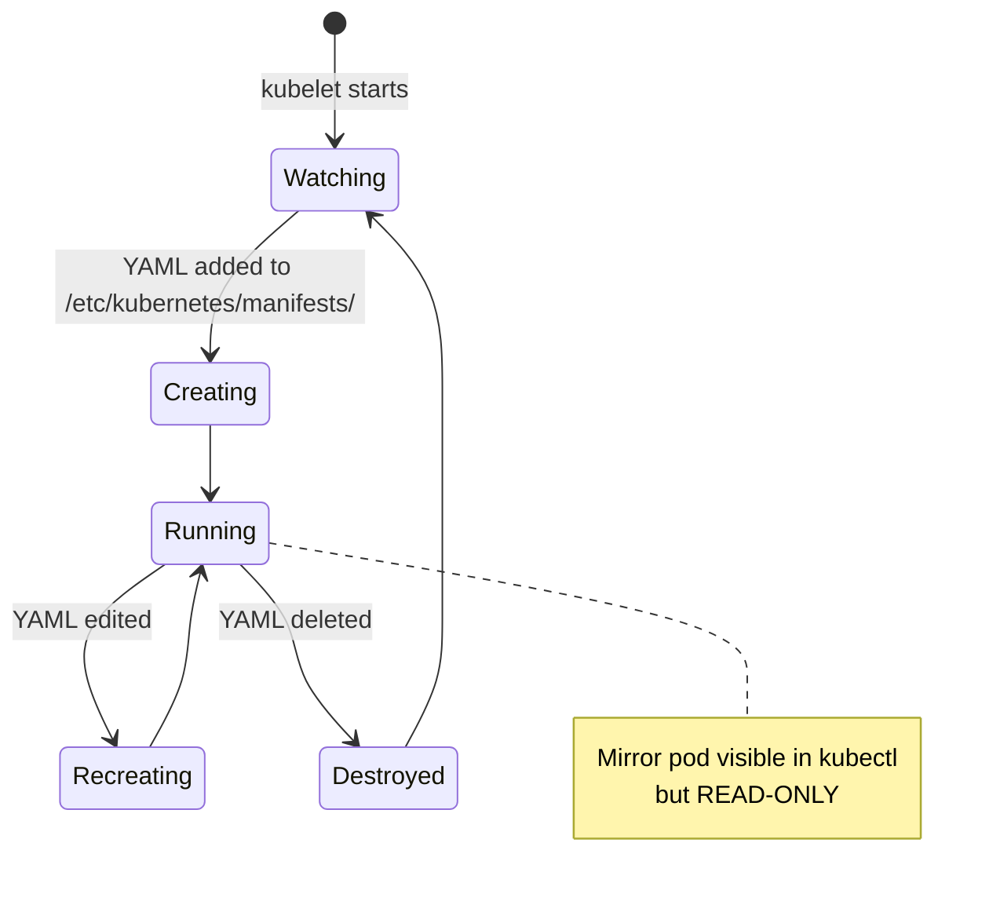

# 5.1 Manual Scheduling & Static Pods

> Part of **05 📅 Scheduling** | CKA Chapter 5

By default, the scheduler assigns pods to nodes. You can **bypass the scheduler** and assign a pod directly to a node using `nodeName`.

---

# Manual Scheduling with nodeName



```yaml
apiVersion: v1
kind: Pod
metadata:
  name: nginx
spec:
  nodeName: node01      # bypass scheduler entirely
  containers:
  - name: nginx
    image: nginx:1.25
```

> ⚠️ If the node doesn't exist or has no capacity, the pod stays Pending. `nodeName` is set **before** the pod is created.

```bash
# Check which node a pod is on
kubectl get pods -o wide

# Move a running pod to another node?
# Not possible directly — delete + recreate with new nodeName
```

---

# Static Pods

Static pods are managed **directly by kubelet** on a node — no API server needed. Used for control plane components (apiserver, etcd, scheduler, controller-manager).



```bash
# Static pod manifest directory
ls /etc/kubernetes/manifests/
# etcd.yaml  kube-apiserver.yaml  kube-controller-manager.yaml  kube-scheduler.yaml

# Create a static pod
vim /etc/kubernetes/manifests/my-static-pod.yaml
# kubelet auto-creates it

# Delete static pod (delete the file, not kubectl delete)
rm /etc/kubernetes/manifests/my-static-pod.yaml

# Mirror pods appear in kubectl but can't be edited via kubectl
kubectl get pods -n kube-system
# NAME                          READY
# etcd-controlplane             1/1    <- static pod
# kube-apiserver-controlplane   1/1    <- static pod
```

