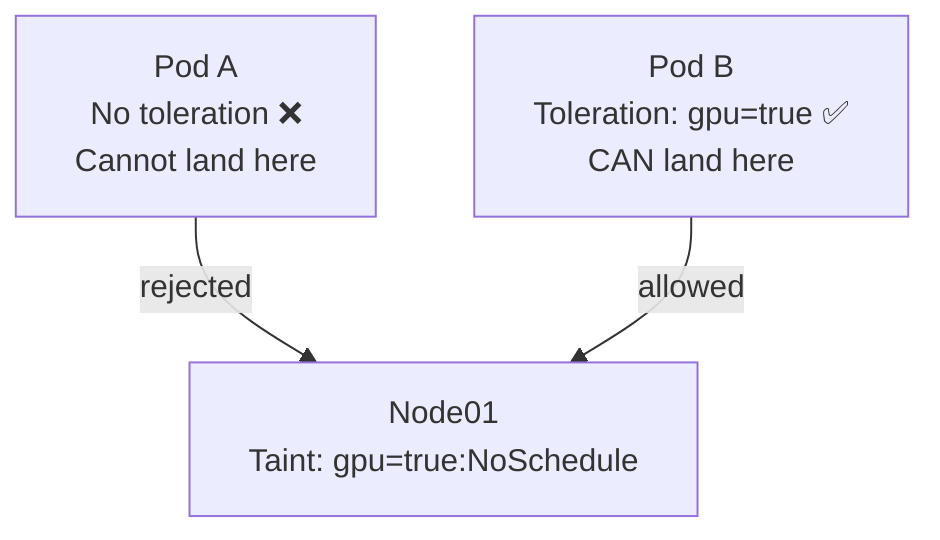

# 5.2 Taints & Tolerations

> Part of **05 📅 Scheduling** | CKA Chapter 5

Taints and tolerations control **which pods can land on which nodes**.

---

# How It Works



> **Think of it as:** Taint = "keep away" sign on a node. Toleration = pod has the key to ignore that sign.

---

# Taint Effects


| Effect | Meaning |
| --- | --- |
| NoSchedule | New pods without toleration won't be scheduled here |
| PreferNoSchedule | Scheduler tries to avoid, but not guaranteed |
| NoExecute | New pods blocked + existing pods without toleration evicted |

---

# Commands

```bash
# Add a taint to a node
kubectl taint nodes node01 gpu=true:NoSchedule
kubectl taint nodes node01 env=production:NoExecute

# Remove a taint (append -)
kubectl taint nodes node01 gpu=true:NoSchedule-

# View taints on a node
kubectl describe node node01 | grep -A5 Taints

# Control plane is tainted by default (why pods don't land there)
kubectl describe node controlplane | grep Taint
# Taints: node-role.kubernetes.io/control-plane:NoSchedule
```

---

# Toleration in Pod Spec

```yaml
spec:
  tolerations:
  - key: "gpu"
    operator: "Equal"
    value: "true"
    effect: "NoSchedule"

  # Tolerate ANY taint with key=gpu
  - key: "gpu"
    operator: "Exists"
    effect: "NoSchedule"

  # Tolerate ALL taints (use with care)
  - operator: "Exists"
```

---

# ⚠️ Important Limitation

Taints & tolerations **only prevent scheduling** (block pods from nodes). They do NOT guarantee a pod goes to a specific node. For that, use **Node Affinity** (next lesson) combined with taints.

