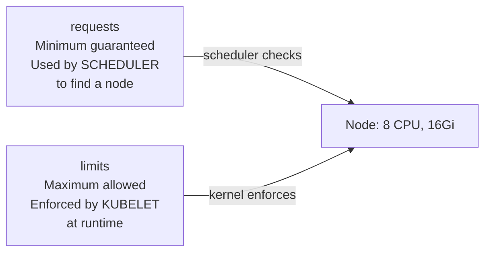
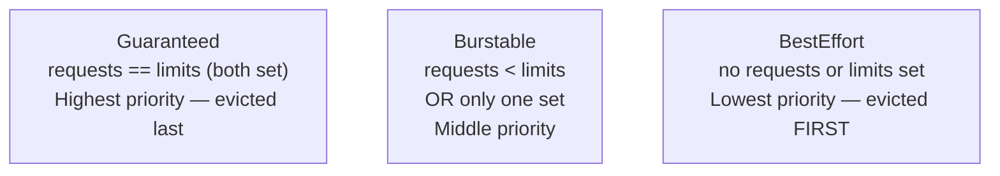

# 5.4 Resource Requests, Limits & QoS

> Part of **05 📅 Scheduling** | CKA Chapter 5

Resource requests and limits tell the scheduler how much CPU/memory a container needs and enforce usage caps.

---

# Requests vs Limits



```yaml
spec:
  containers:
  - name: app
    image: myapp:v2
    resources:
      requests:
        cpu: "250m"        # 250 millicores = 0.25 CPU
        memory: "256Mi"    # 256 Mebibytes
      limits:
        cpu: "500m"        # max 0.5 CPU
        memory: "512Mi"    # max 512Mi — OOMKilled if exceeded
```

---

# CPU vs Memory Enforcement


> ⚠️ **Notice:** Table content could not be synced from Notion due to integration permission restrictions.

---

# QoS Classes

Kubernetes assigns a **Quality of Service** class based on requests/limits — determines eviction priority under node pressure.



```bash
# Check QoS class
kubectl get pod myapp -o jsonpath='{.status.qosClass}'
# Guaranteed | Burstable | BestEffort

# Check node resource usage
kubectl top nodes
kubectl top pods

# See what's allocated on a node
kubectl describe node node01 | grep -A10 'Allocated resources'
```

---

# LimitRange — Set Defaults Per Namespace

```yaml
apiVersion: v1
kind: LimitRange
metadata:
  name: default-limits
  namespace: production
spec:
  limits:
  - type: Container
    default:           # applied if no limits set
      cpu: 500m
      memory: 256Mi
    defaultRequest:    # applied if no requests set
      cpu: 100m
      memory: 128Mi
    max:               # hard ceiling
      cpu: 2
      memory: 2Gi
```

