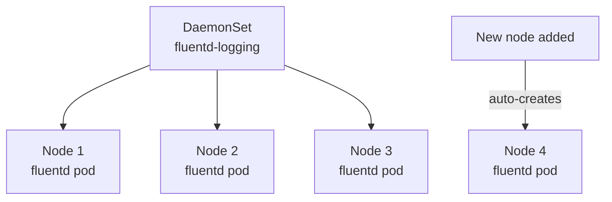

# 5.5 DaemonSets

> Part of **05 📅 Scheduling** | CKA Chapter 5

DaemonSets ensure **exactly one pod runs on every node** — perfect for node-level agents.

---

# How DaemonSets Work



* When a **new node joins**, DaemonSet automatically creates a pod on it
* When a **node is removed**, the pod is garbage collected
* DaemonSet pods **bypass the scheduler** (they go to every node)
---

# Common Use Cases

---

# DaemonSet YAML

```yaml
apiVersion: apps/v1
kind: DaemonSet
metadata:
  name: fluentd-logging
  namespace: kube-system
spec:
  selector:
    matchLabels:
      name: fluentd
  template:
    metadata:
      labels:
        name: fluentd
    spec:
      tolerations:
      # Allow on control plane nodes too
      - key: node-role.kubernetes.io/control-plane
        operator: Exists
        effect: NoSchedule
      containers:
      - name: fluentd
        image: fluent/fluentd:v1.16
        resources:
          requests:
            cpu: 100m
            memory: 200Mi
          limits:
            memory: 500Mi
        volumeMounts:
        - name: varlog
          mountPath: /var/log
      volumes:
      - name: varlog
        hostPath:
          path: /var/log
```

```bash
kubectl get daemonsets
kubectl get ds
kubectl get ds -n kube-system
kubectl describe ds fluentd-logging -n kube-system

# How many pods are running?
kubectl get ds fluentd-logging -n kube-system
# NAME              DESIRED   CURRENT   READY
# fluentd-logging   3         3         3
```

