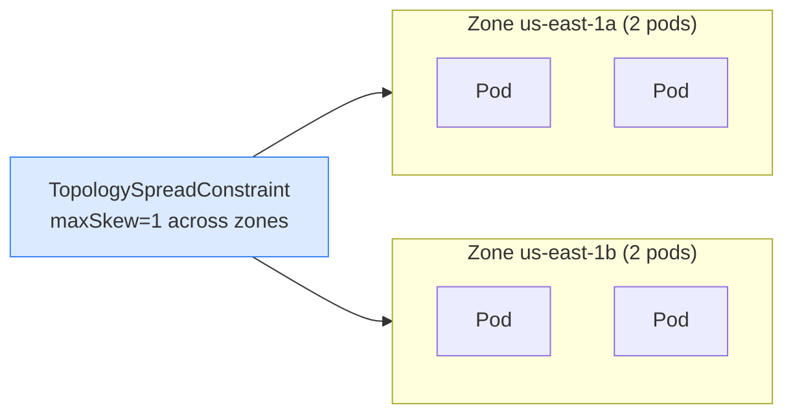
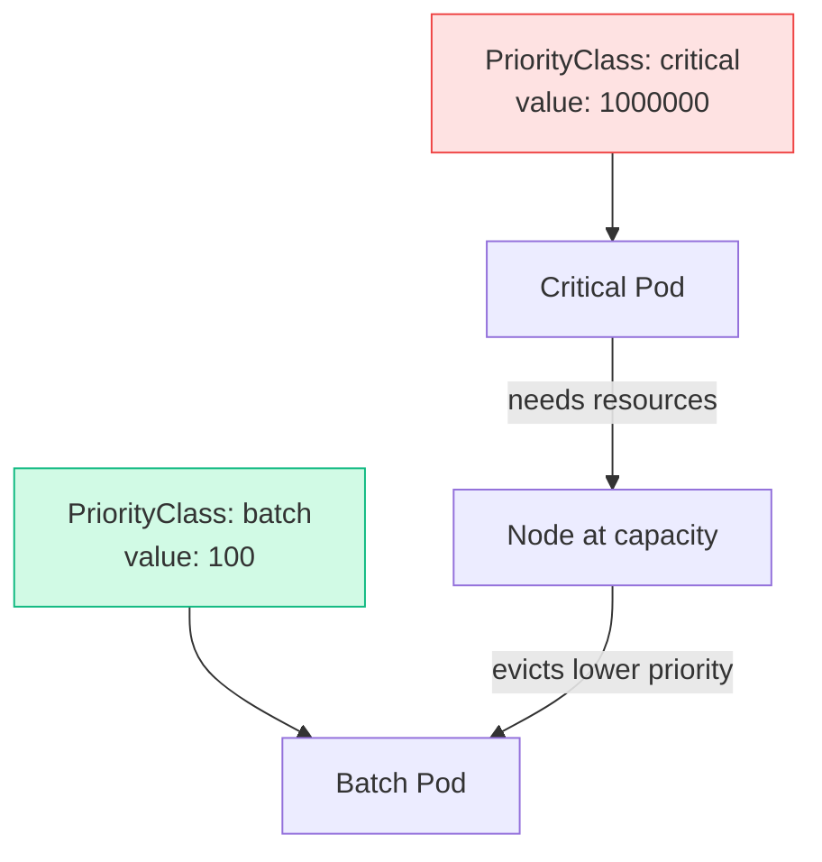

# 5.6 TopologySpreadConstraints & PriorityClass

> Part of **05 📅 Scheduling** | CKA Chapter 5

---

# TopologySpreadConstraints

Spread pods evenly across **zones, nodes, or any topology key** — prevents all replicas landing on one node/zone.



```yaml
spec:
  topologySpreadConstraints:
  - maxSkew: 1
    topologyKey: topology.kubernetes.io/zone
    whenUnsatisfiable: DoNotSchedule
    labelSelector:
      matchLabels:
        app: web
  - maxSkew: 1
    topologyKey: kubernetes.io/hostname
    whenUnsatisfiable: ScheduleAnyway
    labelSelector:
      matchLabels:
        app: web
```

[Table Not Rendered - Unsupported Block]

---

# PriorityClass

Control which pods get scheduled first and which get **evicted first** under resource pressure.



```yaml
apiVersion: scheduling.k8s.io/v1
kind: PriorityClass
metadata:
  name: critical-priority
value: 1000000
globalDefault: false
preemptionPolicy: PreemptLowerPriority
description: "Critical production workloads"
---
# Use in Pod
spec:
  priorityClassName: critical-priority
  containers:
  - name: app
    image: myapp:v2
```

```bash
kubectl get priorityclasses
# System built-ins (never delete):
# system-cluster-critical  → CoreDNS, kube-proxy
# system-node-critical     → static pods
```

