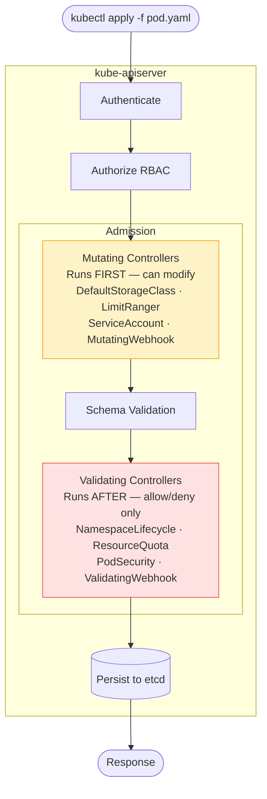

# 5.7 Admission Controllers

> Part of **05 📅 Scheduling** | CKA Chapter 5

Admission controllers intercept API requests **after auth/authz** and can mutate or reject them.

---

# Admission Controller Flow



---

# Common Built-in Controllers

[Table Not Rendered - Unsupported Block]

---

# Custom Admission Webhooks

```yaml
# MutatingWebhookConfiguration
apiVersion: admissionregistration.k8s.io/v1
kind: MutatingWebhookConfiguration
metadata:
  name: my-mutating-webhook
webhooks:
- name: inject-sidecar.company.com
  clientConfig:
    service:
      name: webhook-svc
      namespace: webhook
      path: /mutate
    caBundle: <base64-ca>
  rules:
  - apiGroups: [""]
    apiVersions: ["v1"]
    operations: ["CREATE"]
    resources: ["pods"]
  admissionReviewVersions: ["v1"]
  sideEffects: None
```

```bash
# See which admission plugins are enabled
kubectl get pod kube-apiserver-controlplane -n kube-system -o yaml \
  | grep enable-admission

# Check admission webhooks
kubectl get mutatingwebhookconfigurations
kubectl get validatingwebhookconfigurations
```

