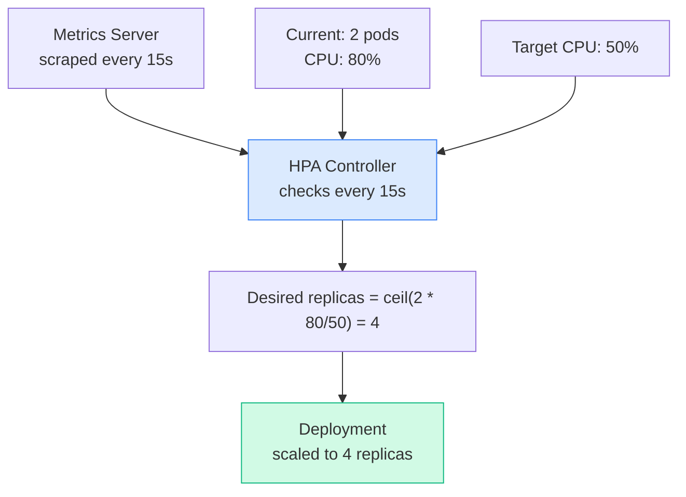
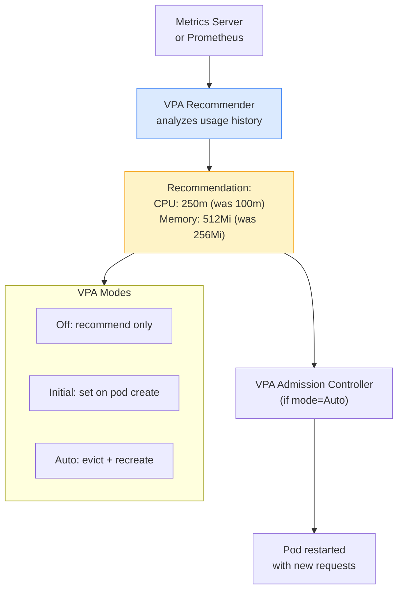
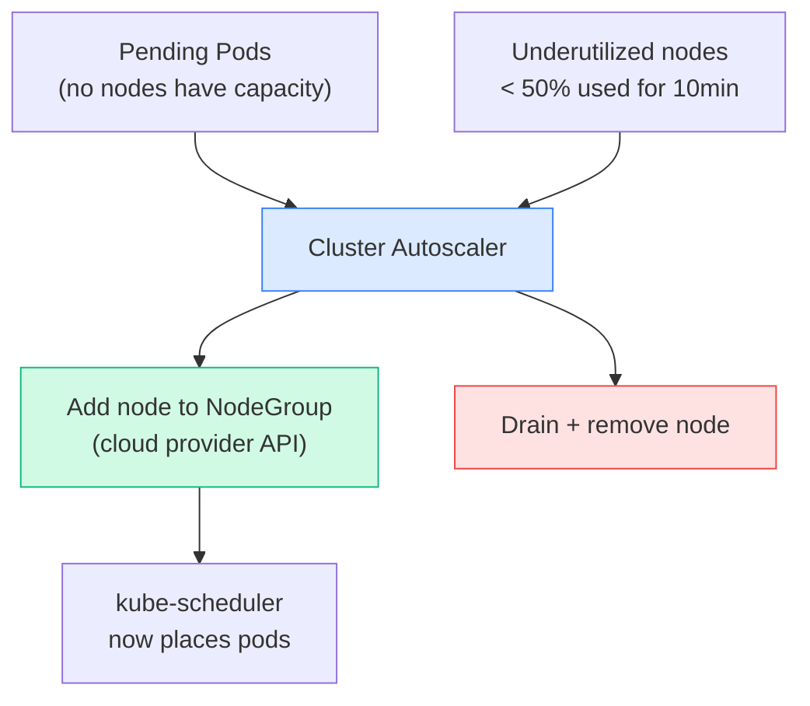

# Overview

> **Source:** CKA 2025/2026 Exam Curriculum | 📅 June 2026

All mechanisms for automatically scaling workloads in Kubernetes — HPA (horizontal), VPA (vertical), and KEDA (event-driven).

---

# 1. HorizontalPodAutoscaler (HPA)

Automatically scales **the number of pod replicas** based on observed CPU, memory, or custom metrics.



## Create HPA Imperative

```bash
# Create HPA targeting 50% CPU
kubectl autoscale deployment myapp \
  --cpu-percent=50 \
  --min=2 \
  --max=10

# Check HPA status
kubectl get hpa
# NAME    REFERENCE          TARGETS   MINPODS   MAXPODS   REPLICAS
# myapp   Deployment/myapp   80%/50%   2         10        4

kubectl describe hpa myapp
```

## HPA YAML (autoscaling/v2 — current API)

```yaml
apiVersion: autoscaling/v2
kind: HorizontalPodAutoscaler
metadata:
  name: myapp-hpa
spec:
  scaleTargetRef:
    apiVersion: apps/v1
    kind: Deployment
    name: myapp
  minReplicas: 2
  maxReplicas: 10
  metrics:
  # Scale on CPU
  - type: Resource
    resource:
      name: cpu
      target:
        type: Utilization
        averageUtilization: 50       # 50% of requested CPU
  # Scale on Memory
  - type: Resource
    resource:
      name: memory
      target:
        type: AverageValue
        averageValue: 512Mi
  # Scale on custom metric (e.g. requests per second)
  - type: Pods
    pods:
      metric:
        name: http_requests_per_second
      target:
        type: AverageValue
        averageValue: "1000"
  behavior:
    scaleUp:
      stabilizationWindowSeconds: 60   # wait 60s before scaling up again
      policies:
      - type: Pods
        value: 2
        periodSeconds: 60              # add max 2 pods per minute
    scaleDown:
      stabilizationWindowSeconds: 300  # wait 5min before scaling down
```

> **Requirements:** Metrics Server must be installed. Pods must have `resources.requests.cpu` set.

```bash
# HPA won't work without resource requests
# Verify:
kubectl describe pod myapp-xxx | grep -A5 Requests

# Watch HPA in real time
kubectl get hpa -w

# Generate load to test HPA
kubectl run load --image=busybox -- /bin/sh -c \
  'while true; do wget -q -O- http://myapp-svc; done'
```

---

# 2. VerticalPodAutoscaler (VPA)

Automatically adjusts **CPU and memory requests/limits** for containers based on historical usage — right-sizes pods instead of adding more.



## Install VPA

```bash
# VPA is NOT built in — install separately
git clone https://github.com/kubernetes/autoscaler.git
cd autoscaler/vertical-pod-autoscaler
./hack/vpa-install.sh

# Verify
kubectl get pods -n kube-system | grep vpa
# vpa-admission-controller-xxx   Running
# vpa-recommender-xxx            Running
# vpa-updater-xxx                Running
```

## VPA YAML

```yaml
apiVersion: autoscaling.k8s.io/v1
kind: VerticalPodAutoscaler
metadata:
  name: myapp-vpa
spec:
  targetRef:
    apiVersion: apps/v1
    kind: Deployment
    name: myapp
  updatePolicy:
    updateMode: "Auto"          # Off | Initial | Recreate | Auto
  resourcePolicy:
    containerPolicies:
    - containerName: myapp
      minAllowed:
        cpu: 50m
        memory: 64Mi
      maxAllowed:
        cpu: 2
        memory: 2Gi
      controlledResources:
      - cpu
      - memory
```

```bash
# Check VPA recommendations
kubectl describe vpa myapp-vpa
# Recommendation:
#   Container Recommendations:
#     Container Name: myapp
#     Lower Bound:    cpu: 100m  memory: 128Mi
#     Target:         cpu: 250m  memory: 512Mi
#     Upper Bound:    cpu: 1     memory: 1Gi

kubectl get vpa myapp-vpa -o yaml | grep -A20 recommendation
```

## VPA Update Modes

[Table Not Rendered - Unsupported Block]

## HPA vs VPA

[Table Not Rendered - Unsupported Block]

---

# 3. Cluster Autoscaler

Adds or removes **nodes** from the cluster when pods are unschedulable or nodes are underutilized.



```bash
# Cluster Autoscaler runs as a Deployment in kube-system
kubectl get deployment cluster-autoscaler -n kube-system

# View logs to see scaling decisions
kubectl logs -n kube-system deployment/cluster-autoscaler | grep -i scale

# Annotate node to prevent scale-down
kubectl annotate node node01 \
  cluster-autoscaler.kubernetes.io/scale-down-disabled=true

# Check why a node won't be removed
kubectl describe node node01 | grep -i autoscaler
```

---

# Quick Reference

```bash
# HPA
kubectl autoscale deployment myapp --cpu-percent=50 --min=2 --max=10
kubectl get hpa
kubectl get hpa -w                  # watch in real time
kubectl describe hpa myapp
kubectl delete hpa myapp

# VPA
kubectl get vpa
kubectl describe vpa myapp-vpa
kubectl get vpa myapp-vpa -o yaml | grep -A20 recommendation

# Metrics (required for HPA)
kubectl top pods
kubectl top nodes
kubectl get --raw /apis/metrics.k8s.io/v1beta1/pods
```

> 📚 **Ref:** [HPA Docs](https://kubernetes.io/docs/tasks/run-application/horizontal-pod-autoscale/) | [VPA Repo](https://github.com/kubernetes/autoscaler/tree/master/vertical-pod-autoscaler)

