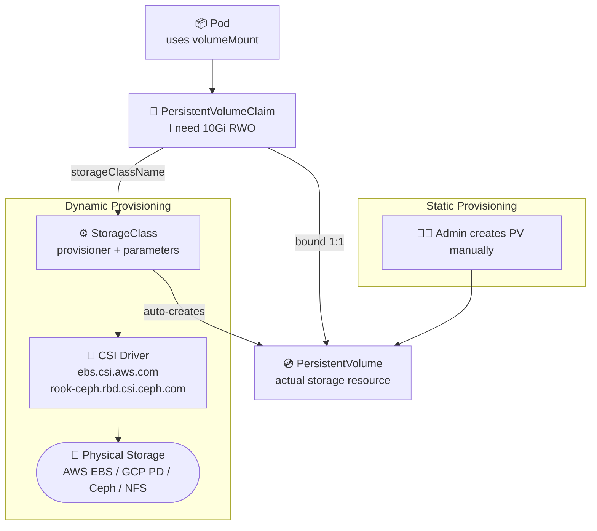
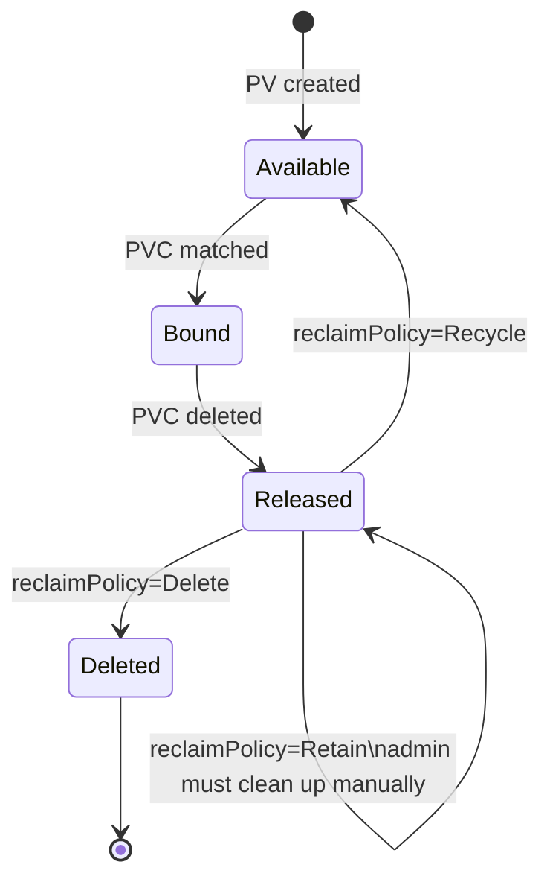
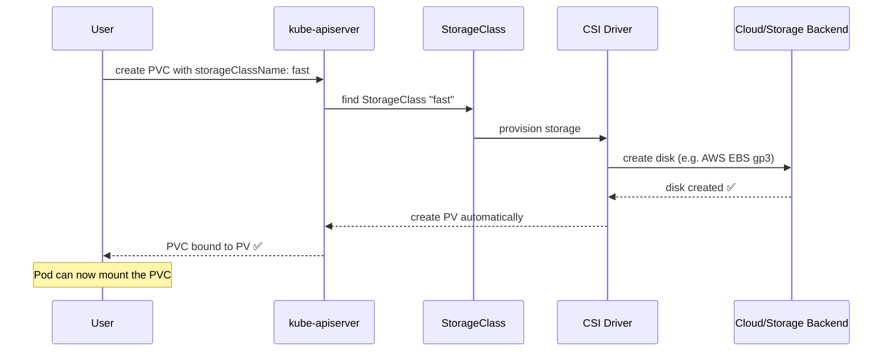
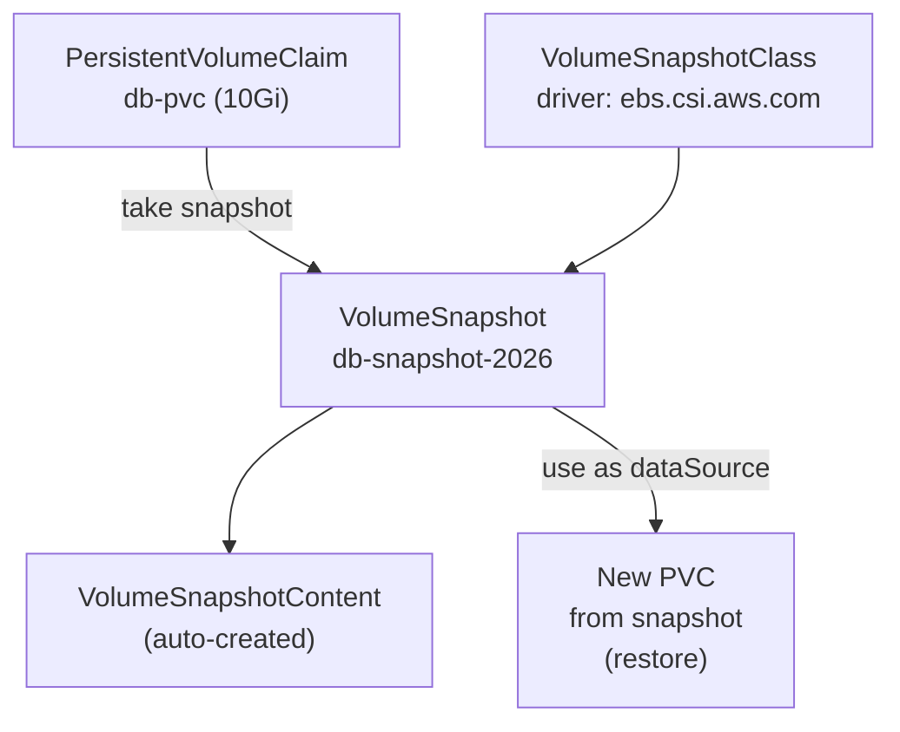
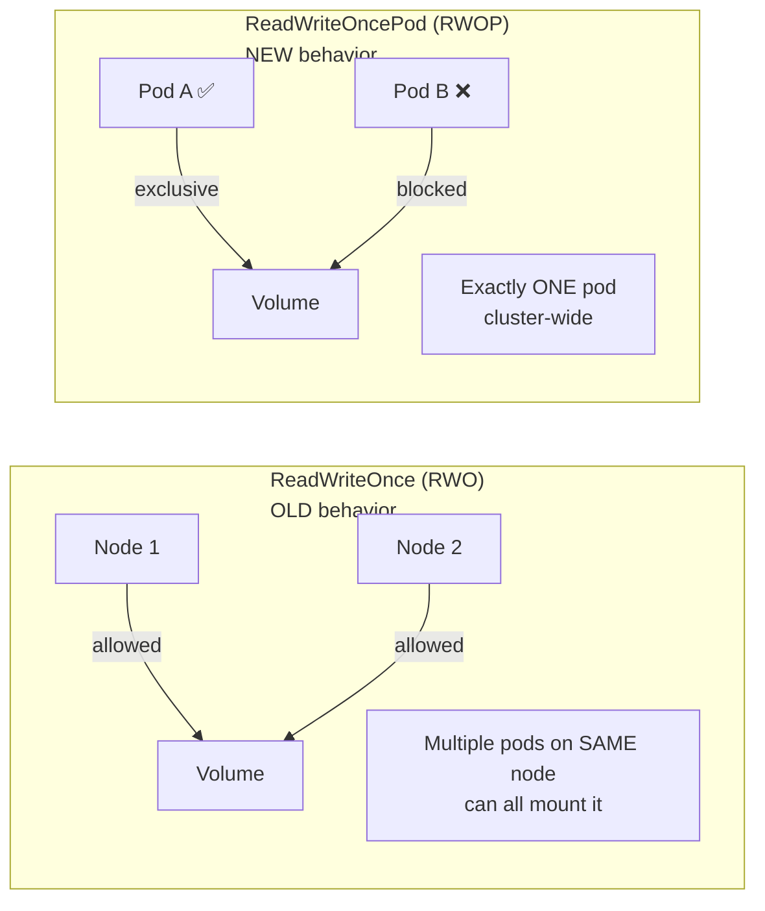

# Overview

---

# Flow: Kubernetes Storage Architecture

```javascript
┌─────────────────────────────────────────────────────┐
│              KUBERNETES STORAGE FLOW                   │
│                                                       │
│  Pod needs storage                                    │
│       │                                               │
│       ▼                                               │
│  PersistentVolumeClaim (PVC)                          │
│  "I need 10Gi of ReadWriteOnce storage"               │
│       │                                               │
│       ▼                                               │
│  Kubernetes binds PVC → PersistentVolume (PV)         │
│  (either static pre-provisioned or dynamic via SC)    │
│       │                                               │
│       ▼                                               │
│  StorageClass (dynamic provisioning)                  │
│  Calls CSI driver → provisions actual disk/volume      │
│       │                                               │
│       ▼                                               │
│  Actual Storage Backend                               │
│  (AWS EBS, GCP PD, Ceph, NFS, local disk...)          │
└─────────────────────────────────────────────────────┘
```

---

# 1. Volumes

## Volume Types


> ⚠️ **Notice:** Table content could not be synced from Notion due to integration permission restrictions.

```yaml
# emptyDir — shared temp between containers in same pod
apiVersion: v1
kind: Pod
metadata:
  name: shared-volume-pod
spec:
  containers:
  - name: writer
    image: busybox
    command: ['sh', '-c', 'echo hello > /data/hello.txt; sleep 3600']
    volumeMounts:
    - name: shared-data
      mountPath: /data
  - name: reader
    image: busybox
    command: ['sh', '-c', 'cat /data/hello.txt; sleep 3600']
    volumeMounts:
    - name: shared-data
      mountPath: /data
  volumes:
  - name: shared-data
    emptyDir: {}    # deleted when pod is deleted
```

---

# 2. PersistentVolumes (PV)

## PV Lifecycle

```javascript
┌──────────────────────────────────────────────────┐
│                  PV LIFECYCLE                         │
│                                                      │
│  Provisioning                                        │
│    Static:  admin creates PV manually                │
│    Dynamic: StorageClass auto-creates PV from PVC     │
│         │                                            │
│         ▼                                            │
│  Available ←─────────────────────────────────┐   │
│         │  PVC created, k8s finds match              │   │
│         ▼                                            │   │
│  Bound (PVC ↔ PV one-to-one binding)                 │   │
│         │  PVC deleted                               │   │
│         ▼                                            │   │
│  Released (PV not yet available for reuse)           │   │
│         │  reclaimPolicy determines next step        │   │
│    ┌────┴───────────────┐                        │   │
│    │Retain│Delete        │Recycle (deprecated)     │   │
│    │keep  │remove disk   │scrub + Available ───────┘   │
│    └──────┴───────────────┘                            │
└──────────────────────────────────────────────────┘
```

```yaml
# Static PersistentVolume
apiVersion: v1
kind: PersistentVolume
metadata:
  name: pv-database
spec:
  capacity:
    storage: 10Gi
  accessModes:
  - ReadWriteOnce         # RWO: one node read-write
  persistentVolumeReclaimPolicy: Retain
  storageClassName: manual
  hostPath:
    path: /data/db        # dev/testing only
  # For production, use:
  # awsElasticBlockStore: {volumeID: vol-xxx}
  # nfs: {server: nfs-server, path: /data}
```

## Access Modes


> ⚠️ **Notice:** Table content could not be synced from Notion due to integration permission restrictions.

---

# 3. PersistentVolumeClaims (PVC)

```yaml
# PVC — request for storage
apiVersion: v1
kind: PersistentVolumeClaim
metadata:
  name: db-pvc
spec:
  accessModes:
  - ReadWriteOnce
  storageClassName: manual    # must match PV storageClassName
  resources:
    requests:
      storage: 5Gi
```

```yaml
# Use PVC in a Pod
apiVersion: v1
kind: Pod
metadata:
  name: postgres-pod
spec:
  containers:
  - name: postgres
    image: postgres:15
    env:
    - name: POSTGRES_PASSWORD
      value: mysecret
    volumeMounts:
    - name: db-storage
      mountPath: /var/lib/postgresql/data
  volumes:
  - name: db-storage
    persistentVolumeClaim:
      claimName: db-pvc
```

```bash
# Check PV and PVC status
kubectl get pv
# NAME           CAPACITY  ACCESS   RECLAIM  STATUS    CLAIM
# pv-database    10Gi      RWO      Retain   Bound     default/db-pvc

kubectl get pvc
# NAME     STATUS  VOLUME       CAPACITY  ACCESS  STORAGECLASS
# db-pvc   Bound   pv-database  10Gi      RWO     manual

kubectl describe pvc db-pvc
```

---

# 4. StorageClasses (Dynamic Provisioning)

## Dynamic Provisioning Flow

```javascript
┌──────────────────────────────────────────────────┐
│           DYNAMIC PROVISIONING FLOW                   │
│                                                      │
│  User creates PVC with storageClassName: fast         │
│       │                                              │
│       ▼                                              │
│  Kubernetes finds StorageClass "fast"                 │
│       │                                              │
│       ▼                                              │
│  StorageClass calls provisioner (CSI driver)          │
│  e.g. ebs.csi.aws.com or ceph.rook.io/block           │
│       │                                              │
│       ▼                                              │
│  PV is auto-created and bound to PVC                  │
│  Actual disk provisioned in cloud/storage backend     │
└──────────────────────────────────────────────────┘
```

```yaml
# StorageClass for AWS EBS
apiVersion: storage.k8s.io/v1
kind: StorageClass
metadata:
  name: fast
  annotations:
    storageclass.kubernetes.io/is-default-class: "true"  # set as default
provisioner: ebs.csi.aws.com
parameters:
  type: gp3
  iops: "3000"
  throughput: "125"
volumeBindingMode: WaitForFirstConsumer   # wait until pod is scheduled
reclaimPolicy: Delete   # delete PV when PVC is deleted
allowVolumeExpansion: true
```

```yaml
# StorageClass for Ceph/Rook
apiVersion: storage.k8s.io/v1
kind: StorageClass
metadata:
  name: rook-ceph-block
provisioner: rook-ceph.rbd.csi.ceph.com
parameters:
  clusterID: rook-ceph
  pool: replicapool
  imageFormat: "2"
  imageFeatures: layering
  csi.storage.k8s.io/provisioner-secret-name: rook-csi-rbd-provisioner
  csi.storage.k8s.io/provisioner-secret-namespace: rook-ceph
reclaimPolicy: Delete
allowVolumeExpansion: true
```

```yaml
# Dynamic PVC — references StorageClass
apiVersion: v1
kind: PersistentVolumeClaim
metadata:
  name: dynamic-db-pvc
spec:
  accessModes:
  - ReadWriteOnce
  storageClassName: fast    # triggers dynamic provisioning
  resources:
    requests:
      storage: 20Gi
```

```bash
# Check storage classes
kubectl get storageclass
kubectl get sc
# NAME      PROVISIONER             RECLAIMPOLICY   VOLUMEBINDINGMODE
# fast (default) ebs.csi.aws.com   Delete          WaitForFirstConsumer

# Expand a PVC (storageClass must have allowVolumeExpansion: true)
kubectl patch pvc dynamic-db-pvc -p '{"spec":{"resources":{"requests":{"storage":"50Gi"}}}}'
```

---

# Quick Reference

```bash
# Volumes
kubectl get pv
kubectl get pvc
kubectl get pvc -A
kubectl describe pv <name>
kubectl describe pvc <name>
kubectl get storageclass

# Delete PVC (PV reclaim policy determines what happens to disk)
kubectl delete pvc <name>
```

> 📚 **Ref:** [Persistent Volumes](https://kubernetes.io/docs/concepts/storage/persistent-volumes/) | [StorageClass](https://kubernetes.io/docs/concepts/storage/storage-classes/) | [CSI](https://kubernetes-csi.github.io/docs/)


> ⚠️ **Notice:** Table content could not be synced from Notion due to integration permission restrictions.

## 🔄 PV Lifecycle States


> ⚠️ **Notice:** Table content could not be synced from Notion due to integration permission restrictions.

## 🔄 Dynamic Provisioning Flow


> ⚠️ **Notice:** Table content could not be synced from Notion due to integration permission restrictions.

## 🔄 Access Modes Comparison


> ⚠️ **Notice:** Table content could not be synced from Notion due to integration permission restrictions.

---

# 🧩 Mermaid Diagrams

## Storage Architecture — Pod to Disk



## PV Lifecycle States



## Dynamic Provisioning Flow




---

# 5. VolumeSnapshots

Point-in-time snapshots of PersistentVolumeClaims — for backup, cloning, and disaster recovery.



```yaml
# Step 1: Create VolumeSnapshotClass (admin)
apiVersion: snapshot.storage.k8s.io/v1
kind: VolumeSnapshotClass
metadata:
  name: csi-aws-snapclass
  annotations:
    snapshot.storage.kubernetes.io/is-default-class: "true"
driver: ebs.csi.aws.com
deletionPolicy: Delete         # Delete or Retain
```

```yaml
# Step 2: Take a snapshot of an existing PVC
apiVersion: snapshot.storage.k8s.io/v1
kind: VolumeSnapshot
metadata:
  name: db-snapshot-2026
  namespace: production
spec:
  volumeSnapshotClassName: csi-aws-snapclass
  source:
    persistentVolumeClaimName: db-pvc    # the PVC to snapshot
```

```yaml
# Step 3: Restore — create new PVC from snapshot
apiVersion: v1
kind: PersistentVolumeClaim
metadata:
  name: db-pvc-restored
  namespace: production
spec:
  accessModes:
  - ReadWriteOnce
  storageClassName: fast
  resources:
    requests:
      storage: 10Gi
  dataSource:
    name: db-snapshot-2026               # reference the snapshot
    kind: VolumeSnapshot
    apiGroup: snapshot.storage.k8s.io
```

```bash
# Check snapshot status
kubectl get volumesnapshot -n production
# NAME                READYTOUSE   SOURCEPVC   RESTORESIZE   AGE
# db-snapshot-2026    true         db-pvc      10Gi          2m

kubectl describe volumesnapshot db-snapshot-2026 -n production

# List snapshot classes
kubectl get volumesnapshotclass
```

---

# 6. ReadWriteOncePod Access Mode

`ReadWriteOncePod` (RWOP) — introduced in Kubernetes v1.22, GA in v1.29. Restricts volume access to **exactly one pod** (not just one node).



```yaml
# PVC using ReadWriteOncePod
apiVersion: v1
kind: PersistentVolumeClaim
metadata:
  name: exclusive-pvc
spec:
  accessModes:
  - ReadWriteOncePod        # only ONE pod in the entire cluster
  storageClassName: fast
  resources:
    requests:
      storage: 5Gi
```


| Lesson | What You'll Learn |
| --- | --- |
| 7.1 Volumes & emptyDir | Temporary storage, shared between containers |
| 7.2 PersistentVolumes & PersistentVolumeClaims | Durable storage — admin provisions, developer claims |
| 7.3 StorageClass & Dynamic Provisioning | Auto-create disks on demand via CSI drivers |
| 7.4 VolumeSnapshots | Point-in-time backups and restore |

