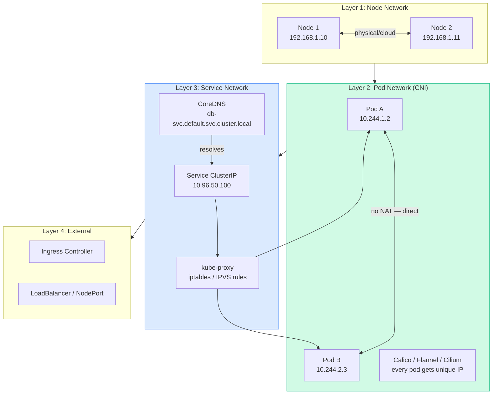
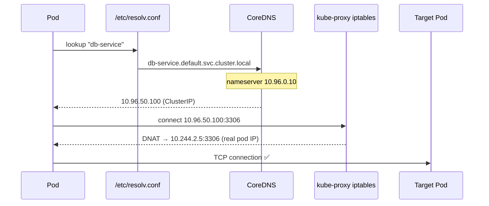
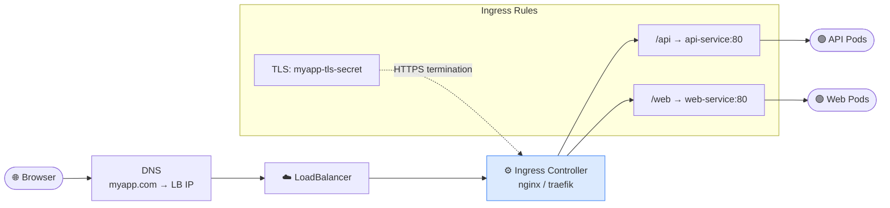
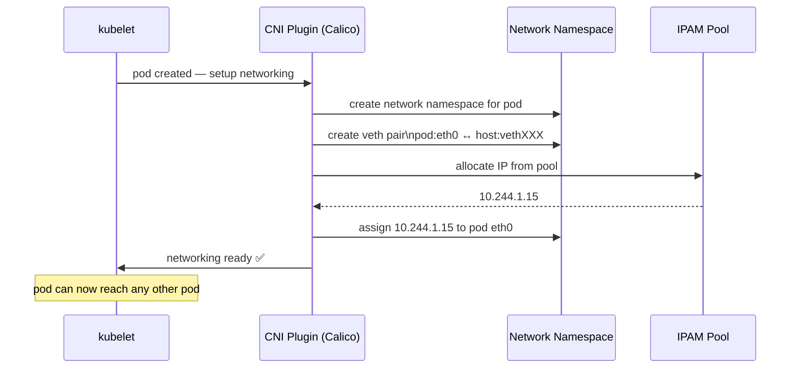
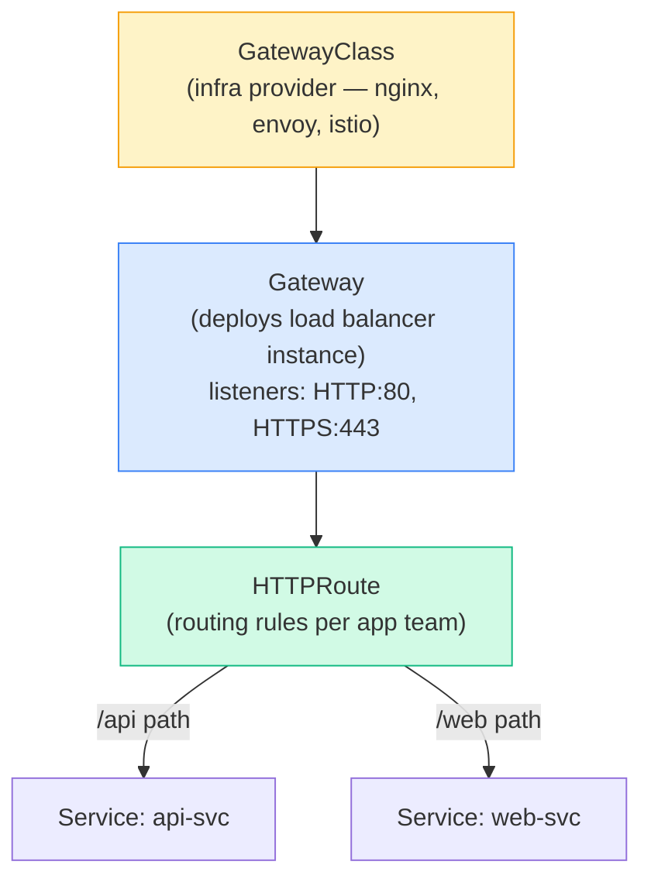
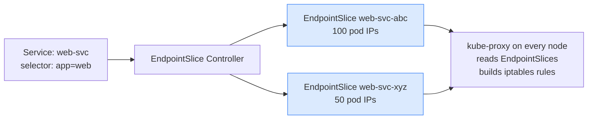

# Overview

---

# Flow: Complete Kubernetes Networking Architecture

```javascript
┌─────────────────────────────────────────────────────┐
│           KUBERNETES NETWORKING LAYERS                 │
│                                                       │
│  L1: Node Networking (Linux, switches, routing)       │
│      Each node has IP, reachable from other nodes     │
│                                                       │
│  L2: Pod Networking (CNI Plugin)                      │
│      Every pod gets unique IP                         │
│      Pods can reach each other without NAT            │
│      CNI: Calico / Flannel / Weave / Cilium           │
│                                                       │
│  L3: Service Networking (kube-proxy + iptables/IPVS)  │
│      Stable virtual IP for a group of pods           │
│      DNS: <svc>.<ns>.svc.cluster.local               │
│                                                       │
│  L4: External Traffic (Ingress / LoadBalancer)        │
│      Route external HTTP/S into the cluster           │
└─────────────────────────────────────────────────────┘
```

---

# 1. Pod Networking & CNI

## Kubernetes Networking Requirements

1. Every pod must have a unique IP
1. All pods can communicate with all other pods without NAT
1. All nodes can communicate with pods without NAT
## CNI Flow

```javascript
┌──────────────────────────────────────────────────┐
│                 CNI FLOW                              │
│                                                      │
│  Pod created → kubelet calls CNI plugin              │
│                       │                              │
│  CNI plugin:                                         │
│    1. Creates a network namespace for the pod         │
│    2. Creates a virtual ethernet pair (veth)          │
│       [pod veth0] ────► [host vethXXX]             │
│    3. Assigns IP to pod (from IPAM pool)              │
│    4. Sets up routing so pod is reachable             │
│    5. Pod can now talk to any other pod               │
└──────────────────────────────────────────────────┘
```

```bash
# Check CNI plugin installed
ls /etc/cni/net.d/
ls /opt/cni/bin/

# Check CNI config
cat /etc/cni/net.d/10-calico.conflist

# Node networking info
kubectl get nodes -o wide    # shows node IPs
ip addr show                  # on node: see interfaces
ip route                      # see routing table

# Pod network info
kubectl get pods -o wide     # shows pod IPs
kubectl exec -it nginx -- ip addr show
kubectl exec -it nginx -- ip route
```

---

# 2. Service Networking

## Service Types & Traffic Flow

```javascript
┌──────────────────────────────────────────────────┐
│              SERVICE TRAFFIC FLOW                     │
│                                                      │
│  ClusterIP (internal)                                │
│  Client Pod ──► ClusterIP:80 ──iptables/IPVS──► Pod  │
│                                                      │
│  NodePort (external via node)                        │
│  Browser ──► NodeIP:30080 ──► ClusterIP:80 ──► Pod  │
│                                                      │
│  LoadBalancer (cloud)                                │
│  Browser ──► LB IP:80 ──► NodePort ──► ClusterIP ─► Pod│
│                                                      │
│  ExternalName                                        │
│  Internal ──► CNAME ──► external.service.com         │
└──────────────────────────────────────────────────┘

kube-proxy role: maintains iptables/IPVS rules on every node
that forward traffic from ClusterIP → actual pod endpoints
```

```bash
# See how kube-proxy implements service routing
kubectl get cm -n kube-system kube-proxy -o yaml | grep mode
# mode: iptables  OR  mode: ipvs

# View iptables rules for a service
iptables -t nat -L KUBE-SERVICES | grep <service-ip>

# Service DNS resolution
kubectl exec -it busybox -- nslookup my-service.default.svc.cluster.local
# Server: 10.96.0.10  (CoreDNS ClusterIP)
# Address: 10.96.0.10#53
# Name: my-service.default.svc.cluster.local
# Address: 10.100.50.25
```

---

# 3. DNS in Kubernetes (CoreDNS)

## DNS Flow

```javascript
┌──────────────────────────────────────────────────┐
│                 DNS FLOW                              │
│                                                      │
│  Pod looks up: "db-service"                          │
│       │                                              │
│       ▼                                              │
│  /etc/resolv.conf → search default.svc.cluster.local │
│       │                                              │
│       ▼                                              │
│  CoreDNS (kube-dns service at 10.96.0.10)            │
│       │                                              │
│       ▼                                              │
│  Resolves: db-service.default.svc.cluster.local      │
│           → 10.100.50.25 (ClusterIP)                 │
│                                                      │
│  DNS Record Formats:                                 │
│    Services: <svc>.<ns>.svc.cluster.local            │
│    Pods:     <pod-ip>.<ns>.pod.cluster.local         │
└──────────────────────────────────────────────────┘
```

```bash
# CoreDNS runs as a Deployment
kubectl get pods -n kube-system -l k8s-app=kube-dns
kubectl get cm -n kube-system coredns -o yaml   # Corefile config

# Test DNS from a pod
kubectl run dns-test --image=busybox --rm -it -- nslookup kubernetes
kubectl run dns-test --image=busybox --rm -it -- nslookup my-service.production

# Pod's DNS config
kubectl exec nginx -- cat /etc/resolv.conf
# nameserver 10.96.0.10
# search default.svc.cluster.local svc.cluster.local cluster.local
```

---

# 4. Ingress

## Ingress Flow

```javascript
┌──────────────────────────────────────────────────┐
│                  INGRESS FLOW                         │
│                                                      │
│  Internet ──► DNS (myapp.com → LB IP)               │
│       │                                              │
│       ▼                                              │
│  LoadBalancer / NodePort                             │
│       │                                              │
│       ▼                                              │
│  Ingress Controller (nginx / traefik / haproxy)      │
│  Reads Ingress resources → configures routing rules  │
│       │                                              │
│  ┌────┴──────────────────────────────────────┐     │
│  │Path: /api     │  Path: /web    │  TLS cert  │     │
│  │► api-service  │  ► web-service  │  (HTTPS)   │     │
│  └──────────────┴───────────────┴──────────┘     │
└──────────────────────────────────────────────────┘
```

```bash
# Install NGINX Ingress Controller
kubectl apply -f https://raw.githubusercontent.com/kubernetes/ingress-nginx/controller-v1.9.0/deploy/static/provider/cloud/deploy.yaml

kubectl get pods -n ingress-nginx
kubectl get svc -n ingress-nginx
```

```yaml
# Ingress — path-based routing
apiVersion: networking.k8s.io/v1
kind: Ingress
metadata:
  name: myapp-ingress
  annotations:
    nginx.ingress.kubernetes.io/rewrite-target: /
spec:
  ingressClassName: nginx
  rules:
  - host: myapp.com
    http:
      paths:
      - path: /api
        pathType: Prefix
        backend:
          service:
            name: api-service
            port:
              number: 80
      - path: /web
        pathType: Prefix
        backend:
          service:
            name: web-service
            port:
              number: 80
```

```yaml
# Ingress — host-based routing + TLS
apiVersion: networking.k8s.io/v1
kind: Ingress
metadata:
  name: multi-host-ingress
spec:
  ingressClassName: nginx
  tls:
  - hosts:
    - api.myapp.com
    - web.myapp.com
    secretName: myapp-tls-secret    # TLS cert stored in Secret
  rules:
  - host: api.myapp.com
    http:
      paths:
      - path: /
        pathType: Prefix
        backend:
          service:
            name: api-service
            port:
              number: 80
  - host: web.myapp.com
    http:
      paths:
      - path: /
        pathType: Prefix
        backend:
          service:
            name: web-service
            port:
              number: 80
```

```bash
# Check Ingress
kubectl get ingress
kubectl describe ingress myapp-ingress
# Events show controller applying the rules

# Create TLS secret for Ingress
kubectl create secret tls myapp-tls-secret \
  --cert=path/to/tls.crt \
  --key=path/to/tls.key
```

---

# Quick Reference

```bash
# Pod networking
kubectl get pods -o wide           # pod IPs
kubectl exec -it <pod> -- ip addr
kubectl exec -it <pod> -- ip route

# Service networking
kubectl get svc
kubectl get endpoints <svc>       # actual pod IPs behind service
kubectl exec -it <pod> -- nslookup <svc>

# DNS
kubectl get pods -n kube-system -l k8s-app=kube-dns
kubectl exec <pod> -- cat /etc/resolv.conf

# Ingress
kubectl get ingress -A
kubectl describe ingress <name>
kubectl get ingressclass

# CNI
ls /etc/cni/net.d/
ls /opt/cni/bin/
```

> 📚 **Ref:** [Services](https://kubernetes.io/docs/concepts/services-networking/service/) | [Ingress](https://kubernetes.io/docs/concepts/services-networking/ingress/) | [DNS](https://kubernetes.io/docs/concepts/services-networking/dns-pod-service/)

[Table Not Rendered - Unsupported Block]

## 🔄 Service Types & Traffic Flow

[Table Not Rendered - Unsupported Block]

## 🔄 DNS Resolution Flow

[Table Not Rendered - Unsupported Block]

## 🔄 Ingress Flow

[Table Not Rendered - Unsupported Block]

## 🔄 CNI Plugin Flow

[Table Not Rendered - Unsupported Block]

---

# 🧩 Mermaid Diagrams

## Kubernetes Networking Layers



## DNS Resolution Flow



## Ingress Traffic Flow



## CNI Plugin Flow



---

# 5. Gateway API

The **next-generation replacement for Ingress** — more expressive, role-oriented, and extensible. Now on the CKA exam.



```bash
# Install Gateway API CRDs
kubectl apply -f https://github.com/kubernetes-sigs/gateway-api/releases/download/v1.1.0/standard-install.yaml

# Verify CRDs installed
kubectl get crd | grep gateway
```

```yaml
# 1. GatewayClass — cluster-level, admin creates once
apiVersion: gateway.networking.k8s.io/v1
kind: GatewayClass
metadata:
  name: nginx
spec:
  controllerName: k8s.nginx.org/nginx-gateway-controller
```

```yaml
# 2. Gateway — deploys the actual load balancer
apiVersion: gateway.networking.k8s.io/v1
kind: Gateway
metadata:
  name: main-gateway
  namespace: infra
spec:
  gatewayClassName: nginx
  listeners:
  - name: http
    port: 80
    protocol: HTTP
    allowedRoutes:
      namespaces:
        from: All             # routes from any namespace
  - name: https
    port: 443
    protocol: HTTPS
    tls:
      certificateRefs:
      - name: myapp-tls-secret
    allowedRoutes:
      namespaces:
        from: Selector
        selector:
          matchLabels:
            gateway-access: "true"
```

```yaml
# 3. HTTPRoute — app team creates in their namespace
apiVersion: gateway.networking.k8s.io/v1
kind: HTTPRoute
metadata:
  name: api-route
  namespace: production
spec:
  parentRefs:
  - name: main-gateway
    namespace: infra
  hostnames:
  - "api.myapp.com"
  rules:
  - matches:
    - path:
        type: PathPrefix
        value: /api
    backendRefs:
    - name: api-service
      port: 80
      weight: 90
    - name: api-service-canary
      port: 80
      weight: 10             # 10% traffic to canary
  - matches:
    - path:
        type: PathPrefix
        value: /health
    backendRefs:
    - name: api-service
      port: 80
```

```bash
kubectl get gateway -A
kubectl get httproute -A
kubectl describe gateway main-gateway -n infra
```

## Gateway API vs Ingress

[Table Not Rendered - Unsupported Block]

---

# 6. EndpointSlices

Replaced `Endpoints` objects for scalability — each slice holds max 100 endpoints. Automatically managed by the EndpointSlice controller.



```bash
# View EndpointSlices for a service
kubectl get endpointslices
kubectl get endpointslices -l kubernetes.io/service-name=web-svc

# Describe shows actual pod IPs + ports
kubectl describe endpointslice web-svc-abc
# Name:         web-svc-abc
# Namespace:    default
# Labels:       kubernetes.io/service-name=web-svc
# AddressType:  IPv4
# Ports:
#   Name   Port  Protocol
#   ----   ----  --------
#   http   8080  TCP
# Endpoints:
#   - Addresses:  10.244.1.5, 10.244.2.8, 10.244.3.2

# Old Endpoints object (still exists for compatibility)
kubectl get endpoints web-svc
```

[Table Not Rendered - Unsupported Block]

