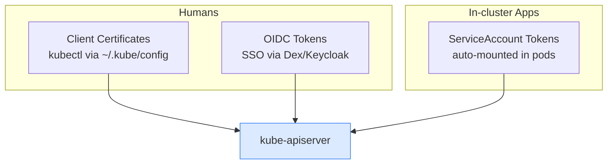
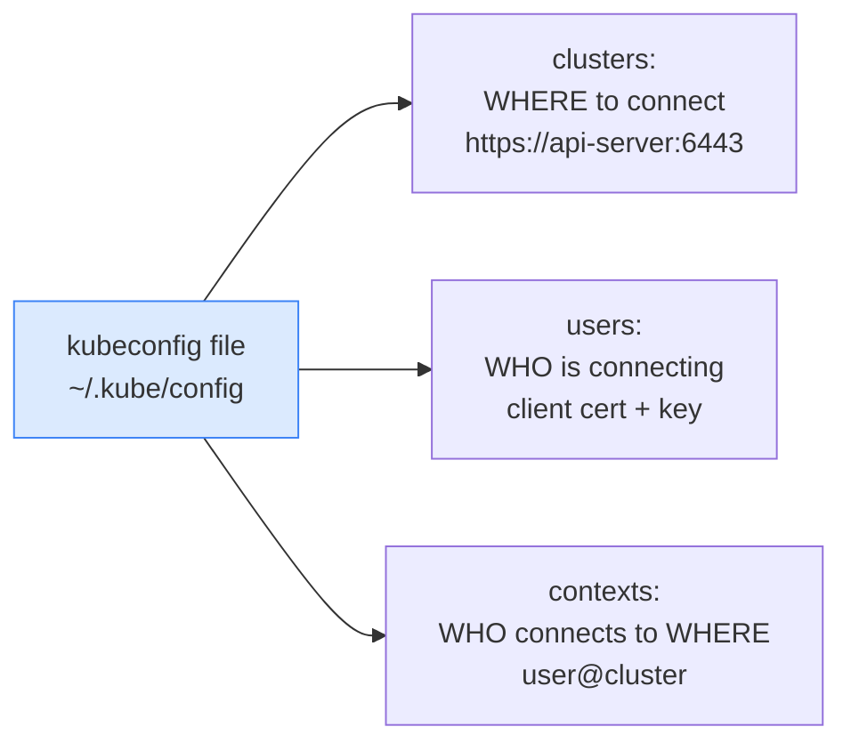

# 9.1 Authentication & kubeconfig

> Part of **09 🔒 Security** | CKA Chapter 9

---

# Authentication — Who Are You?



> K8s does **not** manage human users natively. It relies on certs or OIDC. Only **ServiceAccounts** are native K8s objects.

---

# kubeconfig — How kubectl Knows Where to Connect



```bash
# View current config
kubectl config view

# List contexts (cluster + user combos)
kubectl config get-contexts

# Switch context
kubectl config use-context prod-admin

# Set default namespace for current context
kubectl config set-context --current --namespace=production

# Merge multiple kubeconfigs
export KUBECONFIG=~/.kube/config:~/.kube/dev-config
kubectl config view --flatten > ~/.kube/merged
```

