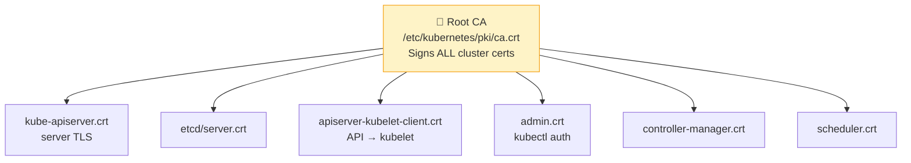

# 9.2 TLS Certificates & CSR

> Part of **09 🔒 Security** | CKA Chapter 9

---

# TLS Certificate Map



```bash
# Check certificate expiry
kubeadm certs check-expiration

# Renew all certificates
kubeadm certs renew all

# Inspect a certificate
openssl x509 -in /etc/kubernetes/pki/apiserver.crt -text -noout \
  | grep -E 'Subject|Issuer|Not After'

# View cert from kubeconfig (base64 encoded)
kubectl config view --raw | grep certificate-authority-data
```

---

# Certificate Signing Requests (CSR)

Create a new user cert using the Kubernetes CA:

```bash
# Generate private key
openssl genrsa -out jane.key 2048

# Generate CSR
openssl req -new -key jane.key \
  -subj "/CN=jane/O=developers" \
  -out jane.csr

# Create K8s CSR object
cat <<EOF | kubectl apply -f -
apiVersion: certificates.k8s.io/v1
kind: CertificateSigningRequest
metadata:
  name: jane
spec:
  request: $(cat jane.csr | base64 | tr -d "\n")
  signerName: kubernetes.io/kube-apiserver-client
  usages:
  - client auth
EOF

# Approve
kubectl certificate approve jane

# Get signed cert
kubectl get csr jane -o jsonpath='{.status.certificate}' | base64 -d > jane.crt
```

