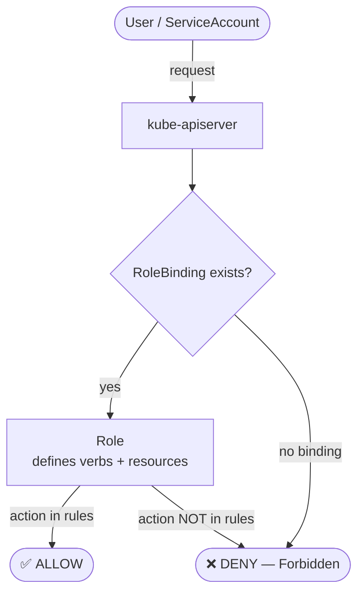

# 9.3 RBAC — Roles & RoleBindings

> Part of **09 🔒 Security** | CKA Chapter 9

---

# RBAC Flow



---

# Namespaced vs Cluster-Wide

---

# YAML Examples

```yaml
# Role
apiVersion: rbac.authorization.k8s.io/v1
kind: Role
metadata:
  name: pod-reader
  namespace: default
rules:
- apiGroups: [""]            # "" = core group (pods, services...)
  resources: ["pods", "pods/log"]
  verbs: ["get", "list", "watch"]
- apiGroups: ["apps"]
  resources: ["deployments"]
  verbs: ["get", "list"]
```

```yaml
# RoleBinding
apiVersion: rbac.authorization.k8s.io/v1
kind: RoleBinding
metadata:
  name: read-pods
  namespace: default
subjects:
- kind: User
  name: jane
  apiGroup: rbac.authorization.k8s.io
- kind: ServiceAccount
  name: monitoring-sa
  namespace: monitoring
roleRef:
  kind: Role
  name: pod-reader
  apiGroup: rbac.authorization.k8s.io
```

```bash
# Imperative creation
kubectl create role pod-reader --verb=get,list,watch --resource=pods -n default
kubectl create rolebinding read-pods --role=pod-reader --user=jane -n default
kubectl create clusterrole cluster-reader --verb=get,list,watch --resource='*.*'
kubectl create clusterrolebinding crb --clusterrole=cluster-reader --user=jane

# Check access
kubectl auth can-i get pods --as=jane
kubectl auth can-i get pods --as=jane -n production
kubectl auth can-i --list --as=jane -n default
kubectl auth can-i '*' '*'    # am I cluster-admin?
```

