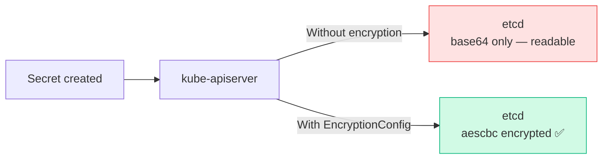
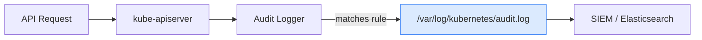

# 9.5 etcd Encryption & Audit Logging

> Part of **09 🔒 Security** | CKA Chapter 9

---

# etcd Encryption at Rest

Secrets stored in etcd are base64 by default — **not encrypted**.



```yaml
# /etc/kubernetes/enc/encryption-config.yaml
apiVersion: apiserver.config.k8s.io/v1
kind: EncryptionConfiguration
resources:
- resources: [secrets]
  providers:
  - aescbc:
      keys:
      - name: key1
        secret: <base64-of-32-byte-key>  # head -c 32 /dev/urandom | base64
  - identity: {}    # fallback for existing unencrypted secrets
```

```bash
# Enable in kube-apiserver
vi /etc/kubernetes/manifests/kube-apiserver.yaml
# Add: --encryption-provider-config=/etc/kubernetes/enc/encryption-config.yaml

# Re-encrypt ALL existing secrets
kubectl get secrets --all-namespaces -o json | kubectl replace -f -

# Verify secret is encrypted in etcd
ETCDCTL_API=3 etcdctl get /registry/secrets/default/my-secret \
  --endpoints=https://127.0.0.1:2379 \
  --cacert=/etc/kubernetes/pki/etcd/ca.crt \
  --cert=/etc/kubernetes/pki/etcd/server.crt \
  --key=/etc/kubernetes/pki/etcd/server.key | hexdump -C | head
# Should show: k8s:enc:aescbc:v1:key1:...
```

---

# Audit Logging



```yaml
# /etc/kubernetes/audit/policy.yaml
apiVersion: audit.k8s.io/v1
kind: Policy
rules:
- level: Metadata    # log secret access (no body)
  resources:
  - group: ""
    resources: ["secrets"]
- level: RequestResponse   # full body for pod create/delete
  verbs: ["create", "delete"]
  resources:
  - group: ""
    resources: ["pods"]
- level: None        # skip noisy health checks
  users: ["system:kube-proxy"]
  verbs: ["watch"]
- level: Metadata    # default: log everything else
```

[Table Not Rendered - Unsupported Block]

