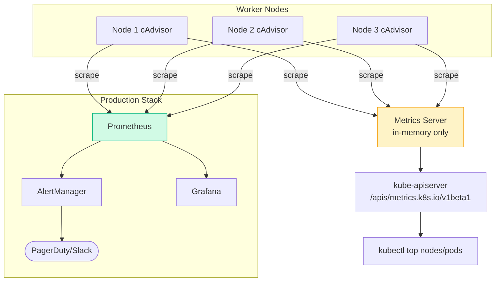
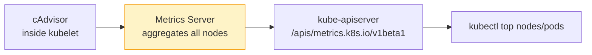
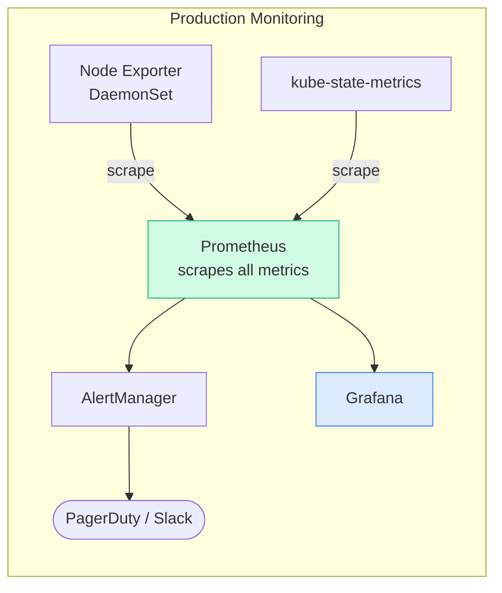
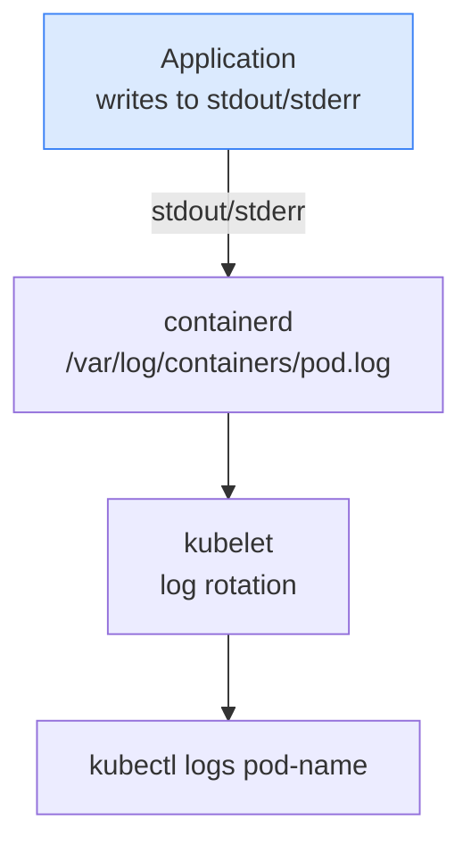
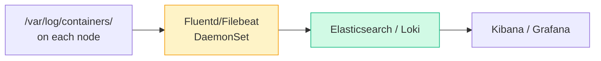
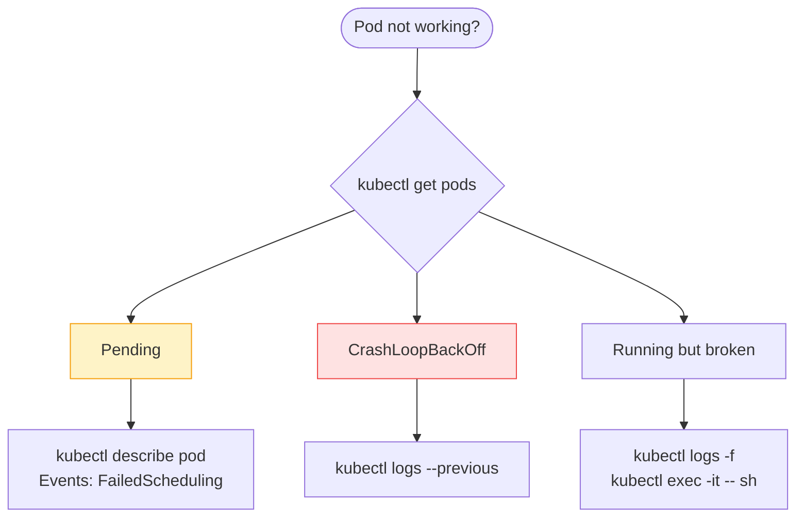

# Overview

---

# Flow: How Monitoring Works in Kubernetes



---

# 1. Monitor Cluster Components

## What to Monitor

[Table Not Rendered - Unsupported Block]

## Metrics Server (Lightweight, In-Memory)

Metrics Server is the **official in-cluster monitoring solution** for Kubernetes. It scrapes resource usage from kubelets (via cAdvisor) and exposes it through the API server.



### Install Metrics Server

```bash
# Deploy metrics server
kubectl apply -f https://github.com/kubernetes-sigs/metrics-server/releases/latest/download/components.yaml

# For kubeadm/self-hosted: add --kubelet-insecure-tls flag
kubectl patch deployment metrics-server -n kube-system \
  --type='json' \
  -p='[{"op":"add","path":"/spec/template/spec/containers/0/args/-","value":"--kubelet-insecure-tls"}]'

# Verify it's running
kubectl get pods -n kube-system | grep metrics-server
kubectl top nodes   # wait ~60s for first data
```

### Using kubectl top

```bash
# Node resource usage
kubectl top nodes
# NAME       CPU(cores)   CPU%   MEMORY(bytes)   MEMORY%
# node01     350m         8%     1200Mi          60%
# node02     120m         3%     800Mi           40%

# Pod resource usage
kubectl top pods
kubectl top pods -n kube-system
kubectl top pods --sort-by=memory      # sort by memory
kubectl top pods --sort-by=cpu         # sort by CPU

# Specific pod
kubectl top pod nginx-pod

# With containers broken out
kubectl top pods --containers
# POD            NAME      CPU   MEMORY
# web-pod        nginx     10m   20Mi
# web-pod        logger    5m    10Mi
```

## Production Monitoring Stack



```bash
# Install via kube-prometheus-stack Helm chart
helm repo add prometheus-community https://prometheus-community.github.io/helm-charts
helm install monitoring prometheus-community/kube-prometheus-stack \
  --namespace monitoring --create-namespace

# Access Grafana
kubectl port-forward svc/monitoring-grafana 3000:80 -n monitoring
# default: admin / prom-operator
```

---

# 2. Managing Application Logs

## Log Flow in Kubernetes



> **Key Rule:** Always write logs to **stdout/stderr** — never to files inside the container. Kubernetes captures stdout/stderr automatically.

## Single Container Pod Logs

```bash
# Basic log retrieval
kubectl logs nginx-pod

# Follow/stream logs in real-time
kubectl logs -f nginx-pod

# Last N lines
kubectl logs --tail=100 nginx-pod

# Logs since a time duration
kubectl logs --since=1h nginx-pod
kubectl logs --since=30m nginx-pod

# Timestamps on every line
kubectl logs --timestamps nginx-pod

# Previous container instance (after crash/restart)
kubectl logs nginx-pod --previous
kubectl logs nginx-pod -p
```

## Multi-Container Pod Logs

```yaml
# multi-container-pod.yaml
apiVersion: v1
kind: Pod
metadata:
  name: web-with-sidecar
spec:
  containers:
  - name: web            # main container
    image: nginx:1.25
  - name: log-agent      # sidecar container
    image: busybox
    command: ['sh', '-c', 'while true; do echo "[LOG] $(date)"; sleep 5; done']
```

```bash
# MUST specify -c <container> for multi-container pods
kubectl logs web-with-sidecar -c web
kubectl logs web-with-sidecar -c log-agent

# Stream a specific container
kubectl logs -f web-with-sidecar -c web

# Get logs from ALL containers in a pod
kubectl logs web-with-sidecar --all-containers=true

# If you forget -c on a multi-container pod:
# Error: a container name must be specified for pod web-with-sidecar,
# choose one of: [web log-agent]
```

## Logs from Deployments and Labels

```bash
# Logs from any pod matching a label
kubectl logs -l app=nginx
kubectl logs -l app=nginx --all-containers=true

# Logs from all pods in a deployment
kubectl logs deployment/my-deployment
kubectl logs deployment/my-deployment -c nginx

# Logs from a crashed pod (very useful for debugging)
kubectl logs nginx-pod --previous
```

## Centralized Log Aggregation



```yaml
# Fluentd DaemonSet snippet — collects logs from all nodes
apiVersion: apps/v1
kind: DaemonSet
metadata:
  name: fluentd
  namespace: kube-system
spec:
  selector:
    matchLabels:
      name: fluentd
  template:
    metadata:
      labels:
        name: fluentd
    spec:
      tolerations:
      - key: node-role.kubernetes.io/control-plane
        operator: Exists
        effect: NoSchedule
      containers:
      - name: fluentd
        image: fluent/fluentd-kubernetes-daemonset:v1-debian-elasticsearch
        env:
        - name: FLUENT_ELASTICSEARCH_HOST
          value: "elasticsearch.logging"
        - name: FLUENT_ELASTICSEARCH_PORT
          value: "9200"
        volumeMounts:
        - name: varlog
          mountPath: /var/log
        - name: varlibdockercontainers
          mountPath: /var/lib/docker/containers
          readOnly: true
      volumes:
      - name: varlog
        hostPath:
          path: /var/log
      - name: varlibdockercontainers
        hostPath:
          path: /var/lib/docker/containers
```

## Debugging Workflow



```bash
# Full debugging sequence
kubectl get pods -o wide                    # overview
kubectl describe pod failing-pod           # events + state
kubectl logs failing-pod --previous        # last crash logs
kubectl logs failing-pod -f                # live stream
kubectl exec -it failing-pod -- /bin/sh    # shell inside
```

---

# Quick Reference

```bash
# Monitoring
kubectl top nodes
kubectl top pods
kubectl top pods --sort-by=cpu
kubectl top pods --sort-by=memory
kubectl top pods --containers

# Logging
kubectl logs <pod>
kubectl logs <pod> -c <container>
kubectl logs <pod> -f
kubectl logs <pod> --tail=50
kubectl logs <pod> --since=1h
kubectl logs <pod> --previous
kubectl logs <pod> --timestamps
kubectl logs deployment/<name>
kubectl logs -l app=<label>
```

> 📚 **Ref:** [Kubernetes Monitoring Docs](https://kubernetes.io/docs/tasks/debug/debug-cluster/resource-metrics-pipeline/)


