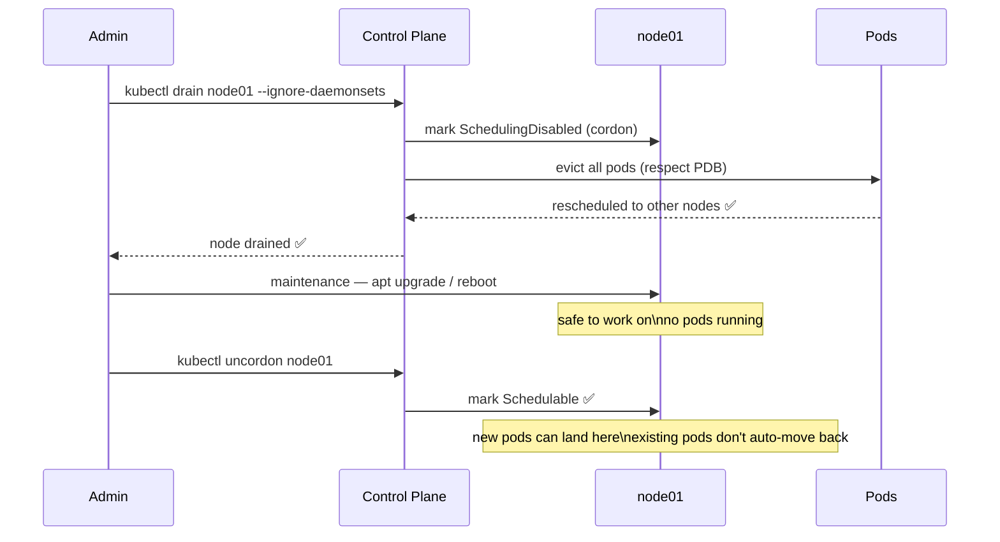
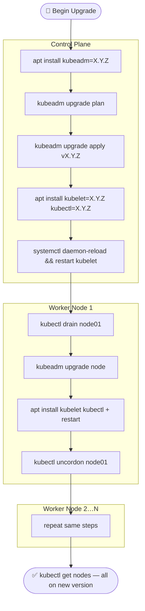
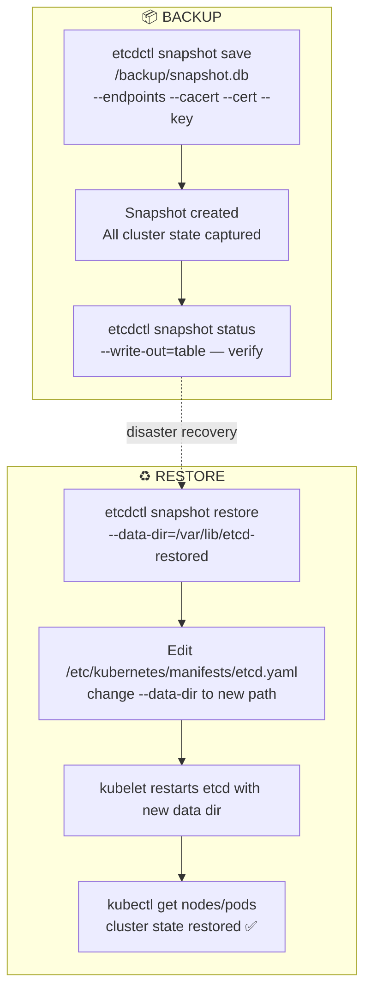
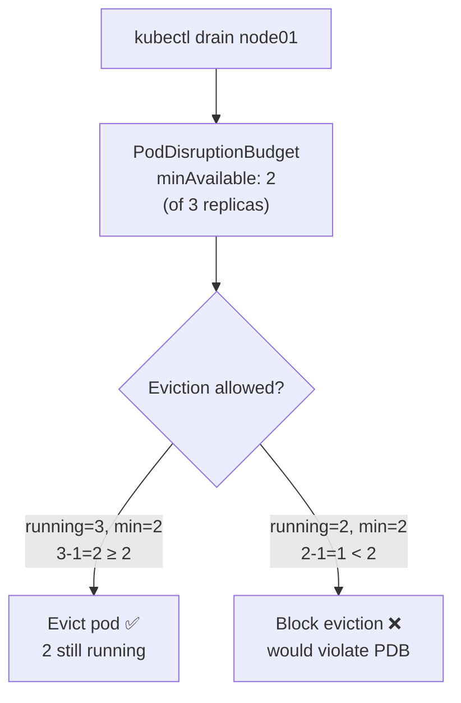
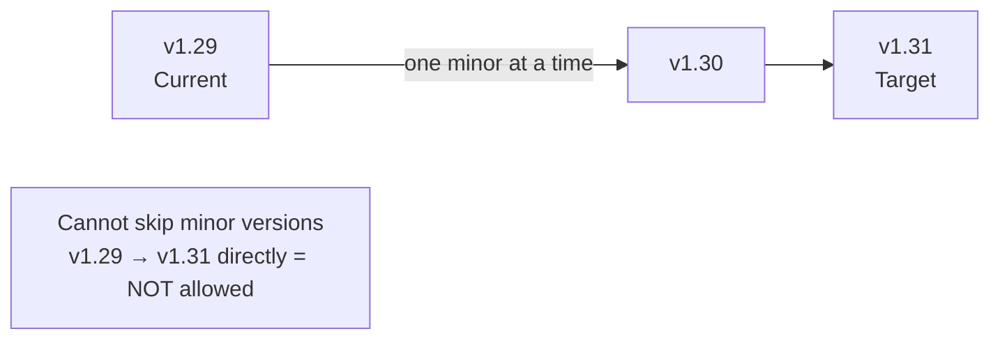

# Overview

---

# 1. OS Upgrades — Node Drain & Cordon

## Flow: Safe Node Maintenance

```javascript
┌─────────────────────────────────────────────────────┐
│              NODE MAINTENANCE FLOW                     │
│                                                       │
│  Step 1: kubectl drain node01                         │
│    └─► Evicts all pods (respects PodDisruptionBudgets)   │
│    └─► Marks node as Unschedulable (cordon)             │
│    └─► Pods rescheduled to other nodes                  │
│         │                                             │
│         ▼                                             │
│  Step 2: Do maintenance                               │
│    apt-get upgrade / reboot / OS patch                │
│         │                                             │
│         ▼                                             │
│  Step 3: kubectl uncordon node01                      │
│    └─► Node becomes Schedulable again                   │
│    └─► New pods can land on it (existing don’t move back)│
└─────────────────────────────────────────────────────┘
```

```bash
# Drain (evict pods + cordon)
kubectl drain node01 --ignore-daemonsets
kubectl drain node01 --ignore-daemonsets --force   # force-delete bare pods
kubectl drain node01 --ignore-daemonsets --delete-emptydir-data

# Cordon only (mark unschedulable, don't evict existing pods)
kubectl cordon node01

# Uncordon (allow scheduling again)
kubectl uncordon node01

# Verify node status
kubectl get nodes
# NAME     STATUS                     ROLES
# node01   Ready,SchedulingDisabled   <none>   <- drained/cordoned
# node02   Ready                      <none>
```

---

# 2. Kubernetes Version Upgrades

## Version Format

```javascript
v  1  .  29  .  3
│  │      │     │
│  │      │     └─ Patch (bug fixes)
│  │      └───── Minor (new features, release every ~4 months)
│  └───────── Major
└─────────── v prefix

Version skew policy:
  kube-apiserver: X (reference version)
  controller-manager/scheduler: X or X-1
  kubelet/kube-proxy: X, X-1, or X-2
  kubectl: X+1 to X-1

Max upgrade hop: ONE minor version at a time
  v1.27 → v1.28 → v1.29 → v1.30  (correct)
  v1.27 → v1.30                     (NOT allowed)
```

## Cluster Upgrade Flow (kubeadm)

```javascript
┌─────────────────────────────────────────────────────┐
│              CLUSTER UPGRADE ORDER                     │
│                                                       │
│  1. CONTROL PLANE first                               │
│     a. Upgrade kubeadm on master                      │
│     b. kubeadm upgrade plan (check what’s possible)   │
│     c. kubeadm upgrade apply v1.30.0                  │
│     d. Upgrade kubelet + kubectl on master            │
│     e. Restart kubelet                                │
│                                                       │
│  2. WORKER NODES one at a time                        │
│     a. kubectl drain node01                           │
│     b. Upgrade kubeadm on node01                      │
│     c. kubeadm upgrade node                           │
│     d. Upgrade kubelet + kubectl on node01            │
│     e. Restart kubelet                                │
│     f. kubectl uncordon node01                        │
│     g. Repeat for each worker                         │
└─────────────────────────────────────────────────────┘
```

### Control Plane Upgrade Commands

```bash
# On the control plane node

# 1. Upgrade kubeadm
apt-get update
apt-get install -y kubeadm=1.30.0-1.1
kubeadm version

# 2. Plan and apply
kubeadm upgrade plan
kubeadm upgrade apply v1.30.0

# 3. Upgrade kubelet and kubectl
apt-get install -y kubelet=1.30.0-1.1 kubectl=1.30.0-1.1
systemctl daemon-reload
systemctl restart kubelet

# 4. Verify
kubectl get nodes
```

### Worker Node Upgrade Commands

```bash
# From control plane
kubectl drain node01 --ignore-daemonsets --force

# SSH to worker node
ssh node01
apt-get update
apt-get install -y kubeadm=1.30.0-1.1
kubeadm upgrade node
apt-get install -y kubelet=1.30.0-1.1 kubectl=1.30.0-1.1
systemctl daemon-reload
systemctl restart kubelet
exit

# Back on control plane
kubectl uncordon node01
kubectl get nodes   # verify node01 shows v1.30.0
```

---

# 3. Backup & Restore

## What to Back Up

```javascript
┌───────────────────────────────────────────────────┐
│               BACKUP TARGETS                          │
│                                                      │
│  Option 1: Resource configs (YAML files)             │
│    kubectl get all --all-namespaces -o yaml > all.yaml│
│    Store in Git (GitOps with ArgoCD/Flux)            │
│                                                      │
│  Option 2: etcd snapshot (preferred for full backup) │
│    etcdctl snapshot save backup.db                   │
│    Captures ALL cluster state including Secrets      │
│                                                      │
│  Option 3: Persistent Volume backups                 │
│    Velero / cloud snapshots                          │
└───────────────────────────────────────────────────┘
```

## etcd Backup & Restore Flow

```javascript
BACKUP
  etcdctl snapshot save /backup/etcd-snapshot.db
        │
        ▼
  snapshot file created with all cluster state

RESTORE
  1. Stop kube-apiserver
        │
        ▼
  2. etcdctl snapshot restore /backup/etcd-snapshot.db \
        --data-dir=/var/lib/etcd-restored
        │
        ▼
  3. Update etcd static pod manifest → new --data-dir
        │
        ▼
  4. kubelet restarts etcd pod with new data dir
        │
        ▼
  5. kubectl get pods → cluster state restored
```

```bash
# Set etcdctl env vars
export ETCDCTL_API=3

# Backup
etcdctl snapshot save /backup/etcd-snapshot-$(date +%Y%m%d).db \
  --endpoints=https://127.0.0.1:2379 \
  --cacert=/etc/kubernetes/pki/etcd/ca.crt \
  --cert=/etc/kubernetes/pki/etcd/server.crt \
  --key=/etc/kubernetes/pki/etcd/server.key

# Verify backup
etcdctl snapshot status /backup/etcd-snapshot-20240101.db --write-out=table
# +----------+----------+------------+------------+
# |   HASH   | REVISION | TOTAL KEYS | TOTAL SIZE |
# +----------+----------+------------+------------+
# | abc12345 |    12345 |       1200 |     5.2 MB |
# +----------+----------+------------+------------+

# Restore
etcdctl snapshot restore /backup/etcd-snapshot-20240101.db \
  --data-dir=/var/lib/etcd-from-backup \
  --endpoints=https://127.0.0.1:2379 \
  --cacert=/etc/kubernetes/pki/etcd/ca.crt \
  --cert=/etc/kubernetes/pki/etcd/server.crt \
  --key=/etc/kubernetes/pki/etcd/server.key

# Update etcd manifest to use new data dir
vi /etc/kubernetes/manifests/etcd.yaml
# Change: --data-dir=/var/lib/etcd
# To:     --data-dir=/var/lib/etcd-from-backup
# Also update volumes/volumeMounts hostPath

# Verify cluster is back
kubectl get pods -A
kubectl get nodes
```

---

# Quick Reference

```bash
# Node operations
kubectl drain <node> --ignore-daemonsets
kubectl drain <node> --ignore-daemonsets --force --delete-emptydir-data
kubectl cordon <node>
kubectl uncordon <node>
kubectl get nodes

# Cluster upgrade (kubeadm)
kubeadm upgrade plan
kubeadm upgrade apply v1.X.Y
kubeadm upgrade node           # on worker nodes

# etcd backup
export ETCDCTL_API=3
etcdctl snapshot save <file> --endpoints=... --cacert=... --cert=... --key=...
etcdctl snapshot status <file> --write-out=table
etcdctl snapshot restore <file> --data-dir=<new-dir>
```

> 📚 **Ref:** [Cluster Upgrade](https://kubernetes.io/docs/tasks/administer-cluster/kubeadm/kubeadm-upgrade/) | [etcd Backup](https://kubernetes.io/docs/tasks/administer-cluster/configure-upgrade-etcd/)

---

# 🧩 Mermaid Diagrams

## Node Drain → Maintain → Uncordon



## Cluster Upgrade Flow (kubeadm)



## etcd Backup & Restore




---

# 7. PodDisruptionBudget (PDB)

Limits **voluntary disruptions** (drains, upgrades, scaling) to ensure minimum availability during cluster operations.

> **Voluntary** = admin-initiated (drain, eviction). **Involuntary** = hardware failure, OOM. PDB only protects against voluntary.



## Example 1 — minAvailable (Absolute)

```yaml
# At least 2 pods must be running at all times
apiVersion: policy/v1
kind: PodDisruptionBudget
metadata:
  name: web-pdb
spec:
  minAvailable: 2         # absolute count
  selector:
    matchLabels:
      app: web-app
```

## Example 2 — minAvailable (Percentage)

```yaml
# At least 80% of pods must be available
apiVersion: policy/v1
kind: PodDisruptionBudget
metadata:
  name: api-pdb
spec:
  minAvailable: "80%"     # percentage of desired replicas
  selector:
    matchLabels:
      app: api-service
```

## Example 3 — maxUnavailable

```yaml
# At most 1 pod can be unavailable at a time
apiVersion: policy/v1
kind: PodDisruptionBudget
metadata:
  name: db-pdb
  namespace: production
spec:
  maxUnavailable: 1       # or "25%"
  selector:
    matchLabels:
      app: postgres
```

## minAvailable vs maxUnavailable


| Lesson | What You'll Learn |
| --- | --- |
| 11.1 Node Drain, Cordon, Uncordon & PDB | Safe node maintenance and disruption budgets |
| 11.2 Cluster Upgrades (kubeadm) | Upgrade control plane and workers step by step |
| 11.3 etcd Backup & Restore | Snapshot and recover all cluster state |

```bash
# Check PDB status
kubectl get pdb
kubectl get pdb -n production
kubectl describe pdb web-pdb

# Output shows:
# NAME      MIN AVAILABLE   MAX UNAVAILABLE   ALLOWED DISRUPTIONS   AGE
# web-pdb   2               N/A               1                     5d

# When drain is blocked by PDB:
kubectl drain node01 --ignore-daemonsets
# error: unable to evict pod "web-app-xxx": cannot evict pod as it would
# violate the pod's disruption budget
```

---

# 8. Cluster Upgrade — Real Version Paths (v1.29 → v1.31)



```bash
# Full upgrade path: v1.29 → v1.30 → v1.31

# === Step 1: Upgrade control plane to v1.30 ===
apt-get update
apt-get install -y kubeadm=1.30.0-1.1
kubeadm upgrade plan                          # check what's available
kubeadm upgrade apply v1.30.0
apt-get install -y kubelet=1.30.0-1.1 kubectl=1.30.0-1.1
systemctl daemon-reload && systemctl restart kubelet

# === Step 2: Upgrade each worker to v1.30 ===
kubectl drain node01 --ignore-daemonsets --delete-emptydir-data
ssh node01
  apt-get install -y kubeadm=1.30.0-1.1
  kubeadm upgrade node
  apt-get install -y kubelet=1.30.0-1.1 kubectl=1.30.0-1.1
  systemctl daemon-reload && systemctl restart kubelet
  exit
kubectl uncordon node01

# === Step 3: Repeat above for v1.30 → v1.31 ===

# Verify
kubectl get nodes
# NAME           STATUS   ROLES           VERSION
# controlplane   Ready    control-plane   v1.31.0
# node01         Ready    <none>          v1.31.0
```

