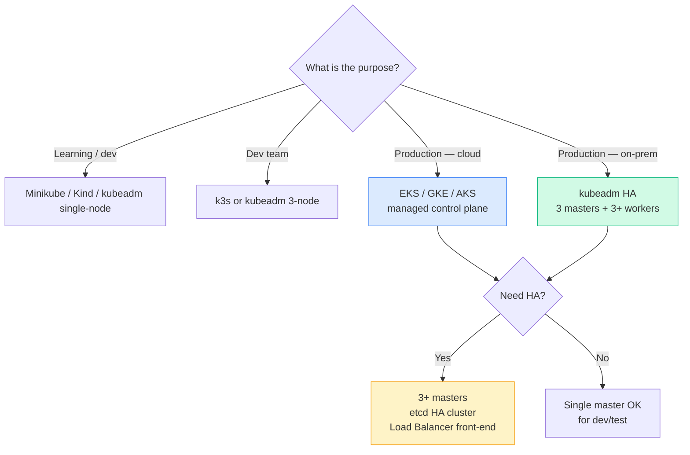
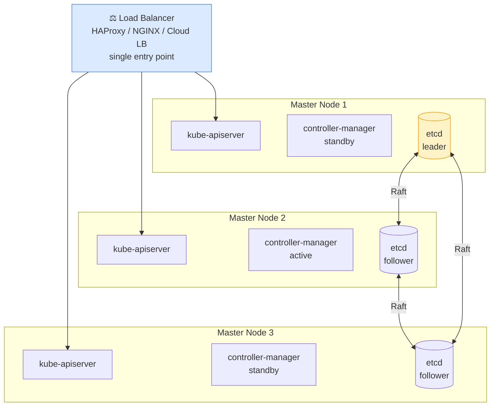
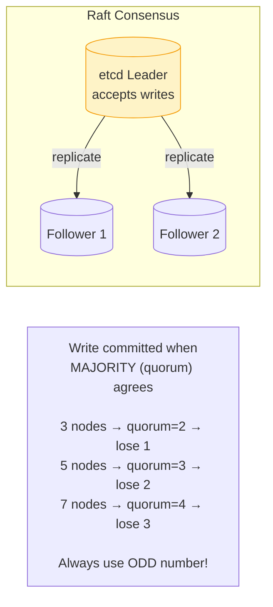
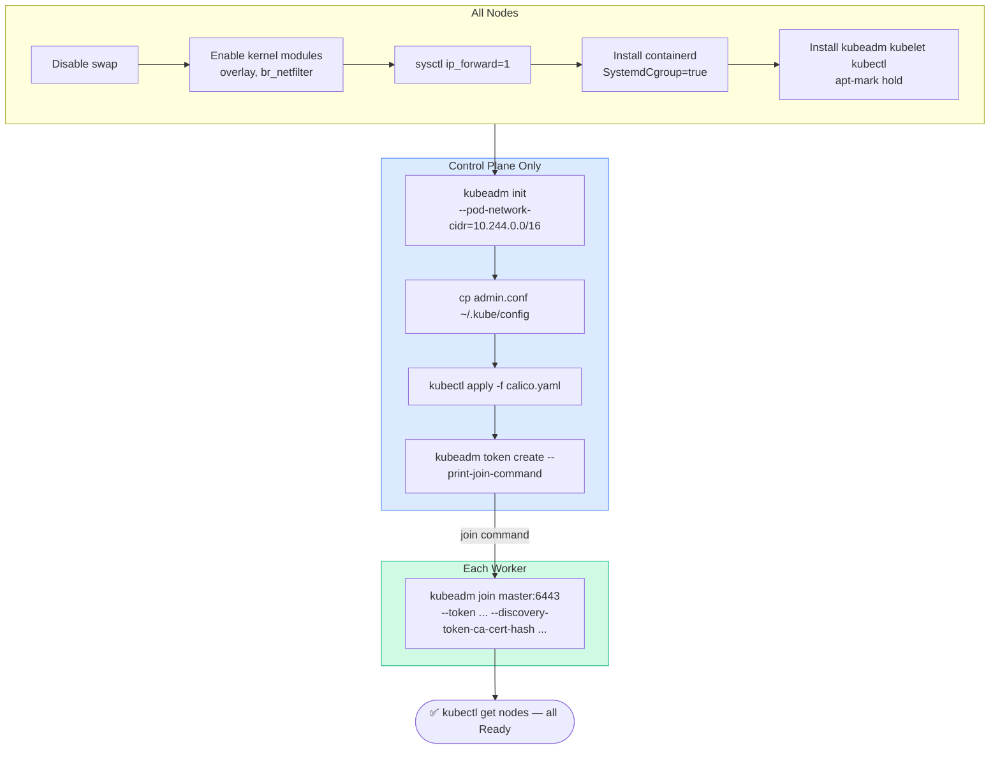

# Overview

---

# Flow: Cluster Design Decision Tree

```javascript
┌─────────────────────────────────────────────────────┐
│           CLUSTER DESIGN DECISION TREE                 │
│                                                       │
│  Purpose?
│  ├── Learning/Dev  → Minikube / Kind / kubeadm 1-node  │
│  ├── Dev team      → kubeadm multi-node / k3s           │
│  └── Production    → Managed (EKS/GKE/AKS) OR kubeadm HA│
│                                                       │
│  Cloud or On-Prem?
│  ├── Cloud  → EKS / GKE / AKS (managed control plane)  │
│  └── On-Prem → kubeadm + MAAS/bare-metal               │
│                                                       │
│  HA needed?
│  ├── Yes → 3+ master nodes + etcd HA + LB front       │
│  └── No  → single master OK for dev/test               │
└─────────────────────────────────────────────────────┘
```

---

# 1. Designing a Kubernetes Cluster

## Node Sizing Guidelines

[Table Not Rendered - Unsupported Block]

## HA Control Plane Architecture

```javascript
┌──────────────────────────────────────────────────┐
│           HA CONTROL PLANE (stacked etcd)              │
│                                                      │
│            ┌──────────────────┐                     │
│            │  Load Balancer      │                     │
│            │  HAProxy / NGINX    │                     │
│            │  (or cloud LB)     │                     │
│            └───┬────────┬──────┘                     │
│               │          │                            │
│         ┌────┴────┐  ┌────┴────┐                      │
│         │ Master 1  │  │ Master 2  │   Master 3       │
│         │ apiserver │  │ apiserver │   apiserver      │
│         │ ctrl-mgr  │  │ ctrl-mgr  │   ctrl-mgr       │
│         │ scheduler │  │ scheduler │   scheduler      │
│         │ etcd      │  │ etcd      │   etcd           │
│         └──────────┘  └──────────┘                      │
│              etcd cluster (Raft consensus)            │
│              needs odd number (3, 5, 7)               │
└──────────────────────────────────────────────────┘
```

---

# 2. etcd in HA

## Raft Consensus Algorithm

```javascript
┌──────────────────────────────────────────────────┐
│                RAFT IN ETCD                           │
│                                                      │
│  etcd-1 (LEADER) ──writes──► etcd-2 (follower)       │
│                           ► etcd-3 (follower)       │
│                                                      │
│  Write is committed when MAJORITY agrees (quorum)    │
│  Quorum = (N/2) + 1                                  │
│                                                      │
│  Nodes  Quorum  Fault tolerance                      │
│  1      1       0  (no fault tolerance)              │
│  3      2       1  (can lose 1 node)                 │
│  5      3       2  (can lose 2 nodes)                │
│  7      4       3  (can lose 3 nodes)                │
│                                                      │
│  Always use ODD number of etcd nodes!                │
│  (4 nodes = same fault tolerance as 3 but more risk) │
└──────────────────────────────────────────────────┘
```

---

# 3. kubeadm Install Flow

```javascript
┌──────────────────────────────────────────────────┐
│               KUBEADM INSTALL FLOW                    │
│                                                      │
│  All nodes:                                          │
│    1. Disable swap                                   │
│    2. Enable kernel modules (overlay, br_netfilter)  │
│    3. Set sysctl (ip_forward)                        │
│    4. Install container runtime (containerd)         │
│    5. Install kubeadm, kubelet, kubectl              │
│                                                      │
│  Control plane only:                                 │
│    6. kubeadm init --pod-network-cidr=10.244.0.0/16  │
│    7. Copy kubeconfig to ~/.kube/config              │
│    8. Install CNI plugin (Calico/Flannel/Weave)      │
│                                                      │
│  Worker nodes:                                       │
│    9. kubeadm join <master-ip>:6443 \ 
            --token <token> \
            --discovery-token-ca-cert-hash sha256:<hash>│
└──────────────────────────────────────────────────┘
```

```bash
# === ALL NODES ===

# Disable swap
swapoff -a
sed -i '/swap/d' /etc/fstab

# Kernel modules
cat > /etc/modules-load.d/k8s.conf << EOF
overlay
br_netfilter
EOF
modprobe overlay && modprobe br_netfilter

# Sysctl
cat > /etc/sysctl.d/k8s.conf << EOF
net.bridge.bridge-nf-call-iptables  = 1
net.bridge.bridge-nf-call-ip6tables = 1
net.ipv4.ip_forward                 = 1
EOF
sysctl --system

# Install containerd
apt-get install -y containerd
mkdir -p /etc/containerd
containerd config default > /etc/containerd/config.toml
# Set SystemdCgroup = true in config.toml
systemctl restart containerd

# Install kubeadm, kubelet, kubectl
apt-get install -y apt-transport-https curl
curl -fsSL https://pkgs.k8s.io/core:/stable:/v1.29/deb/Release.key | gpg --dearmor -o /etc/apt/keyrings/kubernetes-apt-keyring.gpg
echo 'deb [signed-by=/etc/apt/keyrings/kubernetes-apt-keyring.gpg] https://pkgs.k8s.io/core:/stable:/v1.29/deb/ /' > /etc/apt/sources.list.d/kubernetes.list
apt-get update
apt-get install -y kubelet kubeadm kubectl
apt-mark hold kubelet kubeadm kubectl

# === CONTROL PLANE ONLY ===

kubeadm init \
  --pod-network-cidr=10.244.0.0/16 \
  --apiserver-advertise-address=<master-ip>

mkdir -p $HOME/.kube
cp -i /etc/kubernetes/admin.conf $HOME/.kube/config
chown $(id -u):$(id -g) $HOME/.kube/config

# Install CNI (Calico)
kubectl apply -f https://raw.githubusercontent.com/projectcalico/calico/v3.26.0/manifests/calico.yaml

# Get join command for worker nodes
kubeadm token create --print-join-command

# === WORKER NODES ===

kubeadm join <master-ip>:6443 \
  --token <token> \
  --discovery-token-ca-cert-hash sha256:<hash>

# Verify from control plane
kubectl get nodes
```

> 📚 **Ref:** [kubeadm install](https://kubernetes.io/docs/setup/production-environment/tools/kubeadm/install-kubeadm/) | [HA topology](https://kubernetes.io/docs/setup/production-environment/tools/kubeadm/ha-topology/)

[Table Not Rendered - Unsupported Block]

## 🔄 HA Control Plane Architecture

[Table Not Rendered - Unsupported Block]

## 🔄 etcd Raft Quorum Table

[Table Not Rendered - Unsupported Block]

> 📌 Always use an **odd number** of etcd nodes. 4 nodes has the same fault tolerance as 3 but more risk during split-brain scenarios.

## 🔄 Cluster Design Decision Matrix

[Table Not Rendered - Unsupported Block]

---

# 🧩 Mermaid Diagrams

## Cluster Design Decision Tree



## HA Control Plane Architecture



## etcd Raft Quorum



## kubeadm Install Flow



