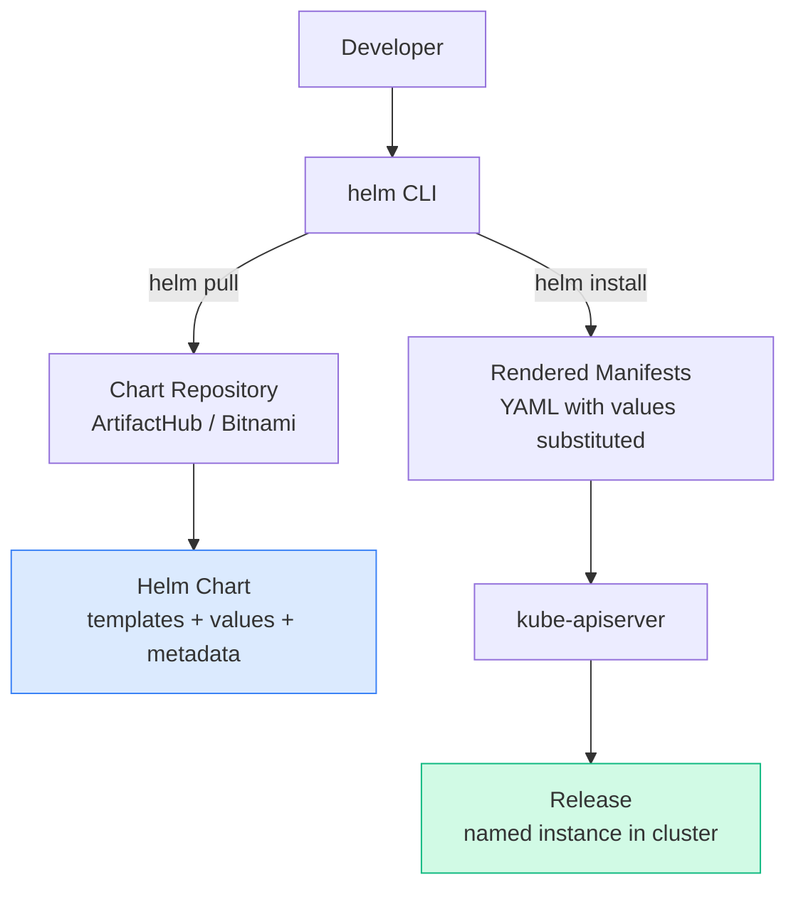
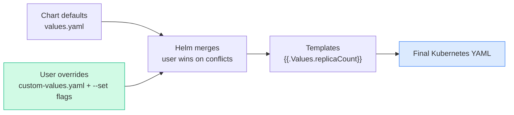
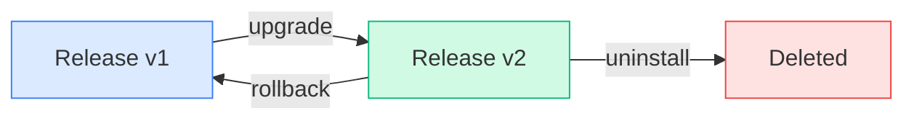
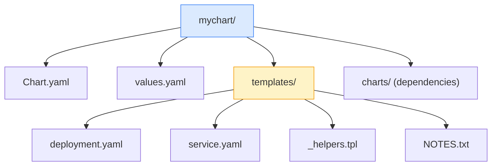

# Overview

> **Source:** KodeKloud CKA Course — Helm Section (2025 Updates) | 📅 June 2026

Helm is the **package manager for Kubernetes** — it bundles related Kubernetes manifests into reusable, versioned packages called **charts**. Added to the CKA exam in 2025.

---

# Flow: How Helm Works



---

# 1. Core Concepts

[Table Not Rendered - Unsupported Block]

## Helm 2 vs Helm 3

[Table Not Rendered - Unsupported Block]

---

# 2. Installation & Repository Setup

```bash
# Install Helm
curl https://raw.githubusercontent.com/helm/helm/main/scripts/get-helm-3 | bash
helm version

# Add repos
helm repo add stable https://charts.helm.sh/stable
helm repo add bitnami https://charts.bitnami.com/bitnami
helm repo update
helm repo list
helm repo remove bitnami
```

---

# 3. Search & Inspect Charts

```bash
# Search ArtifactHub (public)
helm search hub nginx
helm search hub wordpress

# Search local repos
helm search repo nginx
helm search repo bitnami/nginx

# Show chart info
helm show chart bitnami/nginx
helm show values bitnami/nginx      # all configurable values
helm show readme bitnami/nginx
helm show all bitnami/nginx
```

---

# 4. Install, List, Status

```bash
# Basic install
helm install my-nginx bitnami/nginx

# Specific namespace
helm install my-nginx bitnami/nginx --namespace web --create-namespace

# With custom values
helm install my-nginx bitnami/nginx --set replicaCount=3 --set service.type=NodePort
helm install my-nginx bitnami/nginx -f custom-values.yaml

# Dry run (preview without applying)
helm install my-nginx bitnami/nginx --dry-run

# Render templates only
helm template my-nginx bitnami/nginx
helm template my-nginx bitnami/nginx -f values.yaml > output.yaml

# List releases
helm list
helm list -A                        # all namespaces
helm list -n web

# Status + history
helm status my-nginx
helm history my-nginx
# REVISION  STATUS     CHART          DESCRIPTION
# 1         deployed   nginx-15.0.0   Install complete
```

---

# 5. Customizing Values



```yaml
# custom-values.yaml
replicaCount: 3
image:
  repository: nginx
  tag: "1.25"
service:
  type: LoadBalancer
  port: 80
resources:
  requests:
    cpu: 100m
    memory: 128Mi
  limits:
    cpu: 500m
    memory: 256Mi
```

```bash
# --set always wins over -f
helm install myapp bitnami/nginx -f custom-values.yaml --set replicaCount=5

# Nested values
helm install myapp bitnami/nginx --set image.tag=1.26

# View values used in a deployed release
helm get values my-nginx
helm get values my-nginx --all       # includes chart defaults
```

---

# 6. Upgrade, Rollback, Uninstall



```bash
# Upgrade
helm upgrade my-nginx bitnami/nginx
helm upgrade my-nginx bitnami/nginx -f new-values.yaml
helm upgrade my-nginx bitnami/nginx --version 15.2.0

# Idempotent: install if not exists, upgrade if exists
helm upgrade --install my-nginx bitnami/nginx -f values.yaml

# Rollback
helm rollback my-nginx              # to previous revision
helm rollback my-nginx 1            # to revision 1
helm history my-nginx               # check revision numbers

# Uninstall
helm uninstall my-nginx
helm uninstall my-nginx --keep-history
helm uninstall my-nginx -n web
```

---

# 7. Chart Structure



```yaml
# Chart.yaml
apiVersion: v2
name: mychart
description: My application
type: application
version: 0.1.0
appVersion: "1.25.0"
dependencies:
- name: redis
  version: "17.x.x"
  repository: https://charts.bitnami.com/bitnami
```

```yaml
# templates/deployment.yaml
apiVersion: apps/v1
kind: Deployment
metadata:
  name: {{ .Release.Name }}-app
  labels:
    app: {{ .Chart.Name }}
spec:
  replicas: {{ .Values.replicaCount }}
  template:
    spec:
      containers:
      - name: {{ .Chart.Name }}
        image: "{{ .Values.image.repository }}:{{ .Values.image.tag }}"
        resources:
          {{- toYaml .Values.resources | nindent 10 }}
```

---

# 8. Create, Lint, Package

```bash
# Scaffold new chart
helm create mychart

# Validate
helm lint mychart/

# Render locally
helm template myrelease mychart/
helm template myrelease mychart/ -f values.yaml

# Package
helm package mychart/
# Creates: mychart-0.1.0.tgz

# Install from local chart
helm install myapp ./mychart/
helm install myapp mychart-0.1.0.tgz

# Pull chart for inspection / offline use
helm pull bitnami/nginx --untar
helm pull bitnami/nginx --version 15.0.0
```

---

# Quick Reference

```bash
# Repos
helm repo add <name> <url> && helm repo update

# Find charts
helm search hub <keyword>
helm search repo <keyword>
helm show values <chart>

# Deploy
helm install <rel> <chart> [-f values.yaml] [--set k=v] [--dry-run]
helm upgrade <rel> <chart> [-f values.yaml]
helm upgrade --install <rel> <chart>        # idempotent
helm template <rel> <chart>                 # render only

# Inspect
helm list -A
helm status <rel>
helm history <rel>
helm get values <rel>
helm get manifest <rel>

# Lifecycle
helm rollback <rel> [revision]
helm uninstall <rel>

# Develop
helm create <chart> && helm lint <chart> && helm package <chart>
helm pull <chart> --untar
```

> 📚 **Ref:** [Helm Docs](https://helm.sh/docs/) | [ArtifactHub](https://artifacthub.io/)

