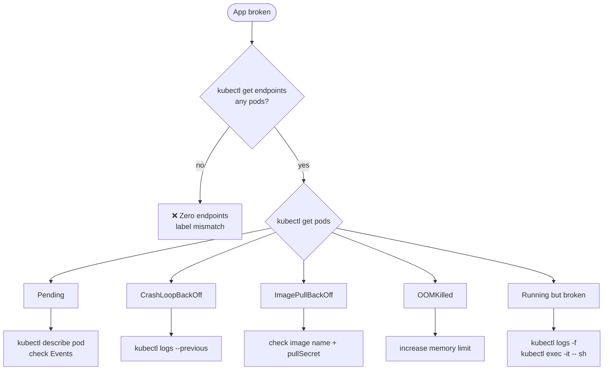

# 15.1 Troubleshooting Pods & Applications

> Part of **15 🔍 Troubleshooting** | CKA Chapter 15

---

# Application Failure Flow



```bash
# Full triage sequence
kubectl get all -n <ns>
kubectl get endpoints <svc>
kubectl describe pod <name>
kubectl logs <pod>
kubectl logs <pod> --previous
kubectl exec -it <pod> -- sh
kubectl exec -it <pod> -- env
kubectl exec -it <pod> -- curl localhost:8080/health
```

