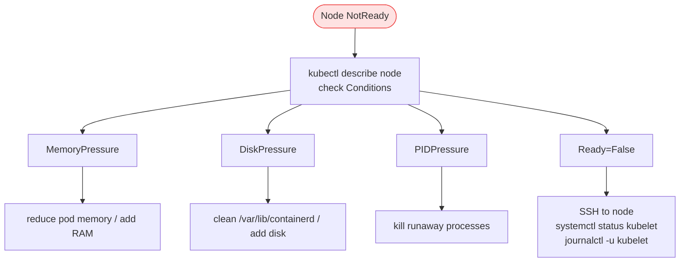

# 15.2 Troubleshooting Nodes

> Part of **15 🔍 Troubleshooting** | CKA Chapter 15

---

# Worker Node Failure Flow



```bash
kubectl get nodes
kubectl describe node node01     # check Conditions section

# SSH to node
ssh node01
systemctl status kubelet
journalctl -u kubelet --no-pager | tail -30
df -h                            # disk usage
free -h                          # memory
dmesg | grep -i oom              # OOM events

# Fix and restart
systemctl daemon-reload
systemctl restart kubelet
systemctl enable kubelet
```

