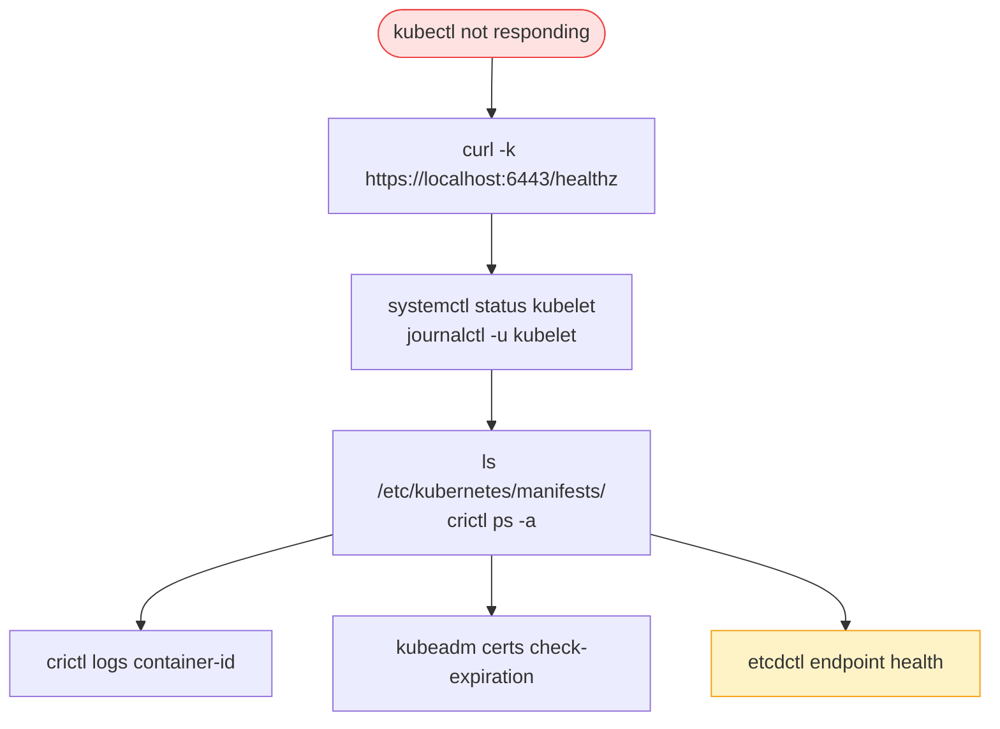

# 15.3 Troubleshooting Control Plane

> Part of **15 🔍 Troubleshooting** | CKA Chapter 15

---

# Control Plane Failure Flow



```bash
# Is API server reachable?
curl -k https://localhost:6443/healthz

# kubelet running?
systemctl status kubelet
journalctl -u kubelet -f

# Static pods running?
crictl ps -a | grep -E "kube-apiserver|etcd|kube-scheduler|kube-controller"
crictl logs $(crictl ps -a | grep kube-apiserver | awk '{print $1}')

# Certs expired?
kubeadm certs check-expiration
kubeadm certs renew all

# etcd health
export ETCDCTL_API=3
etcdctl endpoint health \
  --endpoints=https://127.0.0.1:2379 \
  --cacert=/etc/kubernetes/pki/etcd/ca.crt \
  --cert=/etc/kubernetes/pki/etcd/server.crt \
  --key=/etc/kubernetes/pki/etcd/server.key
```

