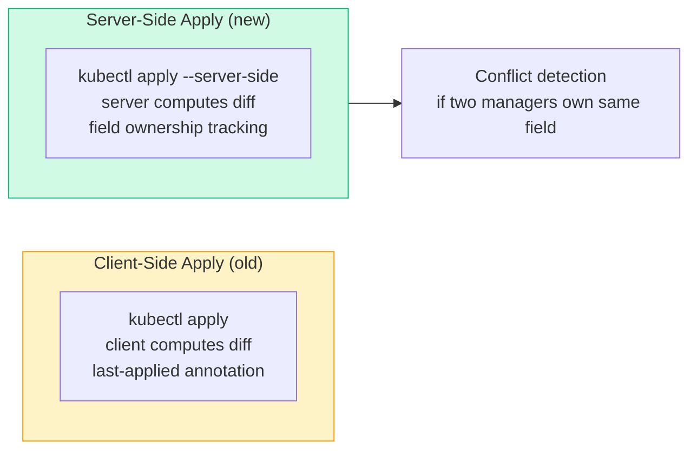
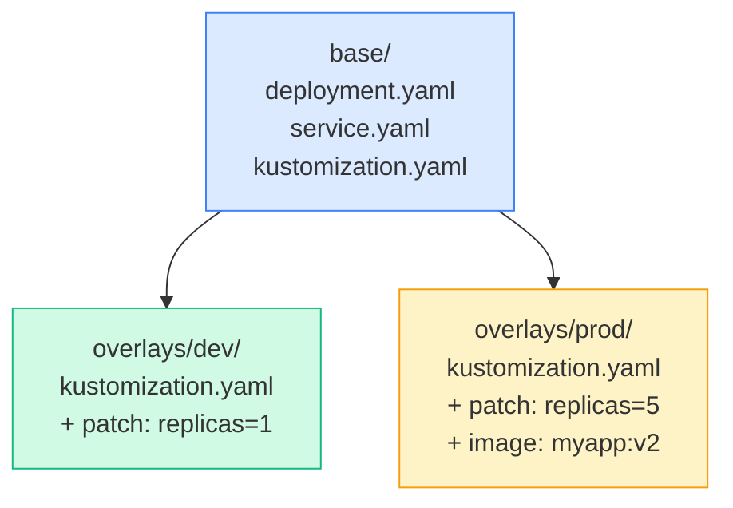

# Overview

---

# 1. JSONPath with kubectl

## What is JSONPath?

JSONPath is a query language for JSON. `kubectl` uses it with `-o jsonpath=` to extract specific fields from API responses.

## JSONPath Flow

```javascript
kubectl get pods -o json
       │
       ▼
 JSON output (full API object)
       │
       ▼
 JSONPath query filters it
  .items[0].metadata.name  → "nginx-pod"
  .items[*].status.podIP   → ["10.0.0.1", "10.0.0.2"]
```

## Syntax Reference

[Table Not Rendered - Unsupported Block]

## Practical Examples

```bash
# Get a single pod name
kubectl get pods -o jsonpath='{.items[0].metadata.name}'

# Get ALL pod names
kubectl get pods -o jsonpath='{.items[*].metadata.name}'

# Get pod names AND IPs (two fields)
kubectl get pods -o jsonpath='{.items[*].metadata.name} {.items[*].status.podIP}'

# Newline-separated with range loop
kubectl get pods -o jsonpath='{range .items[*]}{.metadata.name}{"\t"}{.status.podIP}{"\n"}{end}'

# Node names and their OS
kubectl get nodes -o jsonpath='{range .items[*]}{.metadata.name}{"\t"}{.status.nodeInfo.osImage}{"\n"}{end}'

# Get image of first container in first pod
kubectl get pods -o jsonpath='{.items[0].spec.containers[0].image}'

# Filter: pods on a specific node
kubectl get pods -o jsonpath='{.items[?(@.spec.nodeName=="node01")].metadata.name}'

# Get service ClusterIP
kubectl get svc my-service -o jsonpath='{.spec.clusterIP}'

# Get all PV capacities sorted
kubectl get pv --sort-by=.spec.capacity.storage

# Custom columns (more readable than jsonpath)
kubectl get pods -o custom-columns='NAME:.metadata.name,IMAGE:.spec.containers[0].image,NODE:.spec.nodeName'

# Sort nodes by CPU allocatable
kubectl get nodes --sort-by='.status.allocatable.cpu'

# Get secret value and decode
kubectl get secret my-secret -o jsonpath='{.data.password}' | base64 -d
```

---

# 2. Advanced kubectl Commands

## Imperative Object Management

```bash
# Generate YAML without creating (dry-run trick)
kubectl run nginx --image=nginx --dry-run=client -o yaml > pod.yaml
kubectl create deployment myapp --image=nginx --replicas=3 --dry-run=client -o yaml
kubectl expose deployment myapp --port=80 --type=NodePort --dry-run=client -o yaml
kubectl create configmap my-cm --from-literal=key=value --dry-run=client -o yaml
kubectl create secret generic my-sec --from-literal=pass=secret --dry-run=client -o yaml
kubectl create serviceaccount my-sa --dry-run=client -o yaml
kubectl create role my-role --verb=get,list --resource=pods --dry-run=client -o yaml
kubectl create rolebinding my-rb --role=my-role --user=jane --dry-run=client -o yaml

# Force replace (delete + create)
kubectl replace --force -f pod.yaml

# Patch a field in-place
kubectl patch pod nginx -p '{"spec":{"containers":[{"name":"nginx","image":"nginx:1.26"}]}}'
kubectl patch deployment myapp --type=json \
  -p='[{"op":"replace","path":"/spec/replicas","value":5}]'
```

## Output Formats

```bash
-o yaml          # full YAML
-o json          # full JSON
-o wide          # extra columns
-o name          # just resource/name
-o jsonpath=     # JSONPath query
-o custom-columns=  # pick your columns
--sort-by=       # sort output
```

## Useful kubectl Shortcuts

```bash
# Abbreviations
kubectl get po          # pods
kubectl get svc         # services
kubectl get deploy      # deployments
kubectl get rs          # replicasets
kubectl get cm          # configmaps
kubectl get ns          # namespaces
kubectl get pv          # persistentvolumes
kubectl get pvc         # persistentvolumeclaims
kubectl get sa          # serviceaccounts
kubectl get ing         # ingresses
kubectl get netpol      # networkpolicies
kubectl get sc          # storageclasses

# All resources in all namespaces
kubectl get all -A

# Watch live (like top)
kubectl get pods -w

# Set context namespace
kubectl config set-context --current --namespace=production

# Exec into a pod
kubectl exec -it <pod> -- /bin/bash
kubectl exec -it <pod> -c <container> -- /bin/sh

# Copy files to/from pod
kubectl cp <pod>:/path/to/file ./local-file
kubectl cp ./local-file <pod>:/path/to/file

# Port-forward (local:remote)
kubectl port-forward pod/nginx 8080:80
kubectl port-forward svc/myapp 8080:80
kubectl port-forward deployment/myapp 8080:80

# Run a debug pod (temporary)
kubectl run debug --image=busybox --rm -it -- /bin/sh
kubectl run debug --image=nicolaka/netshoot --rm -it -- bash

# Apply all YAML in a directory
kubectl apply -f ./manifests/
kubectl apply -R -f ./manifests/   # recursive

# Delete all resources in a namespace
kubectl delete all --all -n dev
```

## CKA Exam Speed Tips

```bash
# Set alias (saves typing in exam)
alias k=kubectl
export do="--dry-run=client -o yaml"   # usage: k run nginx --image=nginx $do
export now="--force --grace-period=0"  # usage: k delete pod nginx $now

# Enable kubectl auto-completion
source <(kubectl completion bash)
echo 'source <(kubectl completion bash)' >> ~/.bashrc
complete -o default -F __start_kubectl k

# Use vim for quick YAML edits
export KUBE_EDITOR=vim

# Quick namespace switch
kubectl config set-context --current --namespace=kube-system
```

---

# Quick JSONPath Reference Card

```bash
# Pod info
kubectl get pod <name> -o jsonpath='{.spec.nodeName}'
kubectl get pod <name> -o jsonpath='{.status.podIP}'
kubectl get pod <name> -o jsonpath='{.spec.containers[*].name}'
kubectl get pod <name> -o jsonpath='{.spec.containers[0].image}'

# All pods
kubectl get pods -o jsonpath='{range .items[*]}{.metadata.name}{","}{.status.phase}{"\n"}{end}'

# Nodes
kubectl get nodes -o jsonpath='{.items[*].metadata.name}'
kubectl get nodes -o jsonpath='{range .items[*]}{.metadata.name}{"\t"}{.status.addresses[0].address}{"\n"}{end}'

# Secrets
kubectl get secret <name> -o jsonpath='{.data.<key>}' | base64 -d

# Services
kubectl get svc <name> -o jsonpath='{.spec.clusterIP}'
kubectl get svc <name> -o jsonpath='{.spec.ports[0].nodePort}'
```


---

# 3. kubectl diff — Preview Changes Before Applying

See exactly what will change **before** running `kubectl apply` — like a dry-run with a real diff.

```bash
# Show diff between local YAML and live cluster state
kubectl diff -f deployment.yaml
# --- live
# +++ local
# @@ -10,7 +10,7 @@
#    spec:
#      containers:
# -    - image: nginx:1.24
# +    - image: nginx:1.25
#        name: nginx

# Diff entire directory
kubectl diff -f ./manifests/

# Diff from stdin
cat deployment.yaml | kubectl diff -f -

# Use in CI/CD to gate deployments
kubectl diff -f deployment.yaml
if [ $? -ne 0 ]; then
  echo "Changes detected — review before applying"
fi
```

---

# 4. Server-Side Apply

Applies manifests on the **server** instead of the client — enables field ownership, conflict detection, and better merge semantics.



```bash
# Basic server-side apply
kubectl apply --server-side -f deployment.yaml

# Force conflict resolution (take ownership)
kubectl apply --server-side --force-conflicts -f deployment.yaml

# Specify field manager name
kubectl apply --server-side --field-manager=my-ci-pipeline -f deployment.yaml

# Check field ownership on an object
kubectl get deployment myapp -o yaml | grep -A20 managedFields
```

---

# 5. Kustomize

Built into `kubectl` — overlay-based configuration management without templating.



```yaml
# base/kustomization.yaml
apiVersion: kustomize.config.k8s.io/v1beta1
kind: Kustomization
resources:
- deployment.yaml
- service.yaml
commonLabels:
  app: myapp
```

```yaml
# overlays/prod/kustomization.yaml
apiVersion: kustomize.config.k8s.io/v1beta1
kind: Kustomization
bases:
- ../../base
namePrefix: prod-                    # prefix all resource names
namespace: production
images:
- name: myapp
  newTag: v2.1.0                     # override image tag
patches:
- patch: |-
    - op: replace
      path: /spec/replicas
      value: 5
  target:
    kind: Deployment
    name: myapp
```

```bash
# Preview what kustomize would generate
kubectl kustomize overlays/prod/

# Apply directly
kubectl apply -k overlays/prod/

# Apply base
kubectl apply -k base/

# Build to file
kubectl kustomize overlays/prod/ > prod-manifests.yaml
kubectl apply -f prod-manifests.yaml

# Delete resources created by kustomize
kubectl delete -k overlays/prod/
```

