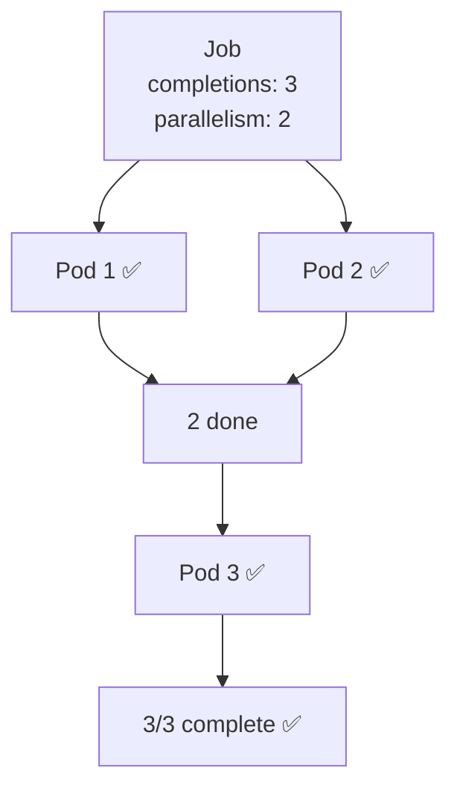
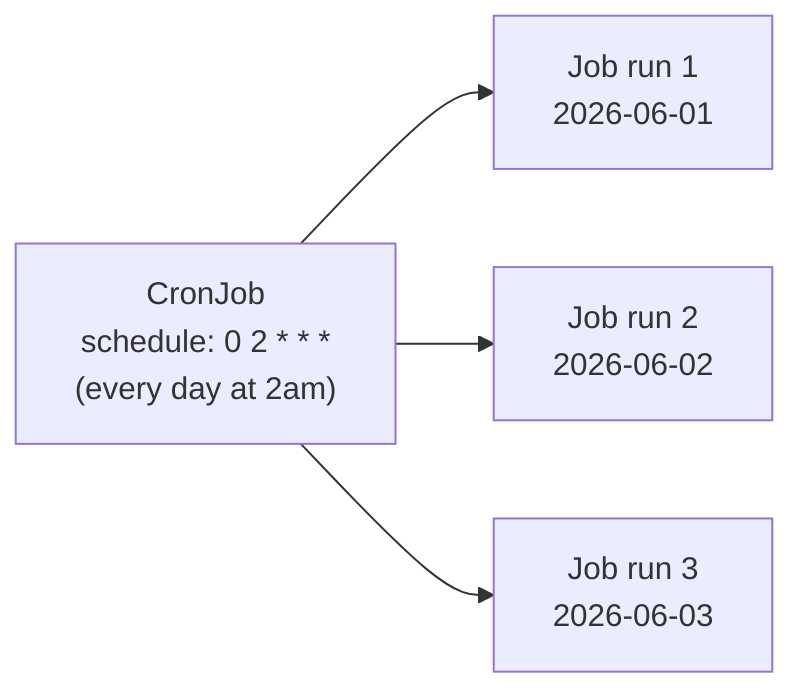

# Jobs & CronJobs

> Part of **04 ⚙️ Application Lifecycle Management** | CKA Chapter 4

Jobs and CronJobs run **batch workloads to completion** — not long-running services.

---

# Jobs — Run to Completion



```yaml
apiVersion: batch/v1
kind: Job
metadata:
  name: data-processor
spec:
  completions: 3           # run 3 pods to completion
  parallelism: 2           # run 2 at the same time
  backoffLimit: 4          # retry failed pods 4 times
  activeDeadlineSeconds: 300  # kill job after 5 min
  template:
    spec:
      restartPolicy: Never   # Never or OnFailure (NOT Always)
      containers:
      - name: processor
        image: batch-job:v1
        command: ['python', 'process.py']
```

```bash
kubectl get jobs
kubectl describe job data-processor
kubectl logs job/data-processor     # logs from job pods
kubectl delete job data-processor   # cleans up pods too
```

---

# CronJobs — Scheduled Jobs



```yaml
apiVersion: batch/v1
kind: CronJob
metadata:
  name: daily-backup
spec:
  schedule: "0 2 * * *"          # cron: at 02:00 daily
  concurrencyPolicy: Forbid      # Allow | Forbid | Replace
  successfulJobsHistoryLimit: 3  # keep last 3 successful jobs
  failedJobsHistoryLimit: 1      # keep last 1 failed job
  startingDeadlineSeconds: 60    # skip if > 60s late
  jobTemplate:
    spec:
      completions: 1
      backoffLimit: 2
      template:
        spec:
          restartPolicy: OnFailure
          containers:
          - name: backup
            image: backup-tool:v1
            command: ['sh', '-c', 'backup.sh']
```

## Cron Schedule Syntax

```javascript
┌──── minute (0-59)
│  ┌─── hour (0-23)
│  │  ┌── day of month (1-31)
│  │  │  ┌─ month (1-12)
│  │  │  │  ┌ day of week (0-6, 0=Sunday)
│  │  │  │  │
*  *  *  *  *

Examples:
0 2 * * *     → every day at 2:00am
*/15 * * * *  → every 15 minutes
0 9 * * 1     → every Monday at 9:00am
0 0 1 * *     → first day of every month at midnight
```

```bash
kubectl get cronjobs
kubectl describe cronjob daily-backup

# Manually trigger a CronJob
kubectl create job --from=cronjob/daily-backup manual-run-01

# Suspend a CronJob
kubectl patch cronjob daily-backup -p '{"spec":{"suspend":true}}'
```

