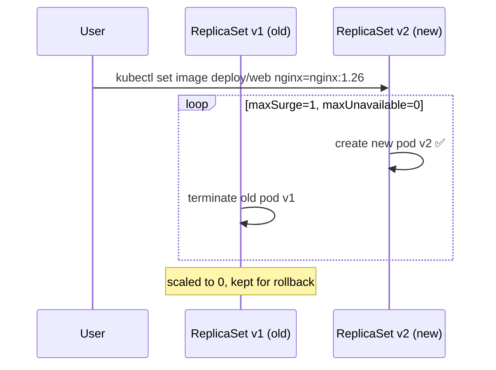

# Rolling Updates & Rollbacks

> Part of **04 ⚙️ Application Lifecycle Management** | CKA Chapter 4

---

# Rolling Updates

A rolling update replaces old pods with new ones **gradually** — zero downtime by default.



```bash
# Update image
kubectl set image deployment/web nginx=nginx:1.26

# Watch rollout live
kubectl rollout status deployment/web

# View history
kubectl rollout history deployment/web

# Rollback to previous version
kubectl rollout undo deployment/web

# Rollback to specific revision
kubectl rollout undo deployment/web --to-revision=1

# Annotate change for history
kubectl annotate deployment/web kubernetes.io/change-cause="upgrade to nginx 1.26"

# Pause + batch multiple changes
kubectl rollout pause deployment/web
kubectl set image deployment/web nginx=nginx:1.26
kubectl set resources deployment/web -c nginx --limits=cpu=500m
kubectl rollout resume deployment/web
```

```yaml
# Deployment update strategy in YAML
spec:
  strategy:
    type: RollingUpdate
    rollingUpdate:
      maxSurge: 1        # max extra pods above desired
      maxUnavailable: 0  # max pods below desired
```

## Recreate Strategy

```yaml
spec:
  strategy:
    type: Recreate     # kill ALL old pods first, then create new
                       # causes downtime — use only when needed
```

