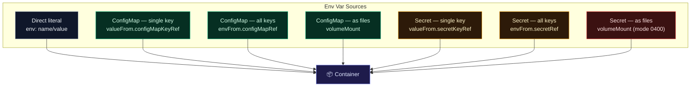

# Environment Variables, ConfigMaps & Secrets

## Env Var Injection Sources



## ConfigMaps

```bash
# Create
kubectl create configmap app-config \
  --from-literal=APP_COLOR=blue \
  --from-literal=APP_MODE=production
kubectl create configmap app-config --from-file=config.properties

# View
kubectl get configmaps
kubectl describe configmap app-config
```

```yaml
# Declarative
apiVersion: v1
kind: ConfigMap
metadata:
  name: app-config
data:
  APP_COLOR: blue
  APP_MODE: production
  DB_HOST: mysql-service
```

```yaml
# Inject ALL keys as env vars
spec:
  containers:
  - name: app
    image: myapp
    envFrom:
    - configMapRef:
        name: app-config
```

```yaml
# Inject single key
    env:
    - name: APP_COLOR
      valueFrom:
        configMapKeyRef:
          name: app-config
          key: APP_COLOR
```

```yaml
# Mount as files (each key = one file)
    volumeMounts:
    - name: config-vol
      mountPath: /etc/config
  volumes:
  - name: config-vol
    configMap:
      name: app-config
# Result: /etc/config/APP_COLOR contains "blue"
```

## Secrets

```bash
# Create
kubectl create secret generic app-secret \
  --from-literal=DB_PASSWORD=mysecretpass \
  --from-literal=API_KEY=abc123xyz

# View (values base64-encoded)
kubectl get secrets
kubectl describe secret app-secret        # values hidden
kubectl get secret app-secret -o yaml     # base64 visible
echo 'bXlzZWNyZXRwYXNz' | base64 -d     # decode
```

```yaml
# Declarative (values must be base64 encoded)
apiVersion: v1
kind: Secret
metadata:
  name: app-secret
type: Opaque
data:
  DB_PASSWORD: bXlzZWNyZXRwYXNz
  API_KEY: YWJjMTIzeHl6
```

```yaml
# Mount as files — most secure approach
    volumeMounts:
    - name: secret-vol
      mountPath: /etc/secrets
      readOnly: true
  volumes:
  - name: secret-vol
    secret:
      secretName: app-secret
      defaultMode: 0400
```

> **Best practice:** Prefer volume mounts over env vars for secrets — they don't appear in `kubectl describe pod` output and can be rotated without restarting the pod.
