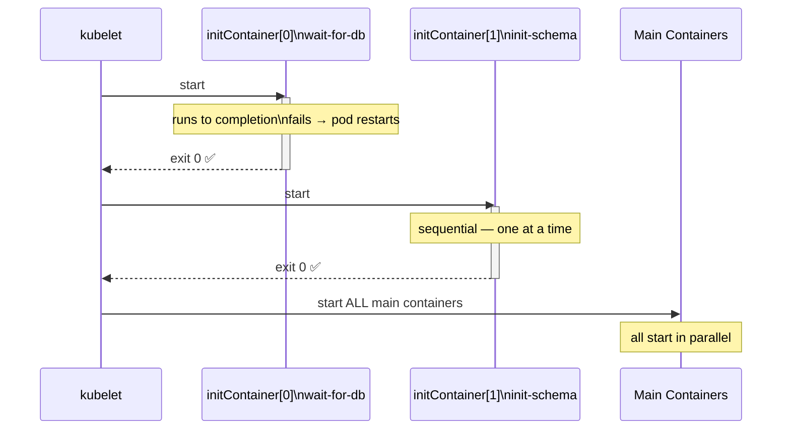

# Init Containers

Init containers run **before** the main application containers start. They must exit successfully before the pod proceeds. Use them for setup tasks: waiting for dependencies, pre-populating volumes, or running DB migrations.

## Execution Flow



## Key Rules

- Init containers run **one at a time**, in order
- Each must **exit 0** (success) before the next starts
- If an init container fails → pod is restarted (per `restartPolicy`)
- Main containers do **not start** until all init containers complete
- Init containers do **not support** liveness/readiness probes

## Example

```yaml
apiVersion: v1
kind: Pod
metadata:
  name: myapp-pod
spec:
  initContainers:
  - name: wait-for-db
    image: busybox
    command: ['sh', '-c', 'until nc -z mysql-service 3306; do echo waiting; sleep 2; done']

  - name: init-schema
    image: mysql:8
    command: ['sh', '-c', 'mysql -h mysql-service -u root -p$DB_PASS < /schema/init.sql']
    env:
    - name: DB_PASS
      valueFrom:
        secretKeyRef:
          name: db-secret
          key: password

  containers:
  - name: myapp
    image: myapp:v2
    ports:
    - containerPort: 8080
```

## Monitoring Init Containers

```bash
kubectl get pods -w
# NAME        READY   STATUS         RESTARTS
# myapp-pod   0/1     Init:0/2       0    ← init[0] running
# myapp-pod   0/1     Init:1/2       0    ← init[1] running
# myapp-pod   0/1     PodInitializing 0
# myapp-pod   1/1     Running        0    ← main container started

kubectl logs myapp-pod -c wait-for-db
```
