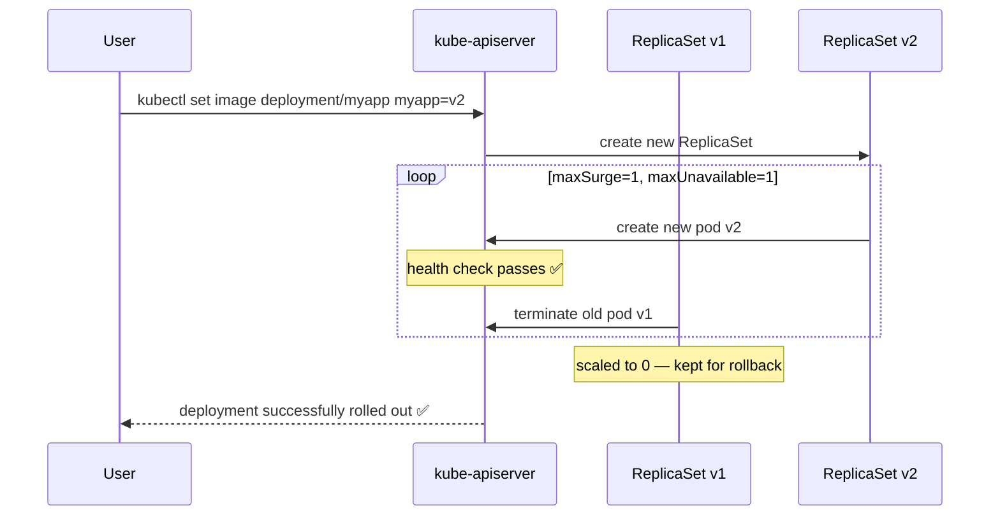
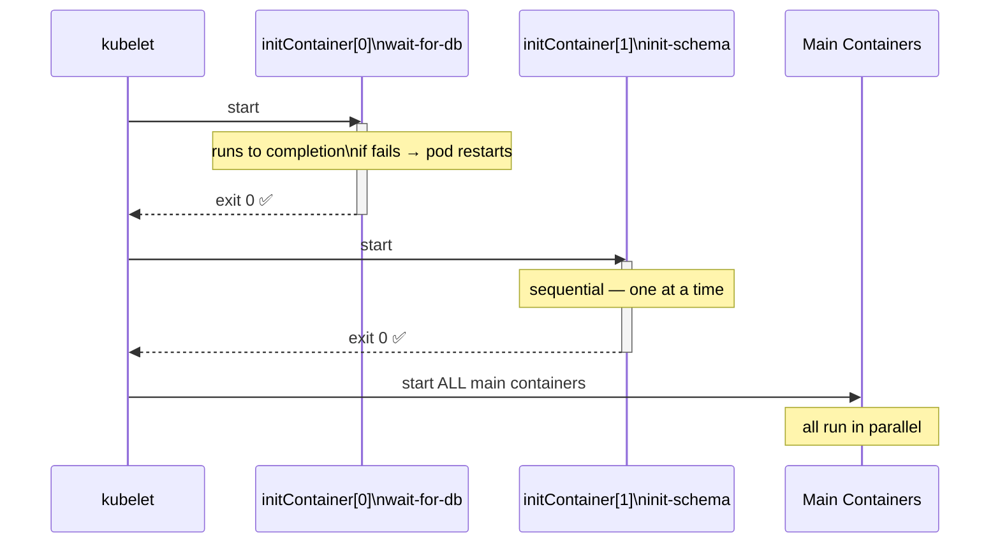
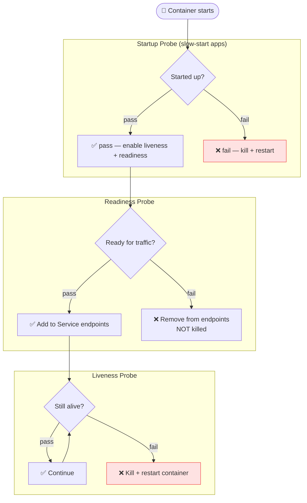
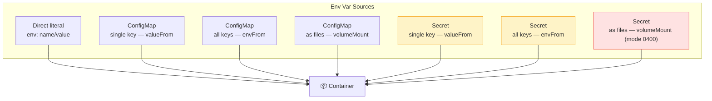

---

# Flow: Application Lifecycle in Kubernetes

```javascript
┌────────────────────────────────────────────────────┐
│           APPLICATION LIFECYCLE FLOW                   │
│                                                        │
│  CREATE                                                │
│  kubectl create deployment myapp --image=v1            │
│       │                                                │
│       ▼                                                │
│  RUNNING (ReplicaSet v1 ──► Pods with image:v1)        │
│       │                                                │
│       ▼                                                │
│  UPDATE (kubectl set image ... v2)                     │
│       │                                                │
│       ▼                                                │
│  ROLLING UPDATE                                        │
│  ReplicaSet v2 created ─► new pods (v2) come up         │
│  ReplicaSet v1 scaled down ─► old pods (v1) removed     │
│  (one at a time, zero downtime)                        │
│       │                                                │
│       ▼                                                │
│  ROLLBACK (if v2 broken)                               │
│  kubectl rollout undo deployment/myapp                 │
│  → ReplicaSet v1 scaled back up                        │
└────────────────────────────────────────────────────┘
```

---

# 1. Rolling Updates & Rollbacks

## Update Strategies

[Table Placeholder]

## Rolling Update Flow

```javascript
Deployment: replicas=4, maxSurge=1, maxUnavailable=1

START:  [v1][v1][v1][v1]           (4 old pods)

STEP 1: [v1][v1][v1][v2]           (1 new created, 1 old removed)
STEP 2: [v1][v1][v2][v2]           (1 more new, 1 more old removed)
STEP 3: [v1][v2][v2][v2]           (...)
STEP 4: [v2][v2][v2][v2]           (all new, done)
```

```yaml
apiVersion: apps/v1
kind: Deployment
metadata:
  name: myapp
spec:
  replicas: 4
  strategy:
    type: RollingUpdate
    rollingUpdate:
      maxSurge: 1           # max pods above desired during update
      maxUnavailable: 1     # max pods below desired during update
  selector:
    matchLabels:
      app: myapp
  template:
    metadata:
      labels:
        app: myapp
    spec:
      containers:
      - name: myapp
        image: myapp:v1
```

## Imperative Update Commands

```bash
# Update image
kubectl set image deployment/myapp myapp=myapp:v2

# Check rollout status (live)
kubectl rollout status deployment/myapp
# Waiting for deployment "myapp" rollout to finish: 2 out of 4 new replicas updated...
# deployment "myapp" successfully rolled out

# View rollout history
kubectl rollout history deployment/myapp
# REVISION  CHANGE-CAUSE
# 1         kubectl create --record
# 2         kubectl set image deployment/myapp myapp=myapp:v2

# View specific revision
kubectl rollout history deployment/myapp --revision=2

# Rollback to previous version
kubectl rollout undo deployment/myapp

# Rollback to specific revision
kubectl rollout undo deployment/myapp --to-revision=1

# Pause to batch multiple changes
kubectl rollout pause deployment/myapp
kubectl set image deployment/myapp myapp=myapp:v3
kubectl set resources deployment/myapp -c myapp --limits=cpu=200m,memory=512Mi
kubectl rollout resume deployment/myapp

# Annotate a change cause (recorded in history)
kubectl annotate deployment/myapp kubernetes.io/change-cause="image updated to v2"
```

---

# 2. Commands & Arguments

## Docker vs Kubernetes

```javascript
┌─────────────────────────────────────────────┐
│   DOCKER           │  KUBERNETES                │
│───────────────────┼─────────────────────────│
│   ENTRYPOINT       │  command                   │
│   CMD              │  args                      │
└───────────────────┴─────────────────────────┘
```

```docker
# Dockerfile
FROM ubuntu
ENTRYPOINT ["sleep"]
CMD ["5"]         # default arg
# docker run ubuntu-sleeper        → sleep 5
# docker run ubuntu-sleeper 10     → sleep 10
```

```yaml
# Override ENTRYPOINT + CMD in Kubernetes
apiVersion: v1
kind: Pod
metadata:
  name: ubuntu-sleeper
spec:
  containers:
  - name: ubuntu
    image: ubuntu-sleeper
    command: ["sleep2.0"]   # overrides ENTRYPOINT
    args: ["10"]            # overrides CMD
```

---

# 3. Environment Variables, ConfigMaps & Secrets

## Env Variable Flow

```javascript
┌──────────────────────────────────────────────────┐
│               ENV VAR SOURCES                          │
│                                                        │
│  1. Direct (hardcoded in pod spec)                     │
│     env: [{name: COLOR, value: blue}]                  │
│                                                        │
│  2. ConfigMap (non-sensitive config)                   │
│     ConfigMap ──► env (single key)                      │
│     ConfigMap ──► envFrom (all keys)                    │
│     ConfigMap ──► Volume (as files)                     │
│                                                        │
│  3. Secret (sensitive: passwords, tokens, certs)       │
│     Secret ──► env (single key)                         │
│     Secret ──► envFrom (all keys)                       │
│     Secret ──► Volume (as files, mode 0400)             │
└──────────────────────────────────────────────────┘
```

## ConfigMaps

```bash
# Create imperative
kubectl create configmap app-config \
  --from-literal=APP_COLOR=blue \
  --from-literal=APP_MODE=production

# From file
kubectl create configmap app-config --from-file=config.properties

# View
kubectl get configmaps
kubectl describe configmap app-config
```

```yaml
# Declarative ConfigMap
apiVersion: v1
kind: ConfigMap
metadata:
  name: app-config
data:
  APP_COLOR: blue
  APP_MODE: production
  DB_HOST: mysql-service
```

```yaml
# Use in Pod — Method 1: envFrom (inject ALL keys)
spec:
  containers:
  - name: app
    image: myapp
    envFrom:
    - configMapRef:
        name: app-config
```

```yaml
# Use in Pod — Method 2: single key
spec:
  containers:
  - name: app
    image: myapp
    env:
    - name: APP_COLOR
      valueFrom:
        configMapKeyRef:
          name: app-config
          key: APP_COLOR
```

```yaml
# Use in Pod — Method 3: volume (each key becomes a file)
spec:
  containers:
  - name: app
    image: myapp
    volumeMounts:
    - name: config-vol
      mountPath: /etc/config
  volumes:
  - name: config-vol
    configMap:
      name: app-config
# Result: /etc/config/APP_COLOR contains "blue"
#         /etc/config/APP_MODE contains "production"
```

## Secrets

```bash
# Create imperative
kubectl create secret generic app-secret \
  --from-literal=DB_PASSWORD=mysecretpass \
  --from-literal=API_KEY=abc123xyz

# From file
kubectl create secret generic app-secret --from-file=secrets.properties

# View (values are base64 encoded)
kubectl get secrets
kubectl describe secret app-secret    # values hidden
kubectl get secret app-secret -o yaml # values shown (base64)

# Decode a value
echo 'bXlzZWNyZXRwYXNz' | base64 -d
```

```yaml
# Declarative Secret (values must be base64 encoded)
apiVersion: v1
kind: Secret
metadata:
  name: app-secret
type: Opaque
data:
  DB_PASSWORD: bXlzZWNyZXRwYXNz    # base64 of 'mysecretpass'
  API_KEY: YWJjMTIzeHl6            # base64 of 'abc123xyz'
```

```yaml
# Use in Pod — envFrom
spec:
  containers:
  - name: app
    image: myapp
    envFrom:
    - secretRef:
        name: app-secret
```

```yaml
# Use in Pod — as Volume (most secure — files with mode 0400)
spec:
  containers:
  - name: app
    image: myapp
    volumeMounts:
    - name: secret-vol
      mountPath: /etc/secrets
      readOnly: true
  volumes:
  - name: secret-vol
    secret:
      secretName: app-secret
      defaultMode: 0400
```

---

# 4. Multi-Container Pods & Design Patterns

## Pattern Flow

```javascript
┌───────────────────────────────────────────────┐
│              MULTI-CONTAINER PATTERNS                  │
│                                                       │
│  1. SIDECAR                                           │
│     [Main App] ──shares volume──► [Log Agent]           │
│     App writes logs → Sidecar ships to Elasticsearch   │
│                                                       │
│  2. AMBASSADOR                                        │
│     [Main App] ──localhost:3306──► [DB Proxy]           │
│     Proxy routes to correct DB env (dev/prod)          │
│                                                       │
│  3. ADAPTER                                           │
│     [Main App]──app-specific format──►[Adapter]         │
│     Adapter converts format for Prometheus scraping    │
└───────────────────────────────────────────────┘
```

```yaml
# Sidecar pattern example
apiVersion: v1
kind: Pod
metadata:
  name: web-with-log-sidecar
spec:
  containers:
  - name: web
    image: nginx:1.25
    volumeMounts:
    - name: shared-logs
      mountPath: /var/log/nginx
  - name: log-agent
    image: busybox
    command: ['sh', '-c', 'tail -f /logs/access.log']
    volumeMounts:
    - name: shared-logs
      mountPath: /logs
  volumes:
  - name: shared-logs
    emptyDir: {}    # shared between both containers
```

---

# 5. Init Containers

## Init Container Flow

```javascript
┌──────────────────────────────────────────────┐
│               INIT CONTAINER FLOW                     │
│                                                       │
│  Pod scheduled                                        │
│       │                                               │
│       ▼                                               │
│  initContainer 1 runs ←─── runs to COMPLETION          │
│       │  (if fails → restart until success)           │
│       ▼                                               │
│  initContainer 2 runs ←─── runs SEQUENTIALLY           │
│       │                                               │
│       ▼                                               │
│  ALL init containers done                             │
│       │                                               │
│       ▼                                               │
│  Main containers start (all in parallel)              │
└──────────────────────────────────────────────┘

Key rules:
  ✔ Init containers run ONE AT A TIME, in order
  ✔ Each must EXIT SUCCESSFULLY before next starts
  ✔ If init container fails → pod restarts (per restartPolicy)
  ✔ Main containers do NOT start until ALL inits complete
```

```yaml
apiVersion: v1
kind: Pod
metadata:
  name: myapp-pod
spec:
  initContainers:
  - name: wait-for-db
    image: busybox
    command: ['sh', '-c', 'until nc -z mysql-service 3306; do echo waiting; sleep 2; done']
  - name: init-schema
    image: mysql:8
    command: ['sh', '-c', 'mysql -h mysql-service -u root -p$DB_PASS < /schema/init.sql']
    env:
    - name: DB_PASS
      valueFrom:
        secretKeyRef:
          name: db-secret
          key: password
  containers:
  - name: myapp
    image: myapp:v2
    ports:
    - containerPort: 8080
```

```bash
# Watch init containers running
kubectl get pods -w
# NAME        READY   STATUS       RESTARTS
# myapp-pod   0/1     Init:0/2     0        <- init container 1 running
# myapp-pod   0/1     Init:1/2     0        <- init container 2 running
# myapp-pod   0/1     PodInitializing  0
# myapp-pod   1/1     Running      0        <- main container started

# Logs of init container
kubectl logs myapp-pod -c wait-for-db
```

---

# 6. Self-Healing Applications

## Restart Policies

[Table Placeholder]

```yaml
spec:
  restartPolicy: OnFailure
  containers:
  - name: batch-job
    image: batch-processor:v1
```

## Liveness & Readiness Probes Flow

```javascript
┌──────────────────────────────────────────────────┐
│                    PROBE TYPES                         │
│                                                        │
│  LIVENESS PROBE ────────────────────────────────┐  │
│  Checks: is the container ALIVE?                     │  │
│  Fails → container is KILLED and RESTARTED            │  │
│  Use: detect deadlocks, infinite loops               │  │
│  └─────────────────────────────────────────────┘  │
│                                                        │
│  READINESS PROBE ──────────────────────────────┐  │
│  Checks: is the container READY to serve traffic?    │  │
│  Fails → pod removed from Service endpoints          │  │
│  (not killed, just stops receiving traffic)           │  │
│  Use: wait for DB conn, warm-up time                 │  │
│  └─────────────────────────────────────────────┘  │
│                                                        │
│  STARTUP PROBE ────────────────────────────────┐  │
│  Checks: has the container started up?               │  │
│  Disables liveness/readiness until it passes         │  │
│  Use: slow-starting apps (JVM, large DBs)            │  │
│  └─────────────────────────────────────────────┘  │
└──────────────────────────────────────────────────┘
```

```yaml
spec:
  containers:
  - name: myapp
    image: myapp:v2
    livenessProbe:
      httpGet:
        path: /healthz
        port: 8080
      initialDelaySeconds: 10
      periodSeconds: 5
      failureThreshold: 3
    readinessProbe:
      httpGet:
        path: /ready
        port: 8080
      initialDelaySeconds: 5
      periodSeconds: 5
    startupProbe:
      httpGet:
        path: /started
        port: 8080
      failureThreshold: 30
      periodSeconds: 10   # up to 5 min to start
```

---

# Quick Reference

```bash
# Rolling updates
kubectl set image deployment/myapp myapp=myapp:v2
kubectl rollout status deployment/myapp
kubectl rollout history deployment/myapp
kubectl rollout undo deployment/myapp
kubectl rollout undo deployment/myapp --to-revision=1
kubectl rollout pause deployment/myapp
kubectl rollout resume deployment/myapp

# ConfigMaps
kubectl create configmap <name> --from-literal=KEY=VALUE
kubectl create configmap <name> --from-file=file.properties
kubectl get configmaps
kubectl describe configmap <name>

# Secrets
kubectl create secret generic <name> --from-literal=KEY=VALUE
kubectl get secrets
kubectl describe secret <name>
echo '<b64>' | base64 -d   # decode
```

> 📚 **Ref:** [K8s Deployments](https://kubernetes.io/docs/concepts/workloads/controllers/deployment/) | [ConfigMaps](https://kubernetes.io/docs/concepts/configuration/configmap/) | [Secrets](https://kubernetes.io/docs/concepts/configuration/secret/)

---

# 🧩 Mermaid Diagrams

## Rolling Update Flow



## Init Container Sequence



## Liveness, Readiness & Startup Probes



## Env Var Injection Sources


