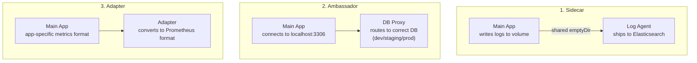

# Multi-Container Pods

Multiple containers in a pod share the same network namespace (localhost), the same IP, and can share volumes. They are always scheduled together on the same node.

## Design Patterns



| Pattern | Purpose | Example |
|---|---|---|
| **Sidecar** | Extends main container | Log shipper, TLS terminator |
| **Ambassador** | Proxies outbound connections | DB proxy, API gateway |
| **Adapter** | Transforms output format | Metrics converter |

## Sidecar Example

```yaml
apiVersion: v1
kind: Pod
metadata:
  name: web-with-log-sidecar
spec:
  containers:
  - name: web
    image: nginx:1.25
    volumeMounts:
    - name: shared-logs
      mountPath: /var/log/nginx
  - name: log-agent
    image: busybox
    command: ['sh', '-c', 'tail -f /logs/access.log']
    volumeMounts:
    - name: shared-logs
      mountPath: /logs
  volumes:
  - name: shared-logs
    emptyDir: {}    # shared between both containers
```

## Key Facts

- All containers share the **same network** — talk via `localhost`
- Containers share **volumes** explicitly mounted by both
- Each container has its own **filesystem** (not shared by default)
- `kubectl logs <pod> -c <container>` — specify container name for logs
- Both containers must succeed for the pod to be `Running`
