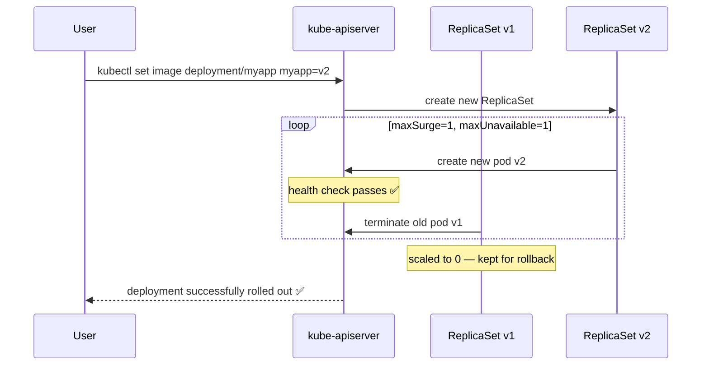

# Rolling Updates & Rollbacks

Kubernetes deployments support zero-downtime updates via rolling update strategy. Old pods are replaced gradually while maintaining availability.

## Update Strategies

| Strategy | Behaviour | Downtime |
|---|---|---|
| `RollingUpdate` | Replace pods gradually, old+new coexist briefly | None |
| `Recreate` | Kill ALL old pods, then start new ones | Yes |

## Rolling Update Flow



## Deployment Strategy Config

```yaml
spec:
  replicas: 4
  strategy:
    type: RollingUpdate
    rollingUpdate:
      maxSurge: 1        # max pods above desired during update
      maxUnavailable: 1  # max pods below desired during update
```

## Commands

```bash
# Update image
kubectl set image deployment/myapp myapp=myapp:v2

# Watch rollout progress
kubectl rollout status deployment/myapp

# View history
kubectl rollout history deployment/myapp
kubectl rollout history deployment/myapp --revision=2

# Rollback
kubectl rollout undo deployment/myapp
kubectl rollout undo deployment/myapp --to-revision=1

# Pause / resume (batch multiple changes)
kubectl rollout pause deployment/myapp
kubectl set image deployment/myapp myapp=myapp:v3
kubectl set resources deployment/myapp -c myapp --limits=cpu=200m,memory=512Mi
kubectl rollout resume deployment/myapp

# Record change cause in history
kubectl annotate deployment/myapp kubernetes.io/change-cause="image updated to v2"
```
