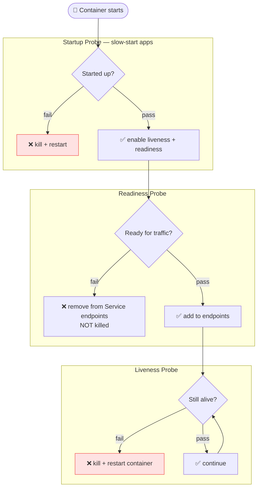

# Self-Healing & Probes

Kubernetes automatically restarts failed containers and removes unhealthy pods from service endpoints — but only if probes are configured correctly.

## Restart Policies

| Policy | Behaviour |
|---|---|
| `Always` (default) | Restart on any exit — intended for long-running services |
| `OnFailure` | Restart only on non-zero exit — intended for batch Jobs |
| `Never` | Never restart — run once and done |

## Probe Types



| Probe | Fails → | Use for |
|---|---|---|
| **Liveness** | Container killed + restarted | Detecting deadlocks, infinite loops |
| **Readiness** | Removed from Service (not killed) | Waiting for DB connection, warm-up |
| **Startup** | Container killed + restarted | Slow-starting apps (JVM, large DBs) |

## Full Example

```yaml
spec:
  containers:
  - name: myapp
    image: myapp:v2
    livenessProbe:
      httpGet:
        path: /healthz
        port: 8080
      initialDelaySeconds: 10   # wait before first check
      periodSeconds: 5          # check every 5s
      failureThreshold: 3       # fail 3 times before restarting

    readinessProbe:
      httpGet:
        path: /ready
        port: 8080
      initialDelaySeconds: 5
      periodSeconds: 5

    startupProbe:
      httpGet:
        path: /started
        port: 8080
      failureThreshold: 30
      periodSeconds: 10         # up to 5 min to start (30 × 10s)
```

## Probe Check Methods

```yaml
# HTTP GET — success if 2xx/3xx response
httpGet:
  path: /healthz
  port: 8080

# TCP socket — success if port accepts connection
tcpSocket:
  port: 3306

# Exec command — success if exit code is 0
exec:
  command: ["pg_isready", "-U", "postgres"]
```
