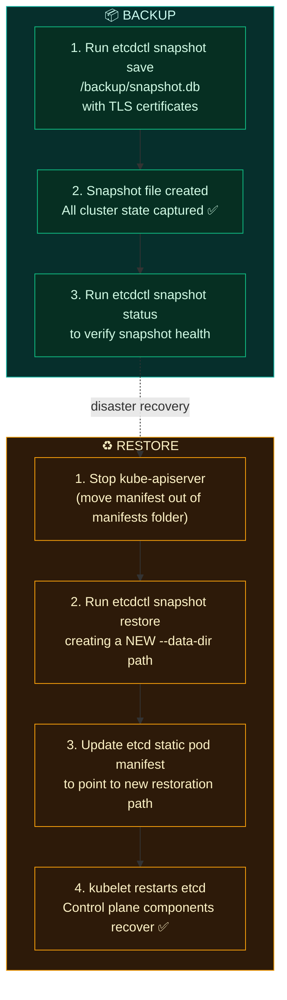

# Backup & Restore

Safeguarding cluster state and setting up a robust disaster recovery procedure is a primary duty of a Kubernetes cluster administrator.

---

## Backup Targets

We can categorise backups into three different levels:

* **Kubernetes Configs (YAML files)**:
  * Export declarative manifests: `kubectl get all --all-namespaces -o yaml > all.yaml`.
  * Preferred approach: Store all configurations in a Git repository (GitOps via ArgoCD or Flux).
* **etcd Database Snapshot**:
  * The single source of truth containing all cluster state, resource listings, and Secrets.
  * Snapshotting is the **highly preferred** method for a full-state master recovery.
* **Persistent Volume Backups**:
  * Storage level backups for live persistent application state (using Velero or direct cloud volumes).

---

## etcd Backup & Restore Flow



---

## etcd Backup Procedure

To use the modern etcd v3 commands, you must configure the environment variable:

```bash
export ETCDCTL_API=3
```

### 1. Perform etcd Snapshot Save
You must provide the etcd CA certificate, server client certificate, and server client private key to authenticate:

```bash
etcdctl snapshot save /backup/etcd-snapshot-$(date +%Y%m%d).db \
  --endpoints=https://127.0.0.1:2379 \
  --cacert=/etc/kubernetes/pki/etcd/ca.crt \
  --cert=/etc/kubernetes/pki/etcd/server.crt \
  --key=/etc/kubernetes/pki/etcd/server.key
```

### 2. Verify Snapshot Status

```bash
etcdctl snapshot status /backup/etcd-snapshot-20260531.db --write-out=table
# +----------+----------+------------+------------+
# |   HASH   | REVISION | TOTAL KEYS | TOTAL SIZE |
# +----------+----------+------------+------------+
# | abc12345 |    12345 |       1200 |     5.2 MB |
# +----------+----------+------------+------------+
```

---

## etcd Restore Procedure

### 1. Restore Snapshot to a New Data Directory
Never restore snapshot files into the live/active directory. Always restore to a **new, empty directory** path to prevent write-corruption:

```bash
etcdctl snapshot restore /backup/etcd-snapshot-20260531.db \
  --data-dir=/var/lib/etcd-from-backup \
  --endpoints=https://127.0.0.1:2379 \
  --cacert=/etc/kubernetes/pki/etcd/ca.crt \
  --cert=/etc/kubernetes/pki/etcd/server.crt \
  --key=/etc/kubernetes/pki/etcd/server.key
```

### 2. Update the etcd Manifest Path
Next, edit the etcd static pod definition file on the Control Plane node to point to the restored directory:

```bash
vi /etc/kubernetes/manifests/etcd.yaml
```

Update the `--data-dir` flag and the hostPath volumes to target the new directory path:

```yaml
# Inside /etc/kubernetes/manifests/etcd.yaml
spec:
  containers:
  - command:
    - etcd
    - --data-dir=/var/lib/etcd-from-backup   # 1. Update flag
    # ...
    volumeMounts:
    - mountPath: /var/lib/etcd
      name: etcd-data
  volumes:
  - name: etcd-data
    hostPath:
      path: /var/lib/etcd-from-backup       # 2. Update hostPath volume
```

### 3. Verify System Recovery
Once you save the manifest file, `kubelet` automatically detects the change, terminates the old etcd pod, and launches the new etcd instance.

```bash
# Verify the nodes and pods are recovered and responsive
kubectl get nodes
kubectl get pods -A
```
