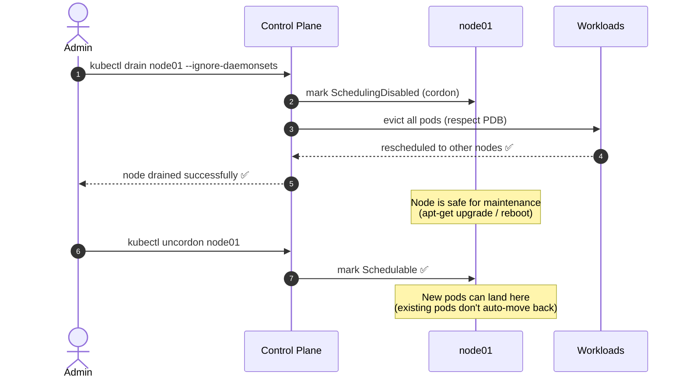

# OS Upgrades — Node Drain & Cordon

A key task in managing a Kubernetes cluster is safely preparing nodes for maintenance (such as OS upgrades, kernel patches, or hardware replacements) without causing downtime for applications.

## Cordoning vs Draining

Kubernetes provides two mechanisms for preparing a node for maintenance:

| Action | Evicts Pods | Marks Unschedulable | Use Case |
|---|---|---|---|
| **Cordon** | No | Yes | Restricting new pods from landing while letting existing ones finish. |
| **Drain** | Yes | Yes | Evicting all workloads safely to clear the node for physical maintenance or upgrades. |

---

## Safe Node Maintenance Flow



---

## Command Reference

### Draining a Node
Draining a node cordons it (marks it unschedulable) and then evicts all active workloads.

```bash
# Standard drain, ignoring local daemonset pods
kubectl drain node01 --ignore-daemonsets

# Force drain (delete pods not managed by a controller)
kubectl drain node01 --ignore-daemonsets --force

# Drain and delete any local data stored in emptyDir volumes
kubectl drain node01 --ignore-daemonsets --delete-emptydir-data
```

### Cordoning a Node (Mark Unschedulable Only)
If you only want to stop new pods from being scheduled on a node without evicting the current running pods, use `cordon`.

```bash
# Cordon node01
kubectl cordon node01

# Verify Node scheduling state (should show SchedulingDisabled)
kubectl get nodes
```

### Uncordoning a Node
Once maintenance is complete, you must uncordon the node to make it active and eligible to host pods again.

```bash
# Uncordon node01
kubectl uncordon node01
```

> [!WARNING]
> When you uncordon a node, already-evicted pods will **not** automatically migrate back to this node. They will remain on their current nodes until they are deleted or rescheduled.

### Verifying Node Maintenance Status

```bash
kubectl get nodes
# NAME     STATUS                     ROLES
# node01   Ready,SchedulingDisabled   <none>   <- drained/cordoned node
# node02   Ready                      <none>   <- healthy active node
```
