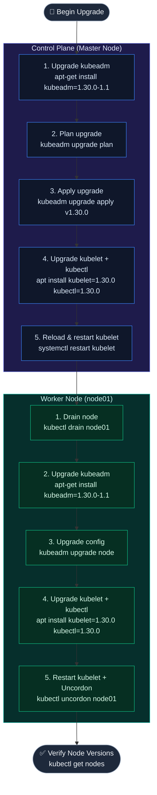

# Kubernetes Version Upgrades

Upgrading a production Kubernetes cluster requires following a strict order of operations to ensure high availability and prevent version skew conflicts. Upgrades must be performed **one minor version at a time** (e.g., `v1.27` → `v1.28` → `v1.29`).

## Version Format & Skew Policy

Kubernetes releases follow **Semantic Versioning** (`vMajor.Minor.Patch`).

### Version Skew Policy

* **kube-apiserver**: Reference version `X` (e.g. `v1.30.0`)
* **kube-controller-manager / kube-scheduler**: Allowed to be `X` or `X-1` (must not be newer than the API server)
* **kubelet / kube-proxy**: Allowed to be `X`, `X-1`, or `X-2` (cannot be newer than the API server)
* **kubectl**: Allowed to be `X+1` down to `X-1`

---

## Cluster Upgrade Flow (kubeadm)

The control plane components must always be upgraded **before** upgrading worker nodes.



---

## Master Node Upgrade Step-by-Step

### 1. Upgrade kubeadm

```bash
apt-get update
apt-get install -y --allow-change-held-packages kubeadm=1.30.0-1.1
kubeadm version
```

### 2. Run Upgrade Plan and Apply
The plan command verifies that your cluster is in a healthy state and displays the available upgrade versions.

```bash
# Verify the upgrade path
kubeadm upgrade plan

# Apply the upgrade (this downloads images and upgrades control plane components)
kubeadm upgrade apply v1.30.0
```

### 3. Upgrade Kubelet & Kubectl on Master
Once the control plane components (API server, scheduler, controllers) are upgraded, upgrade the node components on the master.

```bash
apt-get install -y --allow-change-held-packages kubelet=1.30.0-1.1 kubectl=1.30.0-1.1

# Reload and restart services
systemctl daemon-reload
systemctl restart kubelet
```

---

## Worker Node Upgrade Step-by-Step

Perform these worker node steps **one node at a time** to maintain overall cluster capacity.

### 1. Drain the Node
Run this command from the upgraded **Control Plane/Master node** to safely reschedule pods:

```bash
kubectl drain node01 --ignore-daemonsets --force
```

### 2. Upgrade kubeadm on the Worker Node
SSH to the worker node and perform the upgrade:

```bash
ssh node01

# Upgrade kubeadm package
apt-get update
apt-get install -y --allow-change-held-packages kubeadm=1.30.0-1.1
```

### 3. Upgrade Kubelet Configuration
Run the local kubeadm upgrade node command:

```bash
kubeadm upgrade node
```

### 4. Upgrade Kubelet and Kubectl Packages
Upgrade packages and restart the local kubelet service:

```bash
apt-get install -y --allow-change-held-packages kubelet=1.30.0-1.1 kubectl=1.30.0-1.1

systemctl daemon-reload
systemctl restart kubelet
exit
```

### 5. Uncordon the Worker Node
Back on the **Control Plane/Master node**, allow the node to schedule workloads again:

```bash
kubectl uncordon node01

# Verify version shows v1.30.0
kubectl get nodes
```
